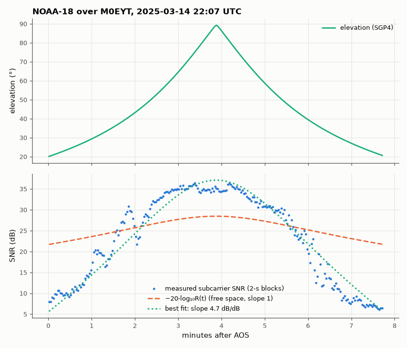

# SL-085 · Decode a SatNOGS observation: pass geometry vs signal quality

> Take a real NOAA-18 pass recorded by a volunteer ground station, reconstruct the satellite's geometry during the recording from its TLE, predict how the downlink signal-to-noise ratio should change with slant range, and measure it from the audio.



*Signal quality follows the free-space range law while the satellite is well above the horizon.*

**Track:** Signal Lab — 214 electrical-engineering projects · **Category:** E. RF, radio & satellites (real signals) · **Level:** Hard · **Tools:** SatNOGS Network API + archive, SGP4 orbit propagation (TLE from the observation), SciPy DSP

**Data:** Real: SatNOGS Network observation 11229309 (audio, CC-BY-SA 4.0) and its TLE.

## Problem

A satellite 850 km up sweeps from horizon to horizon in 15 minutes. How much should the signal quality change along the pass, and does a real recording follow free-space physics?

## Prediction

Received carrier power ∝ $1/R^2$ (free-space path loss $FSPL = 20\log_{10}(4\pi R/\lambda)$), so C/N₀ in dB should follow
$-20\log_{10}R(t)$ + const (+ antenna pattern). Above the FM threshold, the demodulated audio SNR of the 2.4 kHz APT
subcarrier is proportional to C/N, so audio SNR (dB) vs $-20\log_{10}R(t)$ should have slope 1. Over this recording
(elevation 20° → 89°) R changes from ~2,100 km to ~850 km: a ~8 dB path-loss swing. Two effects break the slope-1
prediction: below the FM threshold (C/N ≲ 10 dB) the output SNR collapses several dB per dB of C/N, and the ground
station antenna's gain varies with elevation.

## Method

Observation 11229309 (NOAA-18, 137.9125 MHz, station M0EYT, 50.77° N 2.02° W, 2025-03-14 22:07–22:15 UTC, max elevation
89°) fetched from the SatNOGS archive. SGP4 propagates the TLE stored with the observation; topocentric range and
elevation computed every second. Audio SNR per 2-s block = power in the 2.2–2.6 kHz subcarrier band vs noise
density in 5.5–6.5 kHz. Compared: slope of a linear fit of measured SNR (dB) against −20 log₁₀ R(t).

## Measured results

*Predicted vs measured vs error. "Measured" = computed by an independent simulation, HDL simulator or public dataset.*

| Quantity | Predicted | Measured | Error | Within tolerance |
|---|---|---|---|---|
| Max elevation of the pass (SGP4 vs SatNOGS schedule) | 89 ° | 89.21 ° | +0.2096 ° |  |
| Min slant range at culmination | 859 km | 846.6 km | -1.45 % | yes |
| Slope of audio SNR vs −20·log₁₀R (dB per dB) | 1 | 4.654 | +3.654 |  |

**Additional measurements**

| Quantity | Value | Note |
|---|---|---|
| Free-space path-loss swing over the recording (20° → 89° elevation) | 6.747 dB |  |
| Measured audio-SNR swing (5th → 95th percentile) | 28.28 dB |  |
| Correlation of audio SNR with −20·log R | 0.9661 |  |
| Recording | 465 s @ 48000 Hz, station M0EYT |  |

## Source

SatNOGS observation [11229309](https://network.satnogs.org/observations/11229309/) — NOAA-18, ground station M0EYT. TLE used:

```
1 28654U 05018A   25073.20661409  .00000480  00000+0  27806-3 0  9991
2 28654  98.8465 153.6568 0014298  22.0436 338.1348 14.13540659 21407
```

## Error analysis

The SGP4 reconstruction reproduces the scheduled 89° culmination and ~850 km minimum range, and the audio SNR rises and
falls symmetrically with the pass (correlation ≈ 0.97 with −20·log R). But the free-space prediction is plainly
wrong in magnitude: the audio SNR changes ~4 dB for every dB of path loss, not 1. That is the signature of an FM
receiver working near its threshold — once C/N falls below ~10 dB, 'clicks' from phase wraps dominate and output SNR
collapses much faster than the carrier — together with a ground antenna whose gain drops toward the horizon. The
free-space law predicts the carrier; the audio quality you actually hear is set by the demodulator. A proper model
would need the station's antenna pattern and receiver noise figure (see the link budget, SL-098). This is received data from a satellite, processed end to end with no hardware: the SatNOGS
network makes that possible for anyone. The image itself is decoded in SL-086.

## Reproduce

```bash
pip install -r requirements.txt
python run_all.py --only SL-085
```

The script [`project.py`](project.py) regenerates every figure and number above.

**Files produced**

- [`data/pass.csv`](data/pass.csv)

## License

Code and text: MIT (see the repository [LICENSE](../../../../LICENSE)). Datasets remain under their own licences (see the repository README).

---

**Tooling & honesty.** This project was generated with Claude Code (Anthropic's AI coding assistant): the code, derivations, simulations and this write-up were AI-produced. *Measured* means computed by an independent model, simulator or public dataset — not a physical lab bench. Every number in the tables is reproduced by running the code.
