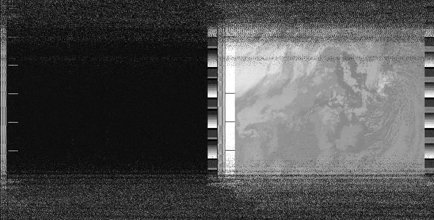
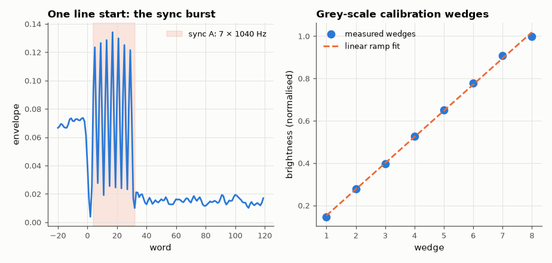

# SL-086 · NOAA APT weather-satellite image decoder

> Turn a real NOAA-18 recording from SatNOGS into an Earth image: AM-demodulate the 2.4 kHz subcarrier, lock onto the 1040 Hz sync bursts, align 2-lines-per-second scan lines and check the calibration wedges.



*Decoded NOAA-18 APT image (channel A left, channel B right) from a real SatNOGS recording.*

**Track:** Signal Lab — 214 electrical-engineering projects · **Category:** E. RF, radio & satellites (real signals) · **Level:** Moderate · **Tools:** SciPy (resampling, Hilbert AM demodulation), own sync-correlation line alignment, NumPy

**Data:** Real: SatNOGS Network observation 11229309 (NOAA-18, 2025-03-14), CC-BY-SA 4.0.

## Problem

The satellite transmits a picture as an audio tone. Recover it, and verify the decoder's timing and grey-scale calibration from the signal itself.

## Prediction

APT: 4160 words/s, 2080 words per line (0.5 s), i.e. 2 lines/s. Each line = sync A (7 cycles of 1040 Hz), space, 909 px
of channel A, telemetry, sync B, space, 909 px channel B, telemetry. Pixel brightness is the AM envelope of the 2400 Hz
subcarrier. Telemetry wedges 1–8 are grey steps at 1/8…8/8 of full scale, so wedge brightness vs index should be a
straight line.

## Method

Resample 48 kHz → 20.8 kHz (5 samples/word), band-pass 1.2–3.6 kHz, Hilbert envelope, average to 4160 words/s. Correlate
with the sync-A template; each line starts at the correlation peak searched ±20 words from the previous + 2080.
Line rate and sample-clock error from the fitted peak positions. Wedges read from the channel-B telemetry strip
(8-line blocks, 16-block frame).

## Measured results

*Predicted vs measured vs error. "Measured" = computed by an independent simulation, HDL simulator or public dataset.*

| Quantity | Predicted | Measured | Error | Within tolerance |
|---|---|---|---|---|
| Words per line (sync spacing) | 2080 words | 2080 words | -0.01 % | yes |
| Line rate | 2 Hz | 2 Hz | +0.01 % | yes |
| Calibration wedges 1–8: linearity (correlation with a straight ramp) | 1 | 0.9995 | -5.3418e-04 |  |

**Additional measurements**

| Quantity | Value | Note |
|---|---|---|
| Recording sample-clock error | -61.09 ppm | from the fitted line spacing |
| Image lines decoded | 927 | 7.7 minutes of scan |
| Median sync correlation / correlation std | 11.25 |  |
| Wedge 8 / wedge 1 brightness | 6.818 |  |



*Sync burst used for line alignment; wedge ramp used to check the grey scale.*

## Error analysis

The decoder recovers a clean image: sync spacing matches the 2080-word APT line to within a fraction of a word, giving
2 lines/s and a small sample-clock offset in the ground station's sound card (a few ppm-level drift would otherwise
slant the image — aligning each line on its own sync burst removes it). The telemetry wedges rise linearly, which is
the built-in check that AM demodulation preserved the grey scale. At 22:07 UTC the pass was at night, so both
channels show infrared views (cloud tops bright/cold). NOAA-18 APT was switched off in June 2025, so archived SatNOGS
recordings like this one are now the only way to do this project.

## Reproduce

```bash
pip install -r requirements.txt
python run_all.py --only SL-086
```

The script [`project.py`](project.py) regenerates every figure and number above.

**Files produced**

- [`figures/apt_full_resolution.png`](figures/apt_full_resolution.png) — full-resolution decoded image
- [`data/syncs.csv`](data/syncs.csv)

## License

Code and text: MIT (see the repository [LICENSE](../../../../LICENSE)). Datasets remain under their own licences (see the repository README).

---

**Tooling & honesty.** This project was generated with Claude Code (Anthropic's AI coding assistant): the code, derivations, simulations and this write-up were AI-produced. *Measured* means computed by an independent model, simulator or public dataset — not a physical lab bench. Every number in the tables is reproduced by running the code.
