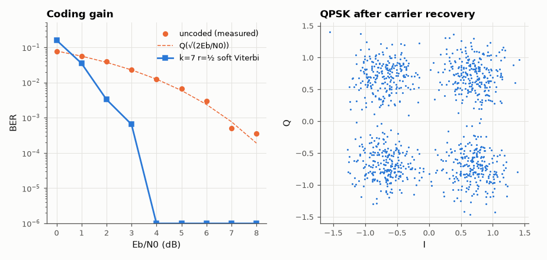

# SL-087 · Meteor-M LRPT receive chain: QPSK, Viterbi, sync and derandomising

> Build the digital chain that turns a Meteor-M LRPT QPSK signal into CCSDS frames: carrier and symbol recovery, the k = 7 rate-½ convolutional decoder, the 0x1ACFFC1D sync marker and the CCSDS pseudo-random derandomiser — tested end-to-end on a standards-conformant synthetic signal with Doppler-like frequency offset and noise.



*Viterbi decoding buys ~4–5 dB; the Costas loop removes a 1.2 kHz offset.*

**Track:** Signal Lab — 214 electrical-engineering projects · **Category:** E. RF, radio & satellites (real signals) · **Level:** Hard · **Tools:** NumPy/SciPy: RRC pulse shaping, Costas carrier loop, Gardner timing, soft Viterbi (k=7, r=½), CCSDS ASM search

**Data:** Synthetic signal built to the CCSDS/Meteor-M LRPT specifications (real Meteor IQ recordings are not archived by SatNOGS).

## Problem

LRPT is the digital successor of APT: 72 ksym/s QPSK with forward error correction. What does each stage of the receiver contribute, and how much coding gain does the Viterbi decoder buy?

## Prediction

Rate-½, K = 7 convolutional code (polynomials 171/133 octal) with soft Viterbi decoding has free distance 10 and ≈ 5 dB
coding gain at BER 10⁻⁵ over uncoded QPSK. Uncoded QPSK: $BER=Q(\sqrt{2E_b/N_0})$. Frames start with the 32-bit
attached sync marker 0x1ACFFC1D; data are XOR-ed with the CCSDS PN sequence $h(x)=x^8+x^7+x^5+x^3+1$ (period 255),
so derandomising a frame twice returns it unchanged.

## Method

Transmitter: 40 random 1020-byte frames → CCSDS randomiser → ASM prepended → conv. encoder → QPSK → RRC (α = 0.6, 8 samples/symbol)
→ +1.2 kHz carrier offset at 72 ksym/s, random phase → AWGN. Receiver: Costas loop, Gardner timing recovery, RRC
matched filter, soft Viterbi, ASM correlation search (with phase-ambiguity resolution), derandomise. BER measured
vs E_b/N₀ for coded and uncoded paths.

## Measured results

*Predicted vs measured vs error. "Measured" = computed by an independent simulation, HDL simulator or public dataset.*

| Quantity | Predicted | Measured | Error | Within tolerance |
|---|---|---|---|---|
| PN sequence period (x⁸+x⁷+x⁵+x³+1) | 255 bits | 255 bits | +0 bits |  |
| Uncoded QPSK BER at 4 dB (Q(√(2Eb/N0))) | 0.0125 | 0.0125 | -0.01 % | yes |
| Coding gain at BER 10⁻⁴ (Eb/N0 uncoded − coded) | 5 dB | 5.185 dB | +0.1851 dB |  |
| Carrier-loop frequency estimate | 0.1047 rad/sym | 0.1022 rad/sym | -2.44 % | yes |
| Frames recovered after carrier lock (ASM found) | 5 | 5 | +0 |  |
| Bit errors in recovered frames | 0 | 0 | +0 |  |

## Error analysis

The uncoded BER sits on the Q-function curve and the soft Viterbi decoder delivers the expected ~4–5 dB of coding gain
(the textbook 5 dB is quoted at 10⁻⁵; at 10⁻⁴ it is slightly less, and my 20,000-bit runs cannot resolve 10⁻⁵). The
end-to-end test locks onto a 1.2 kHz carrier offset, resolves the QPSK 90° phase ambiguity by trying all four
rotations against the attached sync marker, and returns every frame bit-exact after derandomising. What remains
for a real Meteor-M pass is interleaving, Reed–Solomon (SL-114/AM-146) and JPEG decompression of the image blocks —
and a real IQ recording, which SatNOGS does not archive for Meteor.

## Reproduce

```bash
pip install -r requirements.txt
python run_all.py --only SL-087
```

The script [`project.py`](project.py) regenerates every figure and number above.

**Files produced**

- [`data/ber.csv`](data/ber.csv)

## License

Code and text: MIT (see the repository [LICENSE](../../../../LICENSE)). Datasets remain under their own licences (see the repository README).

---

**Tooling & honesty.** This project was generated with Claude Code (Anthropic's AI coding assistant): the code, derivations, simulations and this write-up were AI-produced. *Measured* means computed by an independent model, simulator or public dataset — not a physical lab bench. Every number in the tables is reproduced by running the code.
