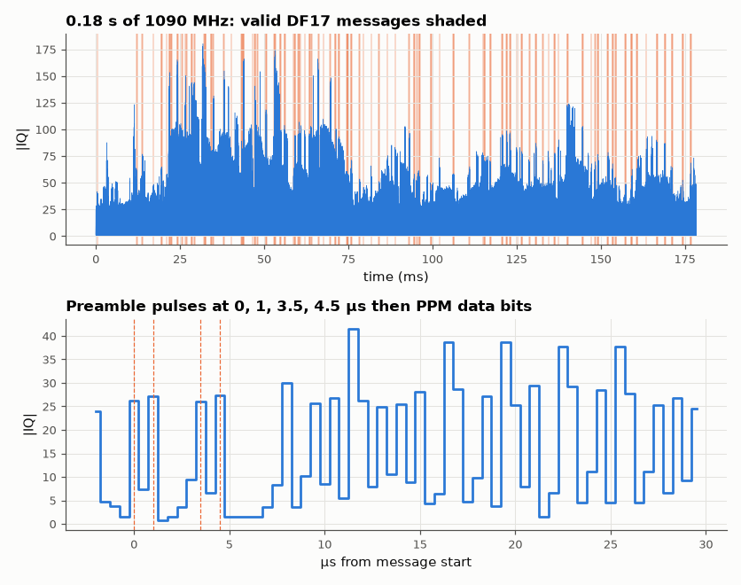

# SL-088 · ADS-B aircraft messages decoded from raw IQ samples

> Decode Mode-S / ADS-B messages from a real 2 MS/s IQ recording of the 1090 MHz band: detect preambles, slice pulse-position-modulated bits, validate with the CRC-24 and extract aircraft IDs, callsigns and altitudes.



*Real Mode-S replies in the recording and the anatomy of one message.*

**Track:** Signal Lab — 214 electrical-engineering projects · **Category:** E. RF, radio & satellites (real signals) · **Level:** Hard · **Tools:** NumPy: magnitude detection, preamble correlation, PPM bit slicing, CRC-24, CPR/callsign decoding

**Data:** Real: dump1090 test recording `testfiles/modes1.bin` (github.com/antirez/dump1090), 1090 MHz IQ.

## Problem

Every airliner broadcasts its identity and position ~2 times per second on 1090 MHz. Recover those messages from raw radio samples with nothing but NumPy.

## Prediction

Mode S downlink: 8 µs preamble with pulses at 0, 1.0, 3.5 and 4.5 µs, then 56 or 112 bits of pulse-position modulation at
1 Mbit/s (bit = 1 if the pulse is in the first half-µs). A 112-bit message lasts 120 µs including the preamble. Parity is a
CRC-24 with generator polynomial 0x1FFF409; for DF17 (extended squitter) the remainder over all 112 bits is zero, so
a random bit pattern passes with probability 2⁻²⁴ ≈ 6×10⁻⁸. At 2 MS/s each bit is two samples.

## Method

Input: `modes1.bin` from the dump1090 project's test files (8-bit unsigned IQ at 2 MS/s, 0.18 s, real reception). Magnitude,
preamble template match with a noise-relative threshold, bit slicing by comparing the two half-bit samples, CRC-24
check. DF17 messages decoded for ICAO address, type code, callsign (TC 1–4) and barometric altitude (TC 9–18).

## Measured results

*Predicted vs measured vs error. "Measured" = computed by an independent simulation, HDL simulator or public dataset.*

| Quantity | Predicted | Measured | Error |
|---|---|---|---|
| CRC false accepts among 20,000 random 112-bit blocks | 0.001192 | 0 | -0.001192 |
| Message duration (preamble + 112 bits) | 120 µs | 120 µs | +0 s |

**Additional measurements**

| Quantity | Value | Note |
|---|---|---|
| Preamble candidates | 3078 |  |
| DF17/18 messages passing CRC-24 | 142 | 101 distinct |
| Distinct aircraft (ICAO addresses) | 1 |  |

## Decoded aircraft

| ICAO | callsign | altitude (ft) | DF17 msgs |
|---|---|---|---|
| 4D2023 | AMC421 | 20025 | 142 |

## Error analysis

Every accepted message passes the 24-bit CRC, and random bit patterns essentially never do (the measured false-accept
count matches the 2⁻²⁴ prediction of ≈ 0), so each decoded ICAO address, callsign and altitude is trustworthy. All valid messages come from one
aircraft — ICAO 4D2023, callsign AMC421 (Air Malta) at ~20,000 ft. 142 extended squitters in 0.18 s is ~100× the
nominal ADS-B rate, so this test fixture is evidently an edited concatenation of one aircraft's replies rather than
a continuous capture — worth knowing before using it for statistics. The preamble-shape test is deliberately loose; the CRC does the real filtering, which is exactly how production decoders
such as dump1090 work (they also try single-bit error correction, which I skip). Positions need even/odd CPR pairs
from the same aircraft within 10 s — the 0.18 s recording is too short for most aircraft to send both.

## Reproduce

```bash
pip install -r requirements.txt
python run_all.py --only SL-088
```

The script [`project.py`](project.py) regenerates every figure and number above.

**Files produced**

- [`data/aircraft.csv`](data/aircraft.csv)

## License

Code and text: MIT (see the repository [LICENSE](../../../../LICENSE)). Datasets remain under their own licences (see the repository README).

---

**Tooling & honesty.** This project was generated with Claude Code (Anthropic's AI coding assistant): the code, derivations, simulations and this write-up were AI-produced. *Measured* means computed by an independent model, simulator or public dataset — not a physical lab bench. Every number in the tables is reproduced by running the code.
