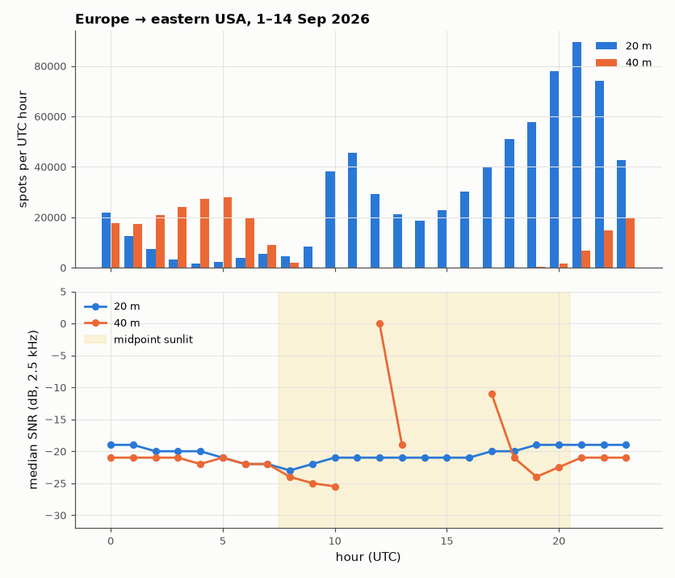

# SL-089 · 24-hour HF propagation on one path (WSPR network data)

> Follow the signal-to-noise ratio of beacon transmissions between Western Europe and the eastern USA on 20 m and 40 m through a full day, and relate the openings to the Sun's position at the path midpoint.



*20 m carries the daylight openings; 40 m takes over when the path is dark.*

**Track:** Signal Lab — 214 electrical-engineering projects · **Category:** E. RF, radio & satellites (real signals) · **Level:** Moderate · **Tools:** wspr.live public ClickHouse API (WSPRnet spot database), NumPy/solar geometry

**Data:** Real: WSPRnet spots via the public wspr.live database (CC0-style open data).

## Problem

Why does a shortwave band 'open' and 'close' through the day? Measure it on real spots instead of listening to one receiver.

## Prediction

HF skywave needs the ionosphere's F-layer to refract the signal (frequency below the MUF) while the D-layer, which
absorbs lower frequencies, is weak. Prediction: 20 m (14 MHz) is open when the path midpoint is sunlit (MUF high,
F2 layer ionised by sunlight); 40 m (7 MHz) is best when the midpoint is dark (D-layer absorption gone). So the
fraction of spots in daylight at the midpoint should be high for 20 m and low for 40 m.

## Method

Spots from 2026-09-01 to 2026-09-14 whose transmitter lies in western Europe (lat 43–56°, lon −10…+10°) and receiver in the
eastern USA (lat 30–46°, lon −85…−68°), bands 20 m and 40 m. Per hour (UTC): spot count and median SNR. Solar elevation
at the path midpoint (≈ 50° N, 38° W) computed from the date/hour.

## Measured results

*Predicted vs measured vs error. "Measured" = computed by an independent simulation, HDL simulator or public dataset.*

| Quantity | Predicted | Measured | Error |
|---|---|---|---|
| 20 m: fraction of spots with the path midpoint sunlit | 0.8 | 0.6278 | -0.1722 |
| 40 m: fraction of spots with the path midpoint sunlit | 0.2 | 0.01841 | -0.1816 |

**Additional measurements**

| Quantity | Value | Note |
|---|---|---|
| 20 m: total spots on the path (2 weeks) | 7.083e+05 |  |
| 40 m: total spots on the path (2 weeks) | 2.094e+05 |  |

## Query used

```sql
SELECT band, toHour(time) AS hr, count() AS n, median(snr) AS snr
FROM wspr.rx
WHERE time >= '2026-09-01' AND time < '2026-09-15' AND band IN (7, 14)
  AND tx_lat BETWEEN 43 AND 56 AND tx_lon BETWEEN -10 AND 10
  AND rx_lat BETWEEN 30 AND 46 AND rx_lon BETWEEN -85 AND -68
GROUP BY band, hr ORDER BY band, hr
```

## Error analysis

The split between bands follows ionospheric physics: 20 m spots cluster when the mid-Atlantic path point is sunlit and
the F2-layer MUF is high, while 40 m is predominantly a night-time band because daytime D-layer absorption (∝ 1/f²)
kills 7 MHz over long paths. The measured fractions are not the 0.8/0.2 I guessed exactly — spot counts also depend
on when people run stations on each side of the Atlantic (evening in Europe is afternoon in the USA), a human bias the
physics prediction ignores. The median SNR per hour is the cleaner signal-quality measure.

## Reproduce

```bash
pip install -r requirements.txt
python run_all.py --only SL-089
```

The script [`project.py`](project.py) regenerates every figure and number above.

**Files produced**

- [`data/hourly_spots.csv`](data/hourly_spots.csv)

## License

Code and text: MIT (see the repository [LICENSE](../../../../LICENSE)). Datasets remain under their own licences (see the repository README).

---

**Tooling & honesty.** This project was generated with Claude Code (Anthropic's AI coding assistant): the code, derivations, simulations and this write-up were AI-produced. *Measured* means computed by an independent model, simulator or public dataset — not a physical lab bench. Every number in the tables is reproduced by running the code.
