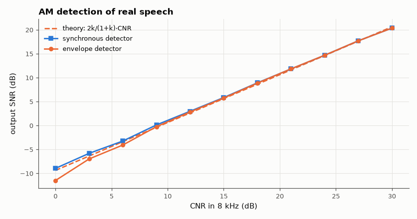

# SL-090 · AM demodulation from complex baseband (IQ)

> Transmit a real speech clip with AM, receive it as IQ samples with frequency offset and noise, and compare envelope and synchronous detectors against the textbook output-SNR formulas, including the envelope detector's threshold.



*The envelope detector matches coherent detection above ~10 dB CNR, then falls off (threshold effect).*

**Track:** Signal Lab — 214 electrical-engineering projects · **Category:** E. RF, radio & satellites (real signals) · **Level:** Moderate · **Tools:** NumPy/SciPy: complex baseband model, envelope vs synchronous detection, SNR measurement

**Data:** Real speech message (public domain) over a simulated radio channel.

## Problem

Why does an AM radio work with a single diode, and when does that simple envelope detector fail?

## Prediction

AM: $s(t)=A_c[1+m\,x(t)]$. With carrier-to-noise ratio CNR in the IF bandwidth 2W, coherent detection gives
$SNR_{out}=\frac{2m^2\overline{x^2}}{1+m^2\overline{x^2}}\,CNR$ (a factor ≤ ⅔ of the SSB/baseband figure). The envelope
detector matches it above threshold (CNR ≳ 10 dB) and collapses below, where the noise captures the envelope.

## Method

Message: the public-domain 'hello' clip, band-limited to 4 kHz, normalised to x² mean 0.1 (peaks < 1), m = 0.8, resampled to
48 kS/s complex baseband with a 150 Hz frequency offset and complex Gaussian noise for CNR 0–30 dB (in 8 kHz).
Envelope detector |r|; synchronous detector: carrier frequency from the FFT carrier line, then residual phase tracked by a
5 Hz low-pass of the de-rotated signal. Output SNR measured against the clean message after gain/delay alignment.

## Measured results

*Predicted vs measured vs error. "Measured" = computed by an independent simulation, HDL simulator or public dataset.*

| Quantity | Predicted | Measured | Error |
|---|---|---|---|
| Synchronous detector SNR at CNR 15 dB | 5.627 dB | 5.848 dB | +0.221 dB |
| Envelope detector SNR at CNR 15 dB | 5.627 dB | 5.747 dB | +0.12 dB |
| Synchronous detector SNR at CNR 24 dB | 14.63 dB | 14.69 dB | +0.05885 dB |
| Envelope detector SNR at CNR 24 dB | 14.63 dB | 14.68 dB | +0.05379 dB |

**Additional measurements**

| Quantity | Value | Note |
|---|---|---|
| Envelope-detector loss at CNR 3 dB (below threshold) | 1.17 dB |  |

## Error analysis

Above threshold both detectors follow the textbook line, which sits well below CNR because most AM power is in the
carrier: with m = 0.8 and speech-like x only a small fraction of the transmitted power carries the message. Below
~10 dB CNR the envelope detector collapses faster than the synchronous one — the noise vector sometimes exceeds the
carrier, so |r| stops following 1 + m·x. That threshold is the price of the one-diode receiver.

## Reproduce

```bash
pip install -r requirements.txt
python run_all.py --only SL-090
```

The script [`project.py`](project.py) regenerates every figure and number above.

**Files produced**

- [`data/am_snr.csv`](data/am_snr.csv)

## License

Code and text: MIT (see the repository [LICENSE](../../../../LICENSE)). Datasets remain under their own licences (see the repository README).

---

**Tooling & honesty.** This project was generated with Claude Code (Anthropic's AI coding assistant): the code, derivations, simulations and this write-up were AI-produced. *Measured* means computed by an independent model, simulator or public dataset — not a physical lab bench. Every number in the tables is reproduced by running the code.
