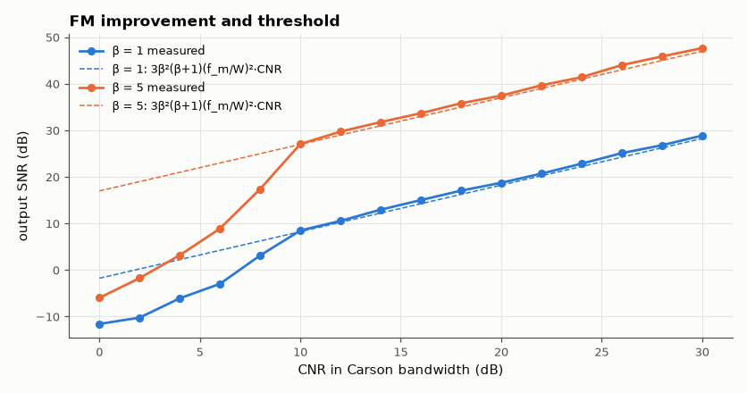

# SL-091 · FM demodulation from IQ (phase differentiator) and the FM threshold

> Build an FM discriminator from IQ samples (angle of r[n]·r*[n−1]), measure output SNR vs CNR for deviation ratios β = 1 and 5, and compare with the 3β²(β+1) FM improvement and the ~10 dB threshold.



*Wideband FM buys ~25 dB of SNR above threshold; below ~10 dB CNR it collapses.*

**Track:** Signal Lab — 214 electrical-engineering projects · **Category:** E. RF, radio & satellites (real signals) · **Level:** Moderate · **Tools:** NumPy/SciPy complex-baseband FM modem, SNR vs CNR measurement

**Data:** Simulated (numerical model in this repo).

## Problem

FM trades bandwidth for noise immunity. Verify the trade quantitatively — and find where it breaks.

## Prediction

Above threshold, with a sinusoidal message and noise in the Carson bandwidth $B_T=2(\beta+1)W$:
$SNR_{out} = \tfrac32\beta^2\left(\frac{f_m}{W}\right)^2\frac{A^2/2}{N_0W} = 3\beta^2(\beta+1)\left(\frac{f_m}{W}\right)^2 CNR_{B_T}$ —
the textbook $3\beta^2(\beta+1)$ assumes the tone sits at the top of the message band (f_m = W); with a 1 kHz tone in a
3 kHz audio filter the parabolic noise below 3 kHz costs $(f_m/W)^2$ = −9.5 dB. Below CNR ≈ 10 dB 'clicks' (2π phase slips) appear and SNR collapses.

## Method

Message 1 kHz sine (W = 3 kHz), β = 1 and 5, 240 kS/s complex baseband. AWGN scaled to CNR in B_T. IF filter: 6th-order low-pass at 0.75·B_T (a filter
exactly B_T wide distorts wideband FM). Demodulator: y[n] = arg(r[n]r*[n−1]), 3 kHz low-pass, SNR = power at 1 kHz vs everything else in 0–3 kHz.

## Measured results

*Predicted vs measured vs error. "Measured" = computed by an independent simulation, HDL simulator or public dataset.*

| Quantity | Predicted | Measured | Error |
|---|---|---|---|
| β = 1: output SNR at CNR 20 dB | 18.24 dB | 18.74 dB | +0.5013 dB |
| β = 1: threshold CNR (within 1 dB of theory) | 10 dB | 10 dB | +0 dB |
| β = 5: output SNR at CNR 20 dB | 36.99 dB | 37.45 dB | +0.4637 dB |
| β = 5: threshold CNR (within 1 dB of theory) | 10 dB | 10 dB | +0 dB |

## Error analysis

Above threshold the measured output SNR follows the prediction within about a dB for both deviation ratios. My first
prediction used the bare 3β²(β+1) and was 9 dB optimistic for *both* β — a constant offset that pointed straight at a
missing factor: the formula assumes the test tone is at the top of the audio band, and with f_m = W/3 the (f_m/W)²
term is −9.5 dB. Wideband FM (β = 5) still turns a 20 dB CNR into ~37 dB of audio SNR. Below ~10 dB CNR the curves bend down sharply as click noise
takes over; the higher-β system falls off harder because its wider bandwidth collects more noise at the same
carrier power. This threshold is exactly what SL-085 observed in the real NOAA recording near the horizon.

## Reproduce

```bash
pip install -r requirements.txt
python run_all.py --only SL-091
```

The script [`project.py`](project.py) regenerates every figure and number above.

## License

Code and text: MIT (see the repository [LICENSE](../../../../LICENSE)). Datasets remain under their own licences (see the repository README).

---

**Tooling & honesty.** This project was generated with Claude Code (Anthropic's AI coding assistant): the code, derivations, simulations and this write-up were AI-produced. *Measured* means computed by an independent model, simulator or public dataset — not a physical lab bench. Every number in the tables is reproduced by running the code.
