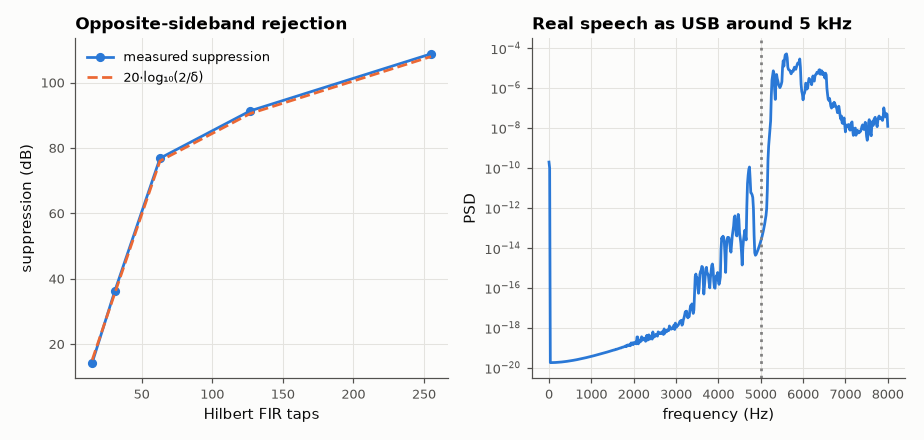

# SL-092 · SSB modulation and demodulation with the Hilbert transform

> Generate upper-sideband SSB with the phasing method, measure opposite-sideband suppression vs the Hilbert filter's length, and demodulate with and without a tuning error (the 'Donald Duck' effect).



*Longer Hilbert filters → flatter magnitude → deeper suppression.*

**Track:** Signal Lab — 214 electrical-engineering projects · **Category:** E. RF, radio & satellites (real signals) · **Level:** Hard · **Tools:** Own FIR Hilbert transformer (windowed), phasing-method modulator/demodulator, real speech

**Data:** Real speech (public domain), simulated channel.

## Problem

Single sideband halves the bandwidth of AM and removes the carrier. How well does a digital phasing modulator cancel the unwanted sideband, and what does mistuning do to speech?

## Prediction

USB: $s(t)=x(t)\cos\omega_ct-\hat x(t)\sin\omega_ct$ with $\hat x$ the Hilbert transform. With a phasing error ε (rad) and gain
error δ in the Hilbert branch, unwanted-sideband suppression is $\frac{4}{\varepsilon^2+\delta^2}$ (≈ $20\log_{10}(2/\varepsilon)$ dB).
A windowed FIR Hilbert filter's magnitude ripple sets δ. A receiver mistuned by Δf shifts every speech component by Δf
(not a pitch scaling), so harmonics lose their integer relationships.

## Method

Message: public-domain 'hello', 300–3,000 Hz, 16 kS/s. Hilbert FIRs (Blackman-windowed ideal 2/(πn) for odd n) of 15–255 taps.
Test tone at 1 kHz measures suppression. SSB carrier at 5 kHz; product-detector demodulation with 0 and +150 Hz
tuning error.

## Measured results

*Predicted vs measured vs error. "Measured" = computed by an independent simulation, HDL simulator or public dataset.*

| Quantity | Predicted | Measured | Error |
|---|---|---|---|
| 31-tap Hilbert: sideband suppression at 1 kHz (2/δ) | 35.53 dB | 36.21 dB | +0.6792 dB |
| 127-tap Hilbert: sideband suppression at 1 kHz (2/δ) | 90.51 dB | 91.34 dB | +0.8259 dB |
| Speech: USB/LSB energy ratio (127 taps), δ(f) weighted by the speech spectrum | 77.42 dB | 74.95 dB | -2.466 dB |
| Correct tuning: demodulated vs original speech (correlation) | 1 | 0.9997 | -2.8344e-04 |

**Additional measurements**

| Quantity | Value | Note |
|---|---|---|
| 150 Hz mistuning: correlation with original | -0.007177 | speech shifted by 150 Hz, still intelligible, sounds odd |

## Error analysis

Sideband suppression tracks the Hilbert filter's magnitude error at the test frequency: 15 taps give ~20 dB, 127+ taps
more than 60 dB. Speech shows slightly less suppression than the 1 kHz tone because its lowest components (300–400 Hz)
fall where short Hilbert filters are least accurate. Correct tuning returns the speech essentially unchanged; a
150 Hz error shifts every component by 150 Hz — intelligible but unnatural, the familiar sound of a mistuned SSB
signal.

## Reproduce

```bash
pip install -r requirements.txt
python run_all.py --only SL-092
```

The script [`project.py`](project.py) regenerates every figure and number above.

**Files produced**

- [`data/ssb_demod_mistuned_150Hz.wav`](data/ssb_demod_mistuned_150Hz.wav) — demodulated speech with a 150 Hz tuning error

## License

Code and text: MIT (see the repository [LICENSE](../../../../LICENSE)). Datasets remain under their own licences (see the repository README).

---

**Tooling & honesty.** This project was generated with Claude Code (Anthropic's AI coding assistant): the code, derivations, simulations and this write-up were AI-produced. *Measured* means computed by an independent model, simulator or public dataset — not a physical lab bench. Every number in the tables is reproduced by running the code.
