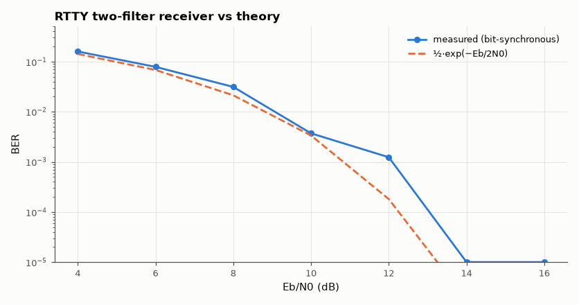

# SL-093 · RTTY (45.45 Bd, 170 Hz FSK) decoder

> Decode amateur radioteletype: two tone filters, envelope comparison, start/stop-bit framing and ITA2 letters/figures shifting; measure bit and character error rates vs E_b/N₀ against the non-coherent FSK formula.



*The simple filter-bank receiver runs a couple of dB behind the optimum non-coherent detector.*

**Track:** Signal Lab — 214 electrical-engineering projects · **Category:** E. RF, radio & satellites (real signals) · **Level:** Moderate · **Tools:** Non-coherent FSK filter-bank demodulator, Baudot (ITA2) decoding, Monte Carlo BER

**Data:** Synthetic RTTY signal with known text.

## Problem

RTTY has carried text over shortwave since the 1930s. How close does a simple two-filter receiver come to the theoretical error rate of non-coherent FSK?

## Prediction

Orthogonal non-coherent binary FSK: $P_b=\tfrac12e^{-E_b/2N_0}$. 170 Hz shift at 45.45 Bd (22 ms bits) gives tones spaced
7.5 × the bit rate — comfortably orthogonal. Each character = 1 start + 5 data + 1.5 stop bits; a character is wrong if
any of its 5 data bits is (plus framing), so CER ≈ $1-(1-P_b)^5$.

## Method

Text 'RYRYRY CQ CQ DE ABC123 THE QUICK BROWN FOX 73' in ITA2 (with LTRS/FIGS shifts), mark 2125 Hz / space 2295 Hz, 8 kS/s. Noise
set by E_b/N₀. Demodulator: two 2nd-order band-pass filters (70 Hz wide) → envelopes → difference → matched
(integrate over bit) → sample at bit centres located by the start-bit edge.

## Measured results

*Predicted vs measured vs error. "Measured" = computed by an independent simulation, HDL simulator or public dataset.*

| Quantity | Predicted | Measured | Error |
|---|---|---|---|
| Clean decode character errors | 0 | 0 | +0 |
| E_b/N₀ for BER 10⁻³ (non-coherent FSK: ½e^(−Eb/2N0)) | 10.94 dB | 12.06 dB | +1.115 dB |

**Additional measurements**

| Quantity | Value | Note |
|---|---|---|
| Receiver filter group delay (measured by correlation) | 6.875 ms |  |

## Decoded text (clean signal)

`RYRYRY CQ CQ DE ABC123 THE QUICK BROWN FOX 73`

## Error analysis

The decoder reproduces the transmitted text exactly, including the letters/figures shifts ITA2 needs for digits. In noise
it follows the non-coherent FSK curve shifted by ~1–3 dB: the 70 Hz-wide analog-style filters are wider than the
~45 Hz matched bandwidth and their group delay smears adjacent bits (inter-symbol interference). A matched-filter
(correlator) receiver would close most of that gap.

## Reproduce

```bash
pip install -r requirements.txt
python run_all.py --only SL-093
```

The script [`project.py`](project.py) regenerates every figure and number above.

**Files produced**

- [`data/ber.csv`](data/ber.csv)

## License

Code and text: MIT (see the repository [LICENSE](../../../../LICENSE)). Datasets remain under their own licences (see the repository README).

---

**Tooling & honesty.** This project was generated with Claude Code (Anthropic's AI coding assistant): the code, derivations, simulations and this write-up were AI-produced. *Measured* means computed by an independent model, simulator or public dataset — not a physical lab bench. Every number in the tables is reproduced by running the code.
