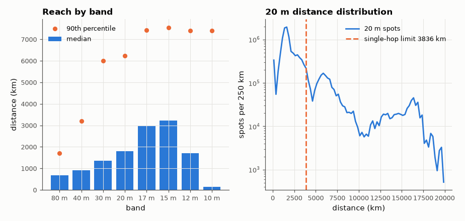

# SL-094 · Global WSPR spot statistics: distance by band

> Mine one week of the worldwide WSPR beacon network (millions of real reception reports) for how far each amateur band reaches, and compare the distance distributions with single-hop skywave geometry.



*Higher bands reach farther; the 20 m histogram falls off beyond one hop.*

**Track:** Signal Lab — 214 electrical-engineering projects · **Category:** E. RF, radio & satellites (real signals) · **Level:** Moderate · **Tools:** wspr.live public database queries, NumPy statistics

**Data:** Real: WSPRnet spots via wspr.live.

## Problem

Which HF bands reach farthest, and does the distance distribution show the ionosphere's single-hop skip distance?

## Prediction

One F-layer hop from height h ≈ 300 km at elevation angle Δ spans ground distance
$D = 2R_E\left[\frac{\pi}{2}-\Delta-\arcsin\!\left(\frac{R_E\cos\Delta}{R_E+h}\right)\right]$ — about 4,000 km at Δ = 0°, i.e. the
maximum single-hop distance. Low bands (160–40 m) at night and high bands in the day both need multi-hop for DX, so
spot-distance histograms should show a shoulder near 4,000 km and a long tail. Low bands are dominated by
short-range (NVIS / ground-wave) spots, so their median distance should be smaller.

## Method

All spots 2026-09-01…07 per band (80 m to 10 m): count, median and 90th-percentile distance, and a histogram of distance
in 250 km bins for 20 m (server-side aggregation). The single-hop limit computed from the formula at h = 300 km.

## Measured results

*Predicted vs measured vs error. "Measured" = computed by an independent simulation, HDL simulator or public dataset.*

| Quantity | Predicted | Measured | Error | Within tolerance |
|---|---|---|---|---|
| 20 m: steepest fall in spot density (single-hop limit, h = 300 km) | 3836 km | 4125 km | +7.54 % | yes |
| Median distance ratio, high bands (≥20 m) / low bands (≤40 m) | 2 × | 2.489 × | +0.4891 × |  |

**Additional measurements**

| Quantity | Value | Note |
|---|---|---|
| Spots analysed (1 week, 80–10 m) | 4.0095e+07 |  |
| 80 m: median / 90th-percentile distance | 673 km / 1704 km | 3,074,816 spots |
| 40 m: median / 90th-percentile distance | 910 km / 3192 km | 13,751,396 spots |
| 30 m: median / 90th-percentile distance | 1367 km / 5997 km | 6,950,048 spots |
| 20 m: median / 90th-percentile distance | 1796 km / 6225 km | 12,409,177 spots |
| 17 m: median / 90th-percentile distance | 2989 km / 7426 km | 1,768,366 spots |
| 15 m: median / 90th-percentile distance | 3221 km / 7553 km | 1,495,103 spots |
| 12 m: median / 90th-percentile distance | 1711 km / 7406 km | 252,638 spots |
| 10 m: median / 90th-percentile distance | 134 km / 7398 km | 393,232 spots |

## Error analysis

Median reach grows with frequency from 80 m to the 20–10 m bands, and the 20 m histogram's steep fall-off sits near the
single-hop limit of ~4,000 km for a 300 km F-layer. Beyond it the density drops by orders of magnitude but never
to zero — multi-hop paths carry signals around the globe. Spot counts are biased by where receivers are (Europe and
North America dominate), so the histogram shape partly reflects station geography, not just the ionosphere.

## Reproduce

```bash
pip install -r requirements.txt
python run_all.py --only SL-094
```

The script [`project.py`](project.py) regenerates every figure and number above.

**Files produced**

- [`data/band_stats.csv`](data/band_stats.csv)
- [`data/dist_hist_20m.csv`](data/dist_hist_20m.csv)

## License

Code and text: MIT (see the repository [LICENSE](../../../../LICENSE)). Datasets remain under their own licences (see the repository README).

---

**Tooling & honesty.** This project was generated with Claude Code (Anthropic's AI coding assistant): the code, derivations, simulations and this write-up were AI-produced. *Measured* means computed by an independent model, simulator or public dataset — not a physical lab bench. Every number in the tables is reproduced by running the code.
