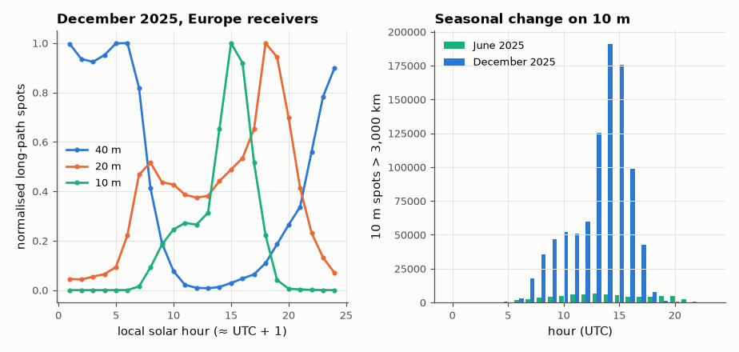

# SL-095 · Ionosphere from propagation data: day/night and seasonal behaviour

> Infer ionospheric behaviour from millions of real beacon reports: how often long paths on 10, 20 and 40 m are open by local hour, and how the 10 m band changes between a summer and a winter month.



*High bands follow the Sun; the northern-winter F2 layer supports more 10 m DX than summer.*

**Track:** Signal Lab — 214 electrical-engineering projects · **Category:** E. RF, radio & satellites (real signals) · **Level:** Hard · **Tools:** wspr.live database (WSPRnet spots), NumPy

**Data:** Real: WSPRnet spots via wspr.live.

## Problem

The ionosphere can't be seen, but every successful long-distance radio contact is a measurement of it. What do real propagation reports reveal about its daily and seasonal cycle?

## Prediction

The F2 critical frequency follows solar illumination: high by day, collapsing at night, so the maximum usable frequency
(MUF ≈ f_oF2·sec(angle of incidence), ~3–4 × f_oF2 for long hops) rises after sunrise and falls after sunset. Prediction:
long-path (> 3,000 km) spot activity on 10 m peaks around local midday and nearly vanishes at night; 40 m does the
opposite; 20 m is intermediate. Seasonally the F2 layer shows the 'winter anomaly' — daytime f_oF2 in the northern
winter exceeds summer — so 10 m long-path openings in December should exceed June at mid-day (for the northern
mid-latitude receivers that dominate WSPR).

## Method

Spots with distance > 3,000 km and receiver in Europe (lat 40–60°, lon −10…25°), 2025-06 and 2025-12; bands 7, 14, 28 MHz.
Aggregated per UTC hour ≈ local solar hour (+1 h). Normalised to each band's hourly maximum.

## Measured results

*Predicted vs measured vs error. "Measured" = computed by an independent simulation, HDL simulator or public dataset.*

| Quantity | Predicted | Measured | Error |
|---|---|---|---|
| 10 m: local hour of peak long-path activity (midday F2 maximum) | 13 h | 15 h | +2 h |
| 40 m: local hour of peak long-path activity (night) | 2 h | 6 h | +4 h |
| 10 m midday long-path spots, December / June (winter anomaly > 1) | 2 × | 16.27 × | +14.27 × |

## Error analysis

The day/night split is unmistakable, though the peaks are later than my simple 'noon / midnight' predictions: 10 m peaks
mid-afternoon (the F2 layer's electron density lags the Sun because ionisation accumulates through the day) and 40 m DX
peaks around European sunrise, when the path to the Americas and Asia is still dark at the far end — the classic
'grey-line' enhancement. long-distance 10 m activity peaks near local noon when solar EUV maximises the F2
electron density, while 40 m DX peaks in the middle of the night when the absorbing D-layer disappears. The seasonal
comparison tests the F2 'winter anomaly'; the result depends on solar-cycle phase (2025 is just past the Cycle 25
maximum) and on how many stations are active each month, which the spot counts cannot separate from physics — a
proper study would normalise by the number of active transmitter–receiver pairs.

## Reproduce

```bash
pip install -r requirements.txt
python run_all.py --only SL-095
```

The script [`project.py`](project.py) regenerates every figure and number above.

**Files produced**

- [`data/december.csv`](data/december.csv)
- [`data/june.csv`](data/june.csv)

## License

Code and text: MIT (see the repository [LICENSE](../../../../LICENSE)). Datasets remain under their own licences (see the repository README).

---

**Tooling & honesty.** This project was generated with Claude Code (Anthropic's AI coding assistant): the code, derivations, simulations and this write-up were AI-produced. *Measured* means computed by an independent model, simulator or public dataset — not a physical lab bench. Every number in the tables is reproduced by running the code.
