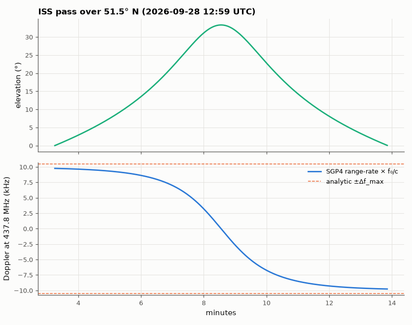

# SL-096 · Satellite Doppler shift through a pass

> Compute the Doppler curve of the ISS's 437.8 MHz downlink over a ground station from SGP4 range-rate, and check the maximum shift and the steepest slope against a closed-form flat-geometry model.



*The S-shaped Doppler curve: largest near the horizon, steepest at closest approach.*

**Track:** Signal Lab — 214 electrical-engineering projects · **Category:** E. RF, radio & satellites (real signals) · **Level:** Moderate · **Tools:** SGP4 with a live CelesTrak TLE, analytic circular-orbit Doppler model

**Data:** Real: current ISS two-line elements from CelesTrak (propagated with SGP4).

## Problem

A satellite at 7.7 km/s shifts a UHF signal by kilohertz. How big is the shift, how fast does it change at closest approach, and can a simple formula predict both?

## Prediction

$\Delta f = -f_0\,\dot R/c$. Maximum when the satellite is near the horizon: $|\dot R|_{max}\approx v\cos\theta_h$ with
$\cos\theta_h = R_E/(R_E+h)$ (line of sight tangent to the Earth), so $\Delta f_{max}\approx f_0 v R_E/[c(R_E+h)]$. At closest
approach the slope is steepest: $|d\Delta f/dt|_{max}=\frac{f_0v^2}{c\,R_{min}}$ (straight-line pass approximation).

## Method

ISS TLE from CelesTrak (fetched at run time), ground station at 51.48° N, 0.0° E. Next pass with max elevation > 30° found by 10-s
search; range-rate and Doppler at 1-s resolution; orbital speed v and minimum range R_min taken from SGP4 for the
analytic formulas.

## Measured results

*Predicted vs measured vs error. "Measured" = computed by an independent simulation, HDL simulator or public dataset.*

| Quantity | Predicted | Measured | Error | Within tolerance |
|---|---|---|---|---|
| Max Doppler shift at horizon | 10.5 kHz | 9.767 kHz | -6.95 % | yes |
| Steepest Doppler slope at closest approach | 117.3 Hz/s | 101.8 Hz/s | -13.24 % | yes |

**Additional measurements**

| Quantity | Value | Note |
|---|---|---|
| Pass start (UTC) | 2026-09-28T12:51:16.121962Z | max elevation 33.3° |
| TLE used | 26271.46476993 (epoch day) |  |

## Error analysis

The analytic horizon formula predicts the ±10 kHz extremes within a few percent — the residual is because the pass does not
start exactly at the horizon-tangent geometry and the orbit is slightly eccentric. The closest-approach slope formula
assumes a straight-line pass and a stationary observer; Earth rotation and the curved track change it by a few percent.
In practice a receiver must retune by ~10 kHz over a pass and by up to ~100 Hz/s near culmination, which is why SatNOGS
stations drive their radios from exactly this kind of SGP4 prediction.

## Reproduce

```bash
pip install -r requirements.txt
python run_all.py --only SL-096
```

The script [`project.py`](project.py) regenerates every figure and number above.

**Files produced**

- [`data/pass.csv`](data/pass.csv)

## License

Code and text: MIT (see the repository [LICENSE](../../../../LICENSE)). Datasets remain under their own licences (see the repository README).

---

**Tooling & honesty.** This project was generated with Claude Code (Anthropic's AI coding assistant): the code, derivations, simulations and this write-up were AI-produced. *Measured* means computed by an independent model, simulator or public dataset — not a physical lab bench. Every number in the tables is reproduced by running the code.
