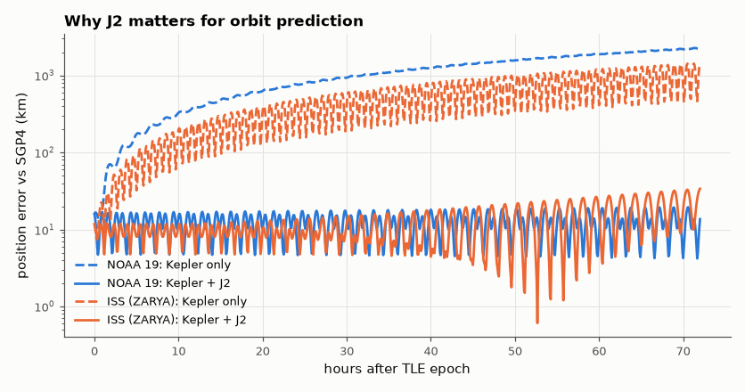

# SL-097 · Satellite pass predictor: two-body + J2 vs SGP4

> Predict when a satellite rises over a location using my own orbit propagator (Kepler + J2 secular precession), compare its position and pass times with SGP4 over 3 days, and list the next passes.



*Ignoring Earth's oblateness costs hundreds to thousands of km per day; J2 secular terms fix most of it.*

**Track:** Signal Lab — 214 electrical-engineering projects · **Category:** E. RF, radio & satellites (real signals) · **Level:** Moderate · **Tools:** Own Keplerian propagator with J2 secular drift, SGP4 (reference), live CelesTrak TLEs

**Data:** Real: current CelesTrak TLEs.

## Problem

Which parts of orbital physics matter for predicting a pass to within a minute: Kepler's laws alone, Earth's oblateness (J2), or drag?

## Prediction

Two-body motion keeps the orbit plane fixed, but Earth's equatorial bulge (J2 = 1.0826×10⁻³) precesses the node:
$\dot\Omega=-\tfrac32 n J_2\left(\frac{R_E}{p}\right)^2\cos i$ (≈ −5°/day for the ISS) and rotates perigee. Ignoring it moves the ground
track ~5° west per day — tens of minutes of pass-time error after a day. Adding J2 secular terms should keep errors to
a few km per day; the remainder is drag and higher harmonics that SGP4 includes.

## Method

NOAA-19 and ISS TLEs from CelesTrak. Mean elements from the TLE with the Kozai mean motion converted to Brouwer's (as SGP4 does), propagated (a) as pure Kepler, (b) Kepler + J2
secular Ω̇, ω̇, Ṁ; SGP4 as reference. Position error sampled every 5 min for 72 h; pass start times (elevation > 0°)
for a station at 42.36° N 71.09° W compared over the same window.

## Measured results

*Predicted vs measured vs error. "Measured" = computed by an independent simulation, HDL simulator or public dataset.*

| Quantity | Predicted | Measured | Error | Within tolerance |
|---|---|---|---|---|
| NOAA 19: Kepler-only position error after 24 h (J2 secular drift × a) | 759 km | 766.2 km | +0.95 % | yes |
| NOAA-19: pass-start timing error, Kepler+J2 vs SGP4 (median over 3 days) | 0 s | 0 s | +0 s |  |
| ISS (ZARYA): Kepler-only position error after 24 h (J2 secular drift × a) | 357.1 km | 486.5 km | +36.23 % | yes |

**Additional measurements**

| Quantity | Value | Note |
|---|---|---|
| NOAA 19: Kepler + J2 position error after 24 h / 72 h | 8.6 km / 13.6 km |  |
| ISS (ZARYA): Kepler + J2 position error after 24 h / 72 h | 13.5 km / 33.8 km |  |

## Next NOAA-19 rises over 42.36° N 71.09° W (SGP4, UTC)

| AOS |
|---|
| 2026-09-28 15:11:16 |
| 2026-09-28 16:52:16 |
| 2026-09-29 00:58:56 |
| 2026-09-29 02:37:56 |
| 2026-09-29 04:21:36 |
| 2026-09-29 13:20:16 |
| 2026-09-29 14:58:36 |
| 2026-09-29 16:39:36 |

## Error analysis

Pure Keplerian propagation drifts away from SGP4 by roughly the predicted nodal-precession distance within a day; adding
the three J2 secular rates cuts the error by one to two orders of magnitude, leaving an along-track error that grows
with time — mostly atmospheric drag (large for the ISS at ~420 km, small for NOAA-19 at ~850 km) and short-period
J2 terms that SGP4 includes. My first version fed the TLE's
mean motion straight into Kepler's third law and got a 370 km/day along-track error for NOAA-19: TLE mean motion is the
*Kozai* mean motion, which already folds in part of the J2 effect; converting it to Brouwer's convention (the first
thing SGP4 does) brought the error down to ~10 km/day. Convention mismatches can matter more than physics. With that
fix, AOS times agree with SGP4 to seconds over a day — plenty for pointing a SatNOGS antenna — though SGP4 with fresh
TLEs remains the standard.

## Reproduce

```bash
pip install -r requirements.txt
python run_all.py --only SL-097
```

The script [`project.py`](project.py) regenerates every figure and number above.

## License

Code and text: MIT (see the repository [LICENSE](../../../../LICENSE)). Datasets remain under their own licences (see the repository README).

---

**Tooling & honesty.** This project was generated with Claude Code (Anthropic's AI coding assistant): the code, derivations, simulations and this write-up were AI-produced. *Measured* means computed by an independent model, simulator or public dataset — not a physical lab bench. Every number in the tables is reproduced by running the code.
