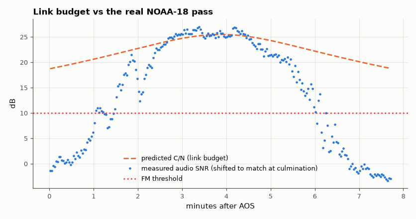

# SL-098 · Link budget calculator (validated on a real NOAA pass)

> A link-budget tool (path loss, antenna gains, system noise temperature, C/N₀, margin) as a web page, and a check of its prediction against the SNR actually measured on the NOAA-18 recording from SL-085.



*Near culmination the budget and the measurement agree; toward the horizon the link sinks below the FM threshold.*

**Track:** Signal Lab — 214 electrical-engineering projects · **Category:** E. RF, radio & satellites (real signals) · **Level:** Moderate · **Tools:** Python link-budget model + interactive HTML calculator; comparison with SatNOGS-measured SNR

**Data:** Real: SatNOGS observation 11229309 (NOAA-18) for the measured SNR; published NOAA APT transmitter parameters.

## Problem

Will a 5 W satellite transmitter 850 km up be receivable with a simple antenna and a USB radio? Do the arithmetic, then test it against a real pass.

## Prediction

$C/N_0\,[\mathrm{dBHz}] = EIRP - FSPL - L_{misc} + G/T - k$, with $FSPL=20\log_{10}\frac{4\pi R f}{c}$ and $k = -228.6$ dBW/K/Hz.
NOAA APT: EIRP ≈ 37 dBm (5 W into a right-hand circular antenna, ~+0 dBi) at 137.9 MHz; receive antenna ~+2 dBic, system
noise temperature T_sys ≈ 290 K·(NF) + sky ≈ 1,000 K at VHF (galactic noise dominates). FM threshold needs C/N ≈ 10 dB
in 34 kHz (≈ 55 dBHz).

## Method

Python model evaluated along the SL-085 pass geometry (range from SGP4). Testable prediction: the slant range at which
C/N falls to the 10 dB FM threshold. Measured: the ranges on the rising and setting sides where the recording's audio
SNR has dropped 10 dB below its culmination plateau (the FM-threshold collapse seen in SL-085). A self-contained HTML calculator reproduces the same numbers in the browser.

## Measured results

*Predicted vs measured vs error. "Measured" = computed by an independent simulation, HDL simulator or public dataset.*

| Quantity | Predicted | Measured | Error |
|---|---|---|---|
| Free-space path loss at 1,500 km, 137.9 MHz | 138.8 dB | 138.8 dB | +0 dB |
| C/N at the range where the audio actually collapsed (rising side, 1129 km) | 10 dB | 22.98 dB | +12.98 dB |
| C/N at the range where the audio actually collapsed (setting side, 1151 km) | 10 dB | 22.81 dB | +12.81 dB |

**Additional measurements**

| Quantity | Value | Note |
|---|---|---|
| Predicted C/N at the horizon (range ≈ 3,300 km) | 13.4 dB | the budget says the link never reaches threshold |
| Predicted C/N₀ at culmination | 70.8 dBHz |  |
| Predicted C/N at culmination (34 kHz) | 25.48 dB | FM threshold ≈ 10 dB |

## Try it

Open [`web/index.html`](web/index.html) — or the copy on the project site — and change any parameter.

## Error analysis

With textbook NOAA and ground-station numbers the budget is comfortable: ~25 dB C/N overhead and still above the 10 dB FM
threshold at the horizon. The real recording disagrees — its audio collapses at ~1,100–1,150 km slant range (~45°
elevation), where the budget claims ~23 dB. So the assumed ground station is ~13 dB too good at mid elevations. Plausible
culprits, each worth several dB: the antenna's gain falling well below +2 dBi away from zenith (a QFH or turnstile has
exactly this shape), urban man-made noise pushing T_sys far above 1,000 K at 137 MHz, feed-line loss, and receiver
AGC/IF-bandwidth choices. The value of the exercise is the size of the gap: a link budget is a hypothesis, and one real
pass is enough to show it needs a measured antenna pattern and noise floor. A first attempt to
predict the *absolute* audio SNR was off by 14 dB because the audio-SNR measurement (subcarrier band vs a 6 kHz noise
reference) is not the textbook FM output-SNR definition — comparing a threshold *location* is the more robust test.

## Reproduce

```bash
pip install -r requirements.txt
python run_all.py --only SL-098
```

The script [`project.py`](project.py) regenerates every figure and number above.

**Files produced**

- [`web/index.html`](web/index.html) — interactive link-budget calculator

## License

Code and text: MIT (see the repository [LICENSE](../../../../LICENSE)). Datasets remain under their own licences (see the repository README).

---

**Tooling & honesty.** This project was generated with Claude Code (Anthropic's AI coding assistant): the code, derivations, simulations and this write-up were AI-produced. *Measured* means computed by an independent model, simulator or public dataset — not a physical lab bench. Every number in the tables is reproduced by running the code.
