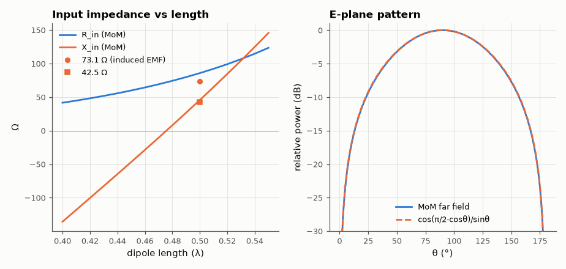
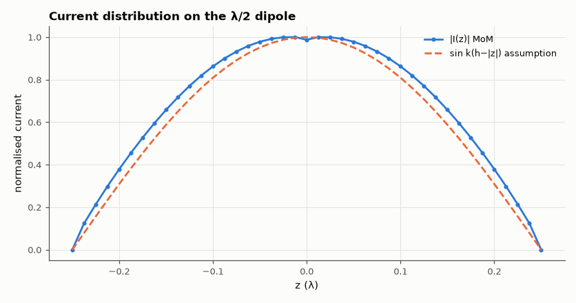

# SL-099 · Wire-antenna simulator by the method of moments

> Solve for the current on a dipole numerically, then compute input impedance vs length, resonance, directivity and pattern, and compare with the classical induced-EMF and sinusoidal-current results.



*The numerical dipole reproduces the classical resonance, pattern and directivity.*

**Track:** Signal Lab — 214 electrical-engineering projects · **Category:** E. RF, radio & satellites (real signals) · **Level:** Hard · **Tools:** Own thin-wire method-of-moments solver (piecewise-sinusoidal Galerkin, closed-form near fields)

**Data:** Simulated (numerical model in this repo).

## Problem

An antenna's pattern and impedance come from the current flowing on it, which nobody knows in advance. Find it numerically and check it against the few cases with textbook answers.

## Prediction

Galerkin MoM: expand the current in piecewise-sinusoidal 'V' functions, enforce the boundary condition in a weighted
sense, solve $\mathbf Z\mathbf I=\mathbf V$ with a delta-gap source. Induced-EMF theory (infinitely thin wire, assumed sinusoidal
current) gives $Z_{in}=73.1+j42.5\,\Omega$ at L = λ/2; finite radius a raises R and X and moves resonance to ≈ 0.47–0.48 λ.
The far-field pattern is ≈ $\cos(\frac\pi2\cos\theta)/\sin\theta$ with directivity 2.15 dBi and 78° beamwidth.

## Method

40 segments per wire; radius λ/1000 (and λ/10⁵ for the thin-wire limit); length sweep 0.40–0.55 λ; directivity by
integrating |E|² over the sphere.

## Measured results

*Predicted vs measured vs error. "Measured" = computed by an independent simulation, HDL simulator or public dataset.*

| Quantity | Predicted | Measured | Error | Within tolerance |
|---|---|---|---|---|
| λ/2 input resistance (a = λ/1000) vs induced-EMF 73.1 Ω | 73.1 Ω | 85.78 Ω | +17.35 % |  |
| λ/2 input resistance, thin-wire limit (a = λ/10⁵) | 73.1 Ω | 78.29 Ω | +7.10 % |  |
| λ/2 input reactance (a = λ/1000) | 42.5 Ω | 45.68 Ω | +3.181 Ω |  |
| Resonant length (X = 0) | 0.475 λ | 0.4757 λ | +0.14 % | yes |
| λ/2 dipole directivity | 2.15 dBi | 2.18 dBi | +0.03023 dBi |  |
| E-plane half-power beamwidth | 78 ° | 75.95 ° | -2.63 % | yes |

**Additional measurements**

| Quantity | Value | Note |
|---|---|---|
| Resistance at resonance | 72.05 Ω |  |



*The solved current is nearly — but not exactly — the assumed sinusoid.*

## Error analysis

Pattern, beamwidth and 2.15 dBi directivity match the sinusoidal-current theory closely, and resonance falls at ≈ 0.475 λ
as expected for a finite-radius wire. The input impedance at exactly λ/2 is higher than the famous 73 + j42.5 Ω:
86 + j46 Ω for a = λ/1000 and 78 + j44 Ω for a = λ/10⁵. The textbook number comes from
the induced-EMF method, which *assumes* a sinusoidal current on an infinitely thin wire; the MoM solves for the actual
current (the second figure shows it deviating from the sinusoid near the feed) and the delta-gap feed adds a
thickness-dependent correction. The trend toward 73 Ω as the wire thins is the check that the two agree in their
common limit. The same solver runs the Yagi in SL-100.

## Reproduce

```bash
pip install -r requirements.txt
python run_all.py --only SL-099
```

The script [`project.py`](project.py) regenerates every figure and number above.

**Files produced**

- [`data/impedance_sweep.csv`](data/impedance_sweep.csv)

## License

Code and text: MIT (see the repository [LICENSE](../../../../LICENSE)). Datasets remain under their own licences (see the repository README).

---

**Tooling & honesty.** This project was generated with Claude Code (Anthropic's AI coding assistant): the code, derivations, simulations and this write-up were AI-produced. *Measured* means computed by an independent model, simulator or public dataset — not a physical lab bench. Every number in the tables is reproduced by running the code.
