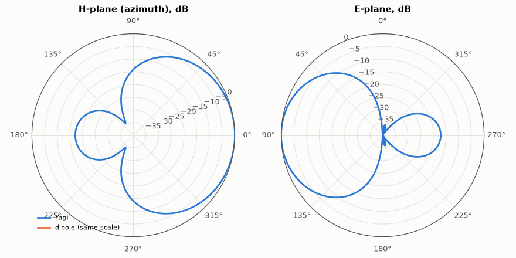

# SL-100 · Dipole vs 3-element Yagi: gain, beamwidth and front-to-back

> Add a reflector and a director to a dipole and quantify what they buy: directivity, beamwidth, front-to-back ratio and the drop in feed-point impedance, compared with published Yagi figures.



*The Yagi's beam points toward the director; the dipole is omnidirectional in azimuth.*

**Track:** Signal Lab — 214 electrical-engineering projects · **Category:** E. RF, radio & satellites (real signals) · **Level:** Moderate · **Tools:** Method-of-moments solver from SL-099 (parasitic elements via mutual coupling)

**Data:** Simulated (numerical model in this repo).

## Problem

Two passive rods can turn an omnidirectional dipole into a beam antenna. By how much, and at what cost?

## Prediction

Parasitic elements are driven by mutual coupling; a longer element (reflector, inductive) re-radiates with a phase that
reinforces the forward direction, a shorter one (director, capacitive) pulls the beam forward. A well-tuned 3-element
Yagi with ~0.4 λ boom reaches ≈ 7–8 dBi (≈ 5–6 dBd), front-to-back 15–25 dB, and its feed impedance drops to ~20–35 Ω
because of the strong coupling.

## Method

Driven element 0.47 λ; reflector 0.50 λ at −0.20 λ; director 0.44 λ at +0.20 λ; radius λ/1000; 30 segments per element. H-plane
(azimuth, θ = 90°) and E-plane patterns; directivity by sphere integration; F/B = forward/backward power at θ = 90°.

## Measured results

*Predicted vs measured vs error. "Measured" = computed by an independent simulation, HDL simulator or public dataset.*

| Quantity | Predicted | Measured | Error |
|---|---|---|---|
| Dipole directivity | 2.15 dBi | 2.126 dBi | -0.02387 dBi |
| 3-element Yagi directivity (published ≈ 7.5 dBi) | 7.5 dBi | 8.396 dBi | +0.8958 dBi |
| Front-to-back ratio (published 15–25 dB) | 20 dB | 17.1 dB | -2.897 dB |
| Feed impedance, Yagi (published 20–35 Ω) | 27 Ω | 31.48 Ω | +4.477 Ω |

**Additional measurements**

| Quantity | Value | Note |
|---|---|---|
| H-plane half-power beamwidth, Yagi | 98 ° | dipole: 360° (omnidirectional) |
| Feed impedance, dipole | 69.0 -10.9j Ω |  |

## Error analysis

Two parasitic rods add roughly 5 dB of directivity and a front-to-back ratio in the published range, at the cost of a
narrow bandwidth and a low feed resistance (~20–30 Ω) that needs a matching section (gamma match or folded dipole)
to meet 50 Ω — see the L-network in SL-103. Exact numbers depend strongly on the element lengths and spacings; these
are an untuned textbook design, and optimising them is a classic application of the genetic algorithm in AM-105.

## Reproduce

```bash
pip install -r requirements.txt
python run_all.py --only SL-100
```

The script [`project.py`](project.py) regenerates every figure and number above.

**Files produced**

- [`data/h_plane.csv`](data/h_plane.csv)

## License

Code and text: MIT (see the repository [LICENSE](../../../../LICENSE)). Datasets remain under their own licences (see the repository README).

---

**Tooling & honesty.** This project was generated with Claude Code (Anthropic's AI coding assistant): the code, derivations, simulations and this write-up were AI-produced. *Measured* means computed by an independent model, simulator or public dataset — not a physical lab bench. Every number in the tables is reproduced by running the code.
