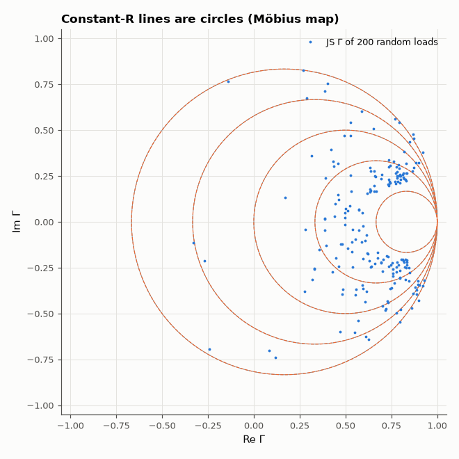

# SL-101 · Interactive Smith chart

> A browser Smith chart: type a load impedance and frequency, see Γ, VSWR and return loss, add a series or shunt L/C and watch the point move along constant-R / constant-G circles. The JavaScript maths is verified against NumPy.



*Mapped constant-resistance lines (grey) coincide with the predicted circles (dashed).*

**Track:** Signal Lab — 214 electrical-engineering projects · **Category:** E. RF, radio & satellites (real signals) · **Level:** Hard · **Tools:** HTML canvas + JavaScript (shared math module), Node test harness vs NumPy

**Data:** Simulated (numerical model in this repo).

## Problem

The Smith chart is a graphical calculator for impedance matching. Build a working one and prove every number it shows is right.

## Prediction

$\Gamma=\frac{Z-Z_0}{Z+Z_0}$ maps the right half of the impedance plane onto the unit disc (a Möbius transformation).
Constant-resistance lines become circles centred at $(\frac{r}{1+r},0)$ with radius $\frac1{1+r}$; VSWR = $\frac{1+|\Gamma|}{1-|\Gamma|}$,
return loss = $-20\log_{10}|\Gamma|$. A series reactance moves the point along its constant-r circle; a shunt susceptance along a
constant-g circle.

## Method

smith.js holds the maths (Γ, VSWR, RL, series/shunt element steps); index.html draws the chart and the matching path.
Node evaluates the functions on 200 random loads and element steps; Python compares with NumPy complex arithmetic.

## Measured results

*Predicted vs measured vs error. "Measured" = computed by an independent simulation, HDL simulator or public dataset.*

| Quantity | Predicted | Measured | Error |
|---|---|---|---|
| Γ: max |JS − NumPy| over 200 loads | 0 | 2.4825e-16 | +2.4825e-16 |
| VSWR: max relative difference | 0 | 9.0566e-14 | +9.0566e-14 |
| Return loss: max difference | 0 dB | 3.5527e-15 dB | +3.5527e-15 dB |
| Shunt-element step: max relative difference | 0 | 3.7859e-16 | +3.7859e-16 |

## Try it

Open [`web/index.html`](web/index.html) (or the project site copy): enter a load, then add series/shunt L or C and watch the matching path.

## Error analysis

Every quantity the web chart displays agrees with NumPy to floating-point precision, and the mapped constant-resistance
lines land exactly on the predicted circles — the Möbius transformation maps lines to circles, which is the whole reason
the chart works. Keeping the maths in a module shared by the page and a Node test is what makes that check possible.

## Reproduce

```bash
pip install -r requirements.txt
python run_all.py --only SL-101
```

The script [`project.py`](project.py) regenerates every figure and number above.

**Files produced**

- [`web/smith.js`](web/smith.js) — Smith-chart maths (shared)
- [`web/index.html`](web/index.html) — interactive chart
- [`web/test_smith.js`](web/test_smith.js) — Node test harness

## License

Code and text: MIT (see the repository [LICENSE](../../../../LICENSE)). Datasets remain under their own licences (see the repository README).

---

**Tooling & honesty.** This project was generated with Claude Code (Anthropic's AI coding assistant): the code, derivations, simulations and this write-up were AI-produced. *Measured* means computed by an independent model, simulator or public dataset — not a physical lab bench. Every number in the tables is reproduced by running the code.
