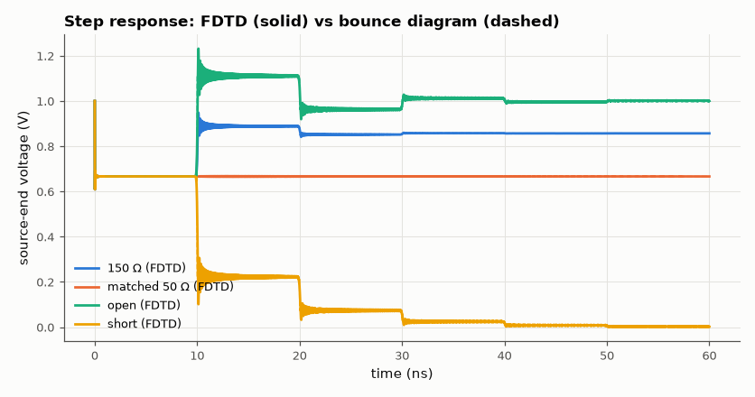
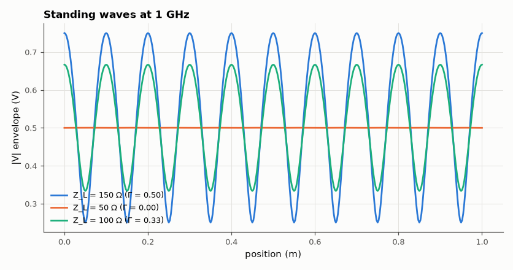

# SL-102 · Transmission-line reflections, standing waves and VSWR

> Launch a step and a sine onto a 50 Ω line terminated in 150 Ω, 50 Ω, open and short loads; compare the time-domain voltage at the source with the bounce-diagram prediction and the standing-wave ratio with (1+|Γ|)/(1−|Γ|).



*Every step in the waveform is one round trip of the reflection.*

**Track:** Signal Lab — 214 electrical-engineering projects · **Category:** E. RF, radio & satellites (real signals) · **Level:** Moderate · **Tools:** 1-D FDTD solution of the telegrapher's equations (NumPy), bounce-diagram prediction

**Data:** Simulated (numerical model in this repo).

## Problem

What really happens when a fast edge hits a mismatched load, and how does that become a standing wave for a continuous sine?

## Prediction

Load reflection $\Gamma_L=\frac{Z_L-Z_0}{Z_L+Z_0}$, source $\Gamma_S=\frac{Z_S-Z_0}{Z_S+Z_0}$. A step $V_s$ launches $V^+=V_s\frac{Z_0}{Z_S+Z_0}$;
after each round trip 2T the source voltage changes by the next bounce term, converging to $V_s\frac{Z_L}{Z_S+Z_L}$.
For a sine, the envelope along the line varies between $|V^+|(1\pm|\Gamma_L|)$: VSWR = $\frac{1+|\Gamma|}{1-|\Gamma|}$.

## Method

Lossless line, L′ = 250 nH/m, C′ = 100 pF/m (Z₀ = 50 Ω, v = 2×10⁸ m/s), 1 m long, 400 cells, leapfrog update at Courant number 0.5, resistive source 25 Ω and resistive/open/short loads implemented as boundary conditions. Step
response vs bounce diagram; 1 GHz sine for VSWR.

## Measured results

*Predicted vs measured vs error. "Measured" = computed by an independent simulation, HDL simulator or public dataset.*

| Quantity | Predicted | Measured | Error | Within tolerance |
|---|---|---|---|---|
| 150 Ω: settled source voltage | 857.1 mV | 857.1 mV | -53.98 µV |  |
| 150 Ω: first-step voltage V⁺ = V_s·Z₀/(Z_S+Z₀) | 666.7 mV | 666.7 mV | -0.00 % | yes |
| 150 Ω: voltage after first reflection returns (t = 2T+) | 888.9 mV | 891.3 mV | +0.27 % | yes |
| matched 50 Ω: settled source voltage | 666.7 mV | 666.5 mV | -170.1 µV |  |
| open: settled source voltage | 1 V | 1 V | +222.8 µV |  |
| short: settled source voltage | 0 V | 2.368 mV | +2.368 mV |  |
| VSWR, Z_L = 150 Ω | 3 | 2.998 | -0.06 % | yes |
| VSWR, Z_L = 50 Ω | 1 | 1.001 | +0.06 % | yes |
| VSWR, Z_L = 100 Ω | 2 | 1.999 | -0.06 % | yes |



*Matched line: flat envelope. Mismatch: peaks every λ/2 with ratio = VSWR.*

## Error analysis

The FDTD waveform steps where and by how much the bounce diagram says; the small overshoot on each edge is the numerical
dispersion of the Courant-0.5 leapfrog scheme (a first attempt at Courant number 1 with a lumped source node went unstable
— boundary conditions are the delicate part of FDTD). The final voltage is simply the DC divider V_s·Z_L/(Z_S+Z_L) — the reflections are
how the line 'discovers' the load. For a sine the reflections superpose into a standing wave whose max/min ratio is
the VSWR; a matched load gives a flat envelope. Real lines add loss (the steps round off) and dispersion.

## Reproduce

```bash
pip install -r requirements.txt
python run_all.py --only SL-102
```

The script [`project.py`](project.py) regenerates every figure and number above.

## License

Code and text: MIT (see the repository [LICENSE](../../../../LICENSE)). Datasets remain under their own licences (see the repository README).

---

**Tooling & honesty.** This project was generated with Claude Code (Anthropic's AI coding assistant): the code, derivations, simulations and this write-up were AI-produced. *Measured* means computed by an independent model, simulator or public dataset — not a physical lab bench. Every number in the tables is reproduced by running the code.
