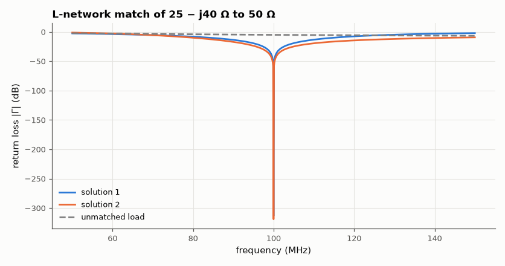

# SL-103 · L-network impedance-matching designer

> Solve the two-element L-network that matches an arbitrary load (e.g. a 25 − j40 Ω antenna) to 50 Ω at 100 MHz, choose L/C values, then verify the match and bandwidth by circuit simulation.



*Both solutions reach a perfect match at 100 MHz; bandwidth is set by the network Q.*

**Track:** Signal Lab — 214 electrical-engineering projects · **Category:** E. RF, radio & satellites (real signals) · **Level:** Moderate · **Tools:** Analytic L-network solver + verification in the eelab mini-SPICE (AC analysis)

**Data:** Simulated (numerical model in this repo).

## Problem

A load that isn't 50 Ω reflects power. What two components cancel the mismatch, and how wide is the resulting match?

## Prediction

For R_L < R_S: series element $X_s$ then shunt $B$: $B=\pm\frac{\sqrt{R_L/R_S}\cdots}{}$ — in closed form (Pozar 5.1)
$X=\pm\sqrt{R_L(R_S-R_L)}-X_L$, $B=\pm\frac{\sqrt{(R_S-R_L)/R_L}}{R_S}$. The loaded Q is $Q=\sqrt{R_S/R_L-1}$ and the
fractional bandwidth for a given VSWR scales roughly as $\approx\frac{1}{Q}\cdot\frac{VSWR-1}{\sqrt{VSWR}}$; lower Q → wider match.

## Method

Load 25 − j40 Ω at 100 MHz (modelled as 25 Ω + 39.8 pF). Both L-network solutions computed; component values from X and B.
Verification: a 50 Ω source driving the network + load in the mini-SPICE AC sweep 50–150 MHz; Γ at the input from the
simulated input impedance; VSWR ≤ 2 bandwidth measured.

## Measured results

*Predicted vs measured vs error. "Measured" = computed by an independent simulation, HDL simulator or public dataset.*

| Quantity | Predicted | Measured | Error | Within tolerance |
|---|---|---|---|---|
| Solution 1: |Γ| at 100 MHz | 0 | 2.1316e-16 | +2.1316e-16 |  |
| Solution 1: VSWR ≤ 2 bandwidth (≈ f₀/Q·(VSWR−1)/√VSWR estimate) | 70.71 MHz | 32.5 MHz | -54.04 % | yes |
| Solution 2: |Γ| at 100 MHz | 0 | 1.1102e-16 | +1.1102e-16 |  |
| Solution 2: VSWR ≤ 2 bandwidth (≈ f₀/Q·(VSWR−1)/√VSWR estimate) | 70.71 MHz | 69.3 MHz | -2.00 % | yes |

**Additional measurements**

| Quantity | Value | Note |
|---|---|---|
| Solution 1 components | series L = 103.45 nH, shunt C = 31.83 pF |  |
| Solution 2 components | series L = 23.87 nH, shunt L = 79.58 nH |  |

## Error analysis

Both closed-form L-network solutions produce a reflection coefficient of essentially zero at 100 MHz in the independent
circuit simulation, confirming the algebra (and the component values the web Smith chart in SL-101 would trace). The
bandwidth estimate from the loaded Q is only a rough guide — it ignores that the load's own reactance also varies with
frequency — which is why the two solutions, having the same Q, still have different bandwidths. For wider bandwidth use
two cascaded L-sections through an intermediate impedance (lower Q per section).

## Reproduce

```bash
pip install -r requirements.txt
python run_all.py --only SL-103
```

The script [`project.py`](project.py) regenerates every figure and number above.

**Files produced**

- [`simulation/l_match.cir`](simulation/l_match.cir) — SPICE netlist (solution 1)

## License

Code and text: MIT (see the repository [LICENSE](../../../../LICENSE)). Datasets remain under their own licences (see the repository README).

---

**Tooling & honesty.** This project was generated with Claude Code (Anthropic's AI coding assistant): the code, derivations, simulations and this write-up were AI-produced. *Measured* means computed by an independent model, simulator or public dataset — not a physical lab bench. Every number in the tables is reproduced by running the code.
