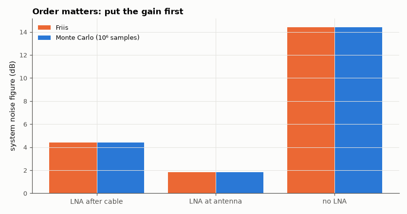

# SL-104 · Noise-figure cascade (Friis) vs Monte Carlo

> Compute the noise figure of a receiver chain (antenna cable, LNA, mixer, IF amp) with the Friis formula and confirm it by pushing actual noise samples through the chain; show why the LNA must come first.



*The same parts give ~1.3 dB or ~4 dB system NF depending only on order.*

**Track:** Signal Lab — 214 electrical-engineering projects · **Category:** E. RF, radio & satellites (real signals) · **Level:** Moderate · **Tools:** Friis formula + sample-level noise simulation of a 4-stage receiver chain (NumPy)

**Data:** Simulated (numerical model in this repo).

## Problem

Why does a 1 dB-noise-figure preamp at the antenna beat a much better receiver at the end of a lossy cable?

## Prediction

Friis: $F_{tot}=F_1+\frac{F_2-1}{G_1}+\frac{F_3-1}{G_1G_2}+\cdots$ (linear). A passive loss L at T₀ has F = L. Each stage adds
input-referred noise $(F_i-1)kT_0B$ at its own input; referring everything to the chain input and comparing output SNR
with input SNR gives the same F.

## Method

Stages: cable (loss 3 dB), LNA (G = 20 dB, NF = 1 dB), mixer (G = −7 dB, NF = 8 dB), IF amp (G = 30 dB, NF = 4 dB). Two orderings:
cable → LNA → … (preamp at the receiver) and LNA → cable → … (preamp at the antenna). Simulation: Gaussian noise at kT₀B
(normalised) plus a test tone, each stage multiplies by √G and adds independent noise of power (F−1)kT₀B·G; SNR ratio
from 10⁶ samples.

## Measured results

*Predicted vs measured vs error. "Measured" = computed by an independent simulation, HDL simulator or public dataset.*

| Quantity | Predicted | Measured | Error |
|---|---|---|---|
| cable → LNA → mixer → IF: noise figure | 4.423 dB | 4.42 dB | -0.002924 dB |
| LNA → cable → mixer → IF: noise figure | 1.836 dB | 1.834 dB | -0.001534 dB |
| no LNA: cable → mixer → IF: noise figure | 14.43 dB | 14.42 dB | -0.004312 dB |

**Additional measurements**

| Quantity | Value | Note |
|---|---|---|
| Noise temperature, LNA at antenna | 152.5 K |  |
| Noise temperature, LNA after cable | 513 K |  |

## Error analysis

The Monte Carlo noise figures agree with Friis to within sampling error (~0.01 dB with 10⁶ samples). Putting the LNA at the
antenna makes the system NF ≈ the LNA's own NF because its 20 dB of gain divides every later stage's contribution; after
the cable the 3 dB loss adds directly to the NF. This is why satellite ground stations — including the SatNOGS station
in SL-085 — mount the preamp at the antenna.

## Reproduce

```bash
pip install -r requirements.txt
python run_all.py --only SL-104
```

The script [`project.py`](project.py) regenerates every figure and number above.

## License

Code and text: MIT (see the repository [LICENSE](../../../../LICENSE)). Datasets remain under their own licences (see the repository README).

---

**Tooling & honesty.** This project was generated with Claude Code (Anthropic's AI coding assistant): the code, derivations, simulations and this write-up were AI-produced. *Measured* means computed by an independent model, simulator or public dataset — not a physical lab bench. Every number in the tables is reproduced by running the code.
