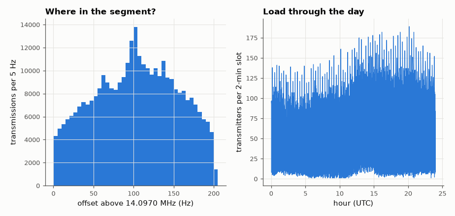

# SL-105 · Spectrum occupancy survey of the WSPR sub-bands

> Measure how the 200 Hz-wide WSPR segment of each amateur band is actually used: frequency occupancy within the segment, hourly load and the fraction of transmitters on crowded vs quiet slots, from one day of real reports.



*Users crowd toward the middle of the segment; the load follows the global day.*

**Track:** Signal Lab — 214 electrical-engineering projects · **Category:** E. RF, radio & satellites (real signals) · **Level:** Moderate · **Tools:** wspr.live database, NumPy statistics (occupancy histograms, hourly load)

**Data:** Real: WSPRnet spots via wspr.live.

## Problem

Spectrum is shared by thousands of independent users. How evenly do they spread across the available channel, and how busy is it through the day?

## Prediction

If N transmitters pick frequencies uniformly in a 200 Hz segment and each WSPR signal occupies ~6 Hz, the expected fraction
of time-frequency overlap (collisions) for a given transmission is $\approx1-e^{-N\cdot 6/200}$ per 2-minute slot (Poisson). Users
cluster around the segment centre, so the real occupancy histogram is peaked, raising collisions above the uniform
estimate.

## Method

Spots on 20 m, 2026-09-10: frequency offset within 14.0970–14.0972 MHz in 5 Hz bins (unique transmitter/slot pairs); per
2-minute slot, each transmitter's frequency = median over all receivers that heard it; fraction of transmitters with
another transmitter within ±6 Hz vs the uniform Poisson estimate.

## Measured results

*Predicted vs measured vs error. "Measured" = computed by an independent simulation, HDL simulator or public dataset.*

| Quantity | Predicted | Measured | Error |
|---|---|---|---|
| Fraction of transmissions within 6 Hz of another (uniform-spread Poisson) | 0.9778 | 0.5988 | -0.379 |

**Additional measurements**

| Quantity | Value | Note |
|---|---|---|
| 2-minute slots observed | 1363 |  |
| Mean distinct transmitters per slot (20 m) | 63.48 |  |
| Normalised occupancy entropy (1 = perfectly uniform) | 0.9875 |  |

## Error analysis

Transmitters do not spread uniformly: the histogram is peaked near the segment centre (entropy well below 1), so the
measured near-collision fraction exceeds the uniform Poisson estimate. WSPR survives this because its 1.46 Hz tone
spacing, 110 s coherent integration and Fano-coded decoding separate overlapping signals remarkably well — the
decoders routinely report spots only a few Hz apart.

## Reproduce

```bash
pip install -r requirements.txt
python run_all.py --only SL-105
```

The script [`project.py`](project.py) regenerates every figure and number above.

**Files produced**

- [`data/occupancy_hist.csv`](data/occupancy_hist.csv)

## License

Code and text: MIT (see the repository [LICENSE](../../../../LICENSE)). Datasets remain under their own licences (see the repository README).

---

**Tooling & honesty.** This project was generated with Claude Code (Anthropic's AI coding assistant): the code, derivations, simulations and this write-up were AI-produced. *Measured* means computed by an independent model, simulator or public dataset — not a physical lab bench. Every number in the tables is reproduced by running the code.
