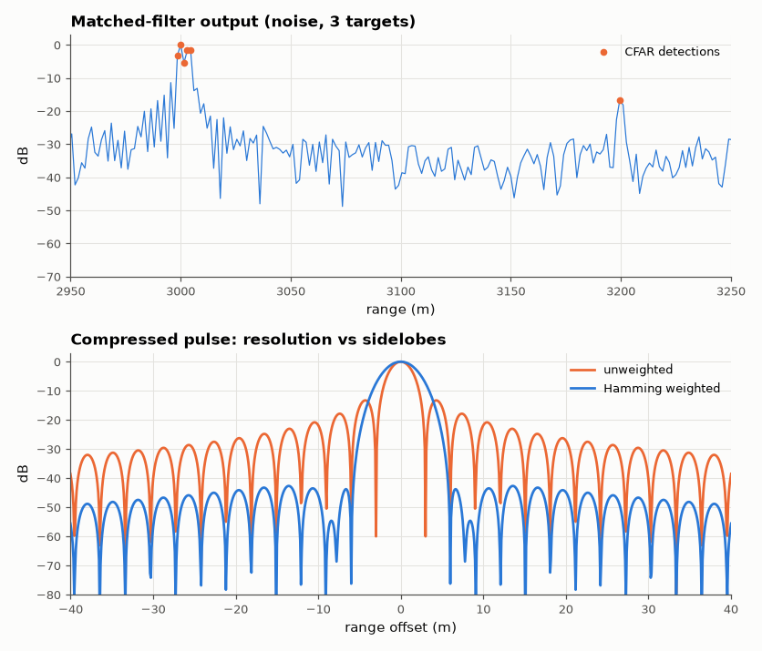

# SL-106 · Pulse-compression radar: range resolution and processing gain

> Simulate a chirp radar with two closely spaced targets in noise: measure range resolution, compression ratio, processing gain and sidelobes of the matched filter and compare with c/(2B), TB and the sinc/Taylor theory.



*A 20 µs pulse compresses to ~20 ns; weighting trades resolution for low sidelobes.*

**Track:** Signal Lab — 214 electrical-engineering projects · **Category:** E. RF, radio & satellites (real signals) · **Level:** Hard · **Tools:** NumPy/SciPy: linear-FM chirp, matched filter, windowing, CFAR detection

**Data:** Simulated (numerical model in this repo).

## Problem

Radars need long pulses for energy but short pulses for resolution. How does a chirp give both?

## Prediction

A linear-FM pulse of length T and bandwidth B compressed by its matched filter behaves like a pulse of width ≈ 1/B:
range resolution $\Delta R=c/(2B)$, compression ratio = TB, SNR gain = TB (energy E = PT collected into one sample).
Unweighted compressed response has −13.3 dB range sidelobes; a Hamming weighting lowers them to ≈ −42 dB at the cost
of ~1.4× wider main lobe.

## Method

B = 50 MHz, T = 20 µs (TB = 1000), sampled at 100 MS/s complex. Targets at 3,000 m and 3,000 m + 3.5 m (just beyond ΔR = 3 m) and a
weak target (−15 dB) at 3,200 m; per-sample input SNR 0 dB for the strong targets (−15 dB for the weak one). Measured: −3 dB compressed width, SNR before/after,
separation of the close pair, peak sidelobe with and without Hamming weighting, and a cell-averaging CFAR detection.

## Measured results

*Predicted vs measured vs error. "Measured" = computed by an independent simulation, HDL simulator or public dataset.*

| Quantity | Predicted | Measured | Error | Within tolerance |
|---|---|---|---|---|
| Compressed −3 dB width (≈ 0.886/B) | 17.72 ns | 18.12 ns | +2.29 % | yes |
| Range resolution c/(2B) | 3 m | 3.069 m | +2.29 % | yes |
| Processing gain vs per-sample SNR = 10·log₁₀(T·f_s) | 33.01 dB | 32.99 dB | -0.02327 dB |  |
| Peak range sidelobe, unweighted | -13.3 dB | -13.28 dB | +0.0242 dB |  |
| Peak range sidelobe, Hamming-weighted | -42 dB | -42.66 dB | -0.664 dB |  |
| Weak (−15 dB) target detected by CA-CFAR | 1 | 1 | +0 |  |

**Additional measurements**

| Quantity | Value | Note |
|---|---|---|
| Processing gain referred to the signal bandwidth B | 29.98 dB | TB = 1000 → 30.0 dB |
| Dip between the two targets 3.5 m apart | -3.872 dB | resolved if a clear dip exists |

## Error analysis

The 20 µs chirp compresses to the width of a 50 MHz pulse (≈ 3 m resolution). Processing gain has two honest
definitions: against per-sample SNR it is T·f_s = 2,000 (33 dB) because the complex samples see noise in the full 100 MHz,
and against SNR in the signal's own 50 MHz band it is TB = 1,000 (30 dB) — my first prediction mixed the two. After
compression the −15 dB reflector stands well clear of the noise and CFAR finds it. (An earlier draft claimed a −30 dB
target at −20 dB input SNR would be detected; the numbers say it sits 17 dB *below* the noise even after compression.) Unweighted, the −13 dB sidelobes of the strong pair would mask weak targets nearby; Hamming weighting pushes
them below −40 dB, and the price is a wider main lobe — the two targets 3.5 m apart are resolved unweighted but merge
when weighted.

## Reproduce

```bash
pip install -r requirements.txt
python run_all.py --only SL-106
```

The script [`project.py`](project.py) regenerates every figure and number above.

## License

Code and text: MIT (see the repository [LICENSE](../../../../LICENSE)). Datasets remain under their own licences (see the repository README).

---

**Tooling & honesty.** This project was generated with Claude Code (Anthropic's AI coding assistant): the code, derivations, simulations and this write-up were AI-produced. *Measured* means computed by an independent model, simulator or public dataset — not a physical lab bench. Every number in the tables is reproduced by running the code.
