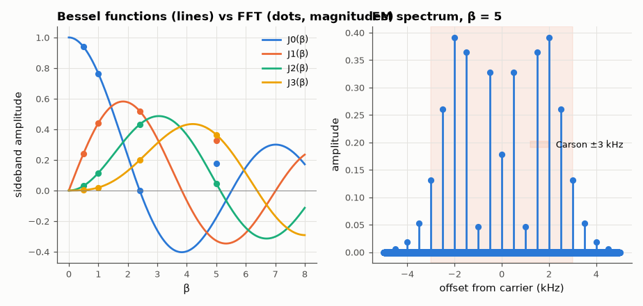

# SL-107 · AM / FM / PM modulation visualiser

> An in-browser explainer that draws AM, FM and PM waveforms and spectra live as you move the sliders; the spectra it shows are checked in Python against Bessel-function sideband amplitudes and Carson's rule.



*Sideband amplitudes follow |J_n(β)|; the carrier vanishes at β ≈ 2.405.*

**Track:** Signal Lab — 214 electrical-engineering projects · **Category:** F. Communication systems · **Level:** Easy · **Tools:** HTML/JS interactive explainer + NumPy verification of spectra (Bessel sidebands, Carson's rule)

**Data:** Simulated (numerical model in this repo).

## Problem

Three ways of putting a message on a carrier look similar in time but very different in frequency. Make the difference visible and verify it numerically.

## Prediction

AM: carrier + two sidebands of amplitude m/2. FM/PM with a sinusoidal message: $\cos(\omega_ct+\beta\sin\omega_mt)=\sum_n J_n(\beta)\cos((\omega_c+n\omega_m)t)$,
so the n-th sideband amplitude is $|J_n(\beta)|$ — the carrier vanishes at β = 2.405. Carson's rule: 98 % of the power lies
within $B\approx2(\beta+1)f_m$.

## Method

Signals synthesised at 100 kHz, carrier 10 kHz, message 500 Hz; FFT sideband amplitudes vs J_n(β) for β = 0.5, 1, 2.405, 5; 98 %-power
bandwidth vs Carson. The web page (web/index.html) computes the same spectra with a JS DFT.

## Measured results

*Predicted vs measured vs error. "Measured" = computed by an independent simulation, HDL simulator or public dataset.*

| Quantity | Predicted | Measured | Error | Within tolerance |
|---|---|---|---|---|
| β = 0.5: max |sideband − |J_n(β)|| | 0 | 1.6586e-13 | +1.6586e-13 |  |
| β = 0.5: 98 %-power bandwidth vs Carson 2(β+1)f_m | 1.5 kHz | 1 kHz | -33.33 % | **no** |
| β = 1.0: max |sideband − |J_n(β)|| | 0 | 7.9351e-14 | +7.9351e-14 |  |
| β = 1.0: 98 %-power bandwidth vs Carson 2(β+1)f_m | 2 kHz | 2 kHz | +0.00 % | yes |
| β = 2.405: max |sideband − |J_n(β)|| | 0 | 1.3502e-13 | +1.3502e-13 |  |
| β = 2.405: 98 %-power bandwidth vs Carson 2(β+1)f_m | 3.405 kHz | 3 kHz | -11.89 % | yes |
| β = 5.0: max |sideband − |J_n(β)|| | 0 | 1.5749e-13 | +1.5749e-13 |  |
| β = 5.0: 98 %-power bandwidth vs Carson 2(β+1)f_m | 6 kHz | 6 kHz | +0.00 % | yes |

## Try it

Open [`web/index.html`](web/index.html) (or the project site copy) and drag the index slider.

## Error analysis

FFT sideband magnitudes equal |J_n(β)| to numerical precision, including the vanishing carrier at β = 2.405 (the classic
way to calibrate an FM deviation meter). Carson's rule captures ≥ 98 % of the power as advertised; it is slightly
generous at small β and slightly tight at large β, where the 98 % contour is set by the last significant Bessel term.

## Reproduce

```bash
pip install -r requirements.txt
python run_all.py --only SL-107
```

The script [`project.py`](project.py) regenerates every figure and number above.

**Files produced**

- [`web/index.html`](web/index.html) — interactive explainer

## License

Code and text: MIT (see the repository [LICENSE](../../../../LICENSE)). Datasets remain under their own licences (see the repository README).

---

**Tooling & honesty.** This project was generated with Claude Code (Anthropic's AI coding assistant): the code, derivations, simulations and this write-up were AI-produced. *Measured* means computed by an independent model, simulator or public dataset — not a physical lab bench. Every number in the tables is reproduced by running the code.
