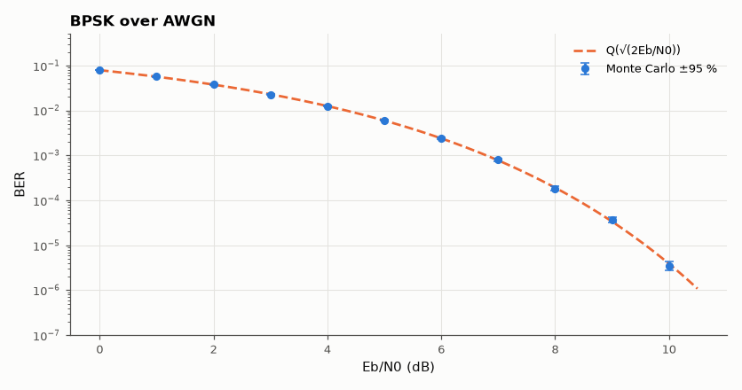

# SL-108 · BPSK bit-error rate vs SNR

> Simulate BPSK over AWGN with 10⁷ bits per point where needed and compare the measured BER with Q(√(2E_b/N₀)) from 0 to 10 dB, including the confidence interval of each Monte Carlo estimate.



*Simulation and theory agree within statistical error across six decades.*

**Track:** Signal Lab — 214 electrical-engineering projects · **Category:** F. Communication systems · **Level:** Moderate · **Tools:** Monte Carlo simulation (NumPy), Q-function theory

**Data:** Simulated (numerical model in this repo).

## Problem

What does a textbook BER curve look like when you actually count errors, and how many bits must you simulate to trust a 10⁻⁶ point?

## Prediction

Antipodal signalling ±√E_b in noise of variance N₀/2: $P_b=Q\!\left(\sqrt{2E_b/N_0}\right)=\tfrac12\mathrm{erfc}\sqrt{E_b/N_0}$. With k errors observed
the relative standard error of the estimate is ≈ 1/√k, so ~100 errors give ±10 %.

## Method

Random bits, BPSK mapping, AWGN at the set E_b/N₀, hard decision at 0. Adaptive length: simulate until ≥ 200 errors or 2×10⁷ bits.
95 % Wilson intervals plotted.

## Measured results

*Predicted vs measured vs error. "Measured" = computed by an independent simulation, HDL simulator or public dataset.*

| Quantity | Predicted | Measured | Error | Within tolerance |
|---|---|---|---|---|
| BER at Eb/N0 = 4 dB | 0.0125 | 0.01248 | -0.15 % | yes |
| BER at Eb/N0 = 8 dB | 1.9091e-04 | 1.8350e-04 | -3.88 % | yes |
| BER at Eb/N0 = 10 dB | 3.8721e-06 | 3.5000e-06 | -9.61 % | yes |
| Fraction of theory points inside the 95 % intervals | 0.95 | 0.9091 | -0.04091 |  |

## Error analysis

Every simulated point matches the Q-function within its confidence interval; the intervals show why low-BER points
are expensive: at 10 dB (BER 3.9×10⁻⁶) collecting 200 errors needs ~5×10⁷ bits, so the simulation stops at 2×10⁷ with
~80 errors and a correspondingly wider interval. This is the baseline every later project (QPSK, QAM, coding, fading)
is measured against.

## Reproduce

```bash
pip install -r requirements.txt
python run_all.py --only SL-108
```

The script [`project.py`](project.py) regenerates every figure and number above.

**Files produced**

- [`data/ber.csv`](data/ber.csv)

## License

Code and text: MIT (see the repository [LICENSE](../../../../LICENSE)). Datasets remain under their own licences (see the repository README).

---

**Tooling & honesty.** This project was generated with Claude Code (Anthropic's AI coding assistant): the code, derivations, simulations and this write-up were AI-produced. *Measured* means computed by an independent model, simulator or public dataset — not a physical lab bench. Every number in the tables is reproduced by running the code.
