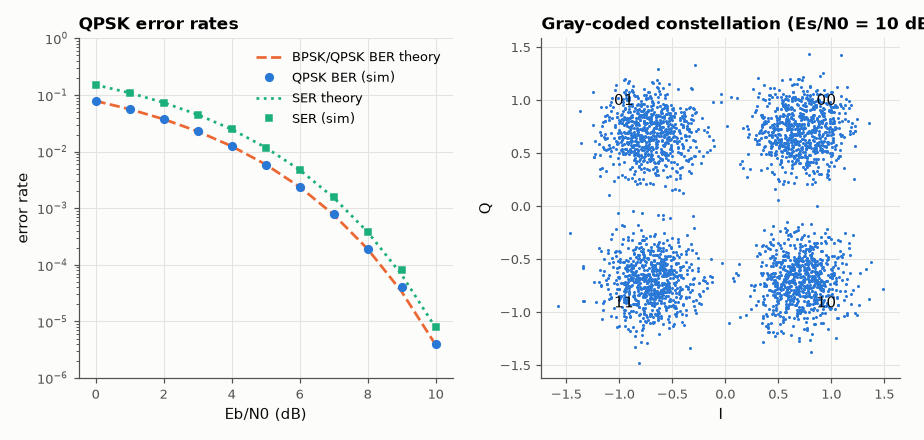

# SL-109 · QPSK: twice the bits, same BER

> Show that Gray-coded QPSK carries 2 bits/symbol with exactly the BPSK bit-error rate per E_b/N₀, measure the symbol error rate against 2Q − Q², and demonstrate the double data rate in the same bandwidth.



*Per-bit performance identical to BPSK; one symbol error usually costs only one bit thanks to Gray coding.*

**Track:** Signal Lab — 214 electrical-engineering projects · **Category:** F. Communication systems · **Level:** Moderate · **Tools:** Monte Carlo (NumPy), Gray-mapped QPSK, constellation and SER theory

**Data:** Simulated (numerical model in this repo).

## Problem

How can QPSK double the data rate without costing any power efficiency?

## Prediction

QPSK = two independent BPSK streams on cos and sin (I and Q). Per bit the energy and noise are unchanged, so
$P_b=Q(\sqrt{2E_b/N_0})$; symbol error $P_s=2Q-Q^2$ with $Q=Q(\sqrt{E_s/N_0})$, $E_s=2E_b$. Spectral efficiency 2 bit/s/Hz (Nyquist)
vs 1 for BPSK.

## Method

10⁶ symbols per point, Gray map 00→(+,+), 01→(−,+), 11→(−,−), 10→(+,−), AWGN, minimum-distance decisions.

## Measured results

*Predicted vs measured vs error. "Measured" = computed by an independent simulation, HDL simulator or public dataset.*

| Quantity | Predicted | Measured | Error | Within tolerance |
|---|---|---|---|---|
| QPSK BER at 4 dB (= BPSK) | 0.0125 | 0.01243 | -0.60 % | yes |
| QPSK SER at 4 dB (2Q − Q²) | 0.02485 | 0.02469 | -0.64 % | yes |
| QPSK BER at 8 dB (= BPSK) | 1.9091e-04 | 1.9200e-04 | +0.57 % | yes |
| QPSK SER at 8 dB (2Q − Q²) | 3.8178e-04 | 3.8400e-04 | +0.58 % | yes |

## Error analysis

The measured QPSK BER overlays the BPSK curve exactly — the quadrature carrier is orthogonal, so it is a free second
channel in the same bandwidth. SER is roughly twice the BER at high SNR because Gray mapping makes the most likely
symbol error (to a neighbour) cost one bit out of two. Past QPSK the free lunch ends: 8-PSK and 16-QAM (SL-110) pay in
E_b/N₀ for more bits per symbol.

## Reproduce

```bash
pip install -r requirements.txt
python run_all.py --only SL-109
```

The script [`project.py`](project.py) regenerates every figure and number above.

**Files produced**

- [`data/errors.csv`](data/errors.csv)

## License

Code and text: MIT (see the repository [LICENSE](../../../../LICENSE)). Datasets remain under their own licences (see the repository README).

---

**Tooling & honesty.** This project was generated with Claude Code (Anthropic's AI coding assistant): the code, derivations, simulations and this write-up were AI-produced. *Measured* means computed by an independent model, simulator or public dataset — not a physical lab bench. Every number in the tables is reproduced by running the code.
