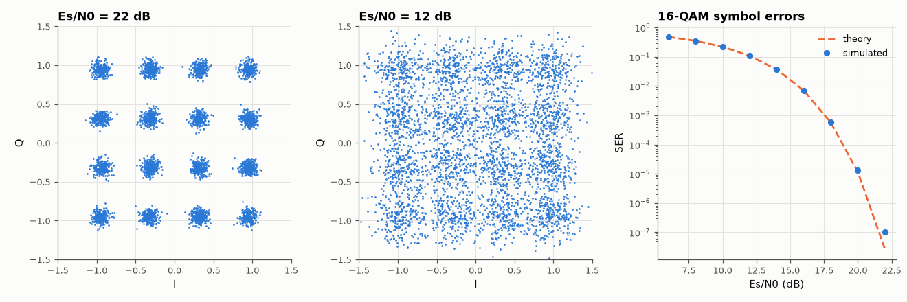

# SL-110 · 16-QAM: constellation, EVM and symbol errors

> Transmit Gray-mapped 16-QAM through AWGN, watch the constellation blur as SNR falls, and compare measured SER and EVM with 4(1−1/√M)Q(√(3E_s/((M−1)N₀))) and EVM = 1/√SNR.



*As SNR falls the 16 clouds merge; SER follows the square-QAM formula.*

**Track:** Signal Lab — 214 electrical-engineering projects · **Category:** F. Communication systems · **Level:** Moderate · **Tools:** Monte Carlo (NumPy), square-QAM SER theory, EVM measurement

**Data:** Simulated (numerical model in this repo).

## Problem

16-QAM carries 4 bits per symbol. How much more SNR does it need than QPSK, and how do engineers measure signal quality from a constellation?

## Prediction

Square M-QAM: $P_s\approx 1-\left(1-2(1-\tfrac1{\sqrt M})Q\!\left(\sqrt{\tfrac{3E_s}{(M-1)N_0}}\right)\right)^2$. For M = 16 the minimum distance at
equal average energy is √(2/5)·√(2/…)… i.e. ~7 dB worse than QPSK at the same SER per symbol, ~4 dB per bit. Error-vector
magnitude (RMS) = $1/\sqrt{E_s/N_0}$ when noise is the only impairment.

## Method

10⁶ symbols per point, normalised to E_s = 1, Gray mapping per axis, minimum-distance decisions. EVM = √(mean|y−s|²/mean|s|²).

## Measured results

*Predicted vs measured vs error. "Measured" = computed by an independent simulation, HDL simulator or public dataset.*

| Quantity | Predicted | Measured | Error | Within tolerance |
|---|---|---|---|---|
| SER at Es/N0 = 14 dB | 0.03715 | 0.03692 | -0.62 % | yes |
| SER at Es/N0 = 18 dB | 5.7264e-04 | 5.7700e-04 | +0.76 % | yes |
| EVM at Es/N0 = 20 dB (= 1/√SNR) | 0.1 | 0.09999 | -0.01 % | yes |

**Additional measurements**

| Quantity | Value | Note |
|---|---|---|
| Extra Es/N0 needed vs QPSK for SER 10⁻³ | 7.759 dB |  |

## Error analysis

SER matches the square-QAM expression and EVM equals 1/√SNR, which is why EVM is the standard 'one number' quality
metric for Wi-Fi and LTE transmitters (e.g. 16-QAM requires EVM better than ~−19 dB). Packing 16 points into the same
average energy shrinks their spacing, costing roughly 7 dB of E_s/N₀ relative to QPSK for the same symbol-error rate.

## Reproduce

```bash
pip install -r requirements.txt
python run_all.py --only SL-110
```

The script [`project.py`](project.py) regenerates every figure and number above.

**Files produced**

- [`data/ser.csv`](data/ser.csv)

## License

Code and text: MIT (see the repository [LICENSE](../../../../LICENSE)). Datasets remain under their own licences (see the repository README).

---

**Tooling & honesty.** This project was generated with Claude Code (Anthropic's AI coding assistant): the code, derivations, simulations and this write-up were AI-produced. *Measured* means computed by an independent model, simulator or public dataset — not a physical lab bench. Every number in the tables is reproduced by running the code.
