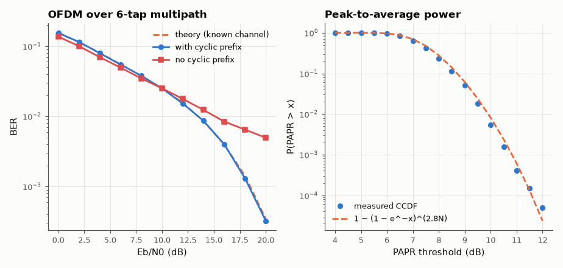

# SL-111 · OFDM with cyclic prefix over a multipath channel

> Build a Wi-Fi-like OFDM link, pass it through a 6-tap multipath channel, and show that a cyclic prefix longer than the delay spread turns ISI into a per-subcarrier multiplication; measure BER with and without CP and the peak-to-average power ratio (PAPR).



*The CP removes the ISI error floor; OFDM's price is a high PAPR.*

**Track:** Signal Lab — 214 electrical-engineering projects · **Category:** F. Communication systems · **Level:** Hard · **Tools:** NumPy OFDM modem (64 subcarriers, IFFT/FFT, cyclic prefix, one-tap equaliser), Monte Carlo

**Data:** Simulated (numerical model in this repo).

## Problem

Why do Wi-Fi, LTE and 5G all use OFDM, and what is the cyclic prefix for?

## Prediction

With a cyclic prefix of length L ≥ channel memory, the channel's linear convolution becomes circular, so each subcarrier sees
$Y_k=H_kX_k+N_k$ — one complex tap equalises it. Per subcarrier the BER is that of flat Rayleigh-like fading averaged over
the $|H_k|$ values: $\overline{P_b}=\frac1N\sum_k Q\!\left(\sqrt{2|H_k|^2\frac{N}{N+L}E_b/N_0}\right)$ for known H (E_b counts the energy spent on the
prefix, hence the N/(N+L) factor). Without CP, inter-symbol and inter-carrier
interference create an error floor. PAPR of N subcarriers: $P(\mathrm{PAPR}>x)\approx1-(1-e^{-x})^N$.

## Method

N = 64, CP = 16, QPSK, channel taps [0.8, 0.5, 0.3, 0.15, 0.1, 0.05]·e^{jφ} (normalised), perfect channel knowledge; 2,000 OFDM
symbols per E_b/N₀. PAPR CCDF from 20,000 symbols (4× oversampled).

## Measured results

*Predicted vs measured vs error. "Measured" = computed by an independent simulation, HDL simulator or public dataset.*

| Quantity | Predicted | Measured | Error | Within tolerance |
|---|---|---|---|---|
| BER with CP at 8 dB (per-subcarrier Q-average) | 0.0376 | 0.03787 | +0.72 % | yes |
| BER with CP at 14 dB (per-subcarrier Q-average) | 0.008536 | 0.008617 | +0.96 % | yes |
| PAPR CCDF at 9 dB | 0.06165 | 0.05045 | -0.0112 |  |

**Additional measurements**

| Quantity | Value | Note |
|---|---|---|
| BER without CP at 20 dB (ISI floor) | 0.004961 |  |
| CP overhead | 20 % | 10·log(80/64) = 0.97 dB energy cost |

## Error analysis

With the cyclic prefix the measured BER follows the per-subcarrier average once the prefix's energy cost is included
(my first prediction forgot the N/(N+CP) factor and was ~1 dB optimistic): multipath has become 64 independent
flat channels, each fixed by one complex division. Without the CP the tail of each symbol leaks into the next and the
BER hits an error floor no amount of power removes. The costs of OFDM are visible too: ~1 dB of energy spent on the CP
and a PAPR that exceeds 9 dB a percent of the time, which forces power amplifiers to back off.

## Reproduce

```bash
pip install -r requirements.txt
python run_all.py --only SL-111
```

The script [`project.py`](project.py) regenerates every figure and number above.

**Files produced**

- [`data/ber.csv`](data/ber.csv)

## License

Code and text: MIT (see the repository [LICENSE](../../../../LICENSE)). Datasets remain under their own licences (see the repository README).

---

**Tooling & honesty.** This project was generated with Claude Code (Anthropic's AI coding assistant): the code, derivations, simulations and this write-up were AI-produced. *Measured* means computed by an independent model, simulator or public dataset — not a physical lab bench. Every number in the tables is reproduced by running the code.
