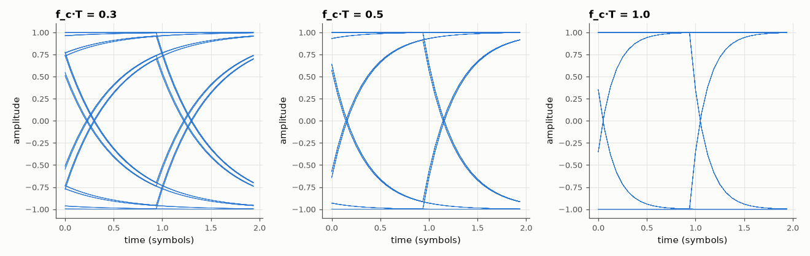
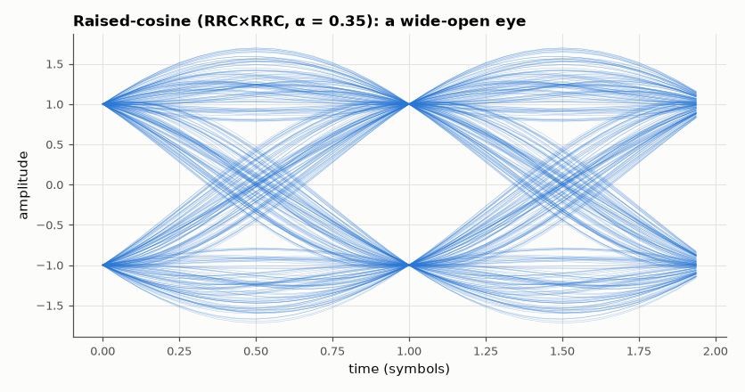

# SL-112 · Eye diagrams, ISI and raised-cosine pulses

> Draw eye diagrams for rectangular and root-raised-cosine (α = 0.35) signalling through a band-limited channel, and measure vertical eye opening and timing margin against the Nyquist ISI criterion.



*A narrower channel closes the eye: more of each symbol leaks into the next.*

**Track:** Signal Lab — 214 electrical-engineering projects · **Category:** F. Communication systems · **Level:** Moderate · **Tools:** NumPy pulse shaping, band-limited channel, eye-opening measurement

**Data:** Simulated (numerical model in this repo).

## Problem

How much bandwidth does a data stream need before its symbols start smearing into each other, and how does an eye diagram show it?

## Prediction

Zero ISI requires the overall pulse to cross zero at every other symbol instant (Nyquist). A raised-cosine spectrum with
roll-off α meets it with bandwidth $(1+\alpha)R_s/2$; split as RRC at transmitter and receiver it also maximises SNR. A
rectangular pulse through a first-order channel with corner $f_c$ loses $e^{-2\pi f_cT}$ of the next symbol into the current
one: vertical eye opening ≈ $1-2e^{-2\pi f_cT}$ (worst case).

## Method

Binary ±1 symbols, 16 samples/symbol. (a) rectangular pulses through RC channels with f_c·T = 0.3, 0.5, 1.0; (b) RRC α = 0.35 (span 8)
matched pair, with and without an extra channel. Eye opening = (min of +1 samples − max of −1 samples)/2 at the best sampling
phase; horizontal opening where the vertical opening stays > 0.

## Measured results

*Predicted vs measured vs error. "Measured" = computed by an independent simulation, HDL simulator or public dataset.*

| Quantity | Predicted | Measured | Error |
|---|---|---|---|
| Rectangular + RC channel f_c·T = 0.3: vertical eye opening | 0.6963 | 0.6963 | +1.4766e-10 |
| Rectangular + RC channel f_c·T = 0.5: vertical eye opening | 0.9136 | 0.9136 | -1.1102e-16 |
| Rectangular + RC channel f_c·T = 1.0: vertical eye opening | 0.9963 | 0.9963 | +0 |
| RRC × RRC (α = 0.35): peak ISI at the ideal sampling instant | 0 | 0.007488 | +0.007488 |

**Additional measurements**

| Quantity | Value | Note |
|---|---|---|
| RRC occupied bandwidth (1+α)·R_s/2 | 0.675 × R_s |  |



*All traces pass through ±1 at the sampling instant — zero ISI in only 0.675·R_s of bandwidth.*

## Error analysis

For the rectangular pulse through an RC channel the measured eye opening follows 1 − 2e^(−2πf_cT) — the worst-case sum of the
single-pole tail — and closes almost completely at f_c·T = 0.3. The matched RRC pair gives a raised-cosine overall
response whose zero crossings land exactly on neighbouring symbol instants, so the eye is wide open (residual ISI only
from truncating the filters to ±8 symbols) while using only 1.35/2 of the symbol rate in bandwidth.

## Reproduce

```bash
pip install -r requirements.txt
python run_all.py --only SL-112
```

The script [`project.py`](project.py) regenerates every figure and number above.

## License

Code and text: MIT (see the repository [LICENSE](../../../../LICENSE)). Datasets remain under their own licences (see the repository README).

---

**Tooling & honesty.** This project was generated with Claude Code (Anthropic's AI coding assistant): the code, derivations, simulations and this write-up were AI-produced. *Measured* means computed by an independent model, simulator or public dataset — not a physical lab bench. Every number in the tables is reproduced by running the code.
