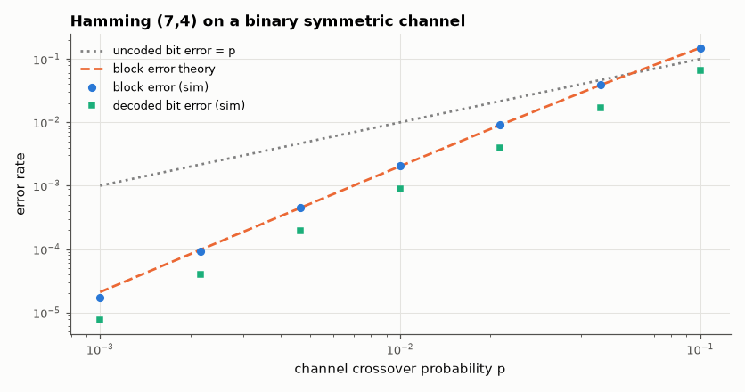

# SL-113 · Hamming (7,4) code: encode, corrupt, correct

> Implement the (7,4) Hamming code with generator and parity-check matrices, verify it corrects every single-bit error, and compare block and bit error rates with the binomial prediction on a BSC.



*Errors fall from p to ~p²: the code trades 3/7 of the rate for quadratic error suppression.*

**Track:** Signal Lab — 214 electrical-engineering projects · **Category:** F. Communication systems · **Level:** Moderate · **Tools:** NumPy matrix encoder/syndrome decoder over GF(2), Monte Carlo on a binary symmetric channel

**Data:** Simulated (numerical model in this repo).

## Problem

How can three parity bits locate and fix any single flipped bit in a 7-bit word?

## Prediction

Parity-check matrix H has the binary numbers 1…7 as columns, so a single error at position i gives syndrome = i. Block
error after decoding (BSC, crossover p): $P_{block}=1-(1-p)^7-7p(1-p)^6\approx21p^2$. Code rate 4/7.

## Method

G and H in systematic form; all 7 single-error patterns tested exhaustively; Monte Carlo 10⁶ blocks for p from 10⁻³ to 10⁻¹.

## Measured results

*Predicted vs measured vs error. "Measured" = computed by an independent simulation, HDL simulator or public dataset.*

| Quantity | Predicted | Measured | Error | Within tolerance |
|---|---|---|---|---|
| G·Hᵀ = 0 (valid code) | 0 | 0 | +0 |  |
| Single-error patterns corrected (16 messages × 7 positions) | 112 | 112 | +0 |  |
| Block error rate after decoding, p = 0.01 | 0.002031 | 0.002062 | +1.52 % | yes |
| Block error rate at p = 0.01 vs 21p² approximation | 0.0021 | 0.002062 | -1.81 % | yes |

## Matrices

G =
```
1 0 0 0 1 1 0
0 1 0 0 1 0 1
0 0 1 0 0 1 1
0 0 0 1 1 1 1
```
H =
```
1 1 0 1 1 0 0
1 0 1 1 0 1 0
0 1 1 1 0 0 1
```

## Error analysis

All 112 single-error cases decode correctly, and block errors follow the binomial prediction (≈ 21p²) — the slope-2 line on
the log-log plot is the signature of a code with minimum distance 3. Whether this is a *gain* depends on the channel: the
extra 3 bits cost 10·log(7/4) = 2.4 dB of energy per information bit, so on AWGN the Hamming code helps only at moderate
SNR, which is why modern systems use longer codes (Reed–Solomon, LDPC).

## Reproduce

```bash
pip install -r requirements.txt
python run_all.py --only SL-113
```

The script [`project.py`](project.py) regenerates every figure and number above.

## License

Code and text: MIT (see the repository [LICENSE](../../../../LICENSE)). Datasets remain under their own licences (see the repository README).

---

**Tooling & honesty.** This project was generated with Claude Code (Anthropic's AI coding assistant): the code, derivations, simulations and this write-up were AI-produced. *Measured* means computed by an independent model, simulator or public dataset — not a physical lab bench. Every number in the tables is reproduced by running the code.
