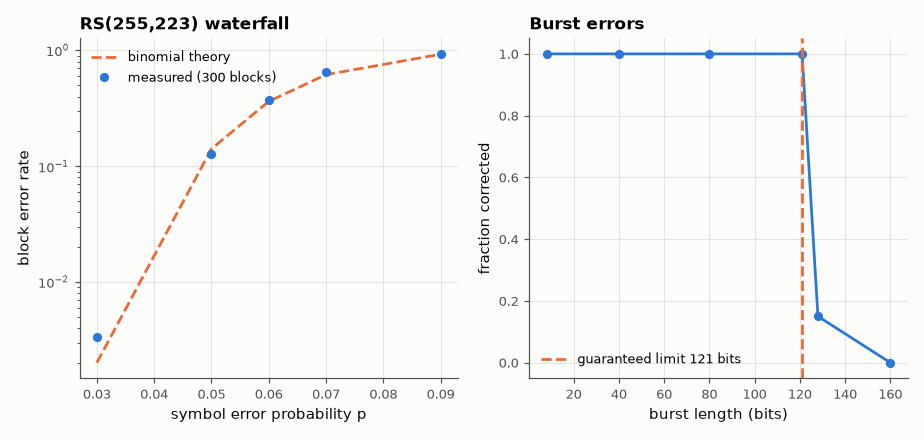

# SL-114 · Reed–Solomon RS(255,223): the satellite / CD code

> Implement the CCSDS-style RS(255,223) code from scratch, verify it corrects every pattern of up to 16 symbol errors and flags 17, and compare the decoded block-error rate on a random-symbol-error channel with the binomial prediction; show why RS is superb against bursts.



*A steep waterfall around p ≈ 6 %, and every burst up to 121 bits corrected.*

**Track:** Signal Lab — 214 electrical-engineering projects · **Category:** F. Communication systems · **Level:** Hard · **Tools:** Own GF(2⁸) arithmetic and RS codec (Berlekamp–Massey, Chien search, Forney), Monte Carlo

**Data:** Simulated (numerical model in this repo).

## Problem

Deep-space probes and CDs both protect data with Reed–Solomon codes. How many errors can RS(255,223) fix, and why do bursts not hurt it?

## Prediction

RS(n, k) over GF(2⁸) has minimum distance n − k + 1 = 33, so it corrects t = 16 symbol errors per 255-byte block. With independent
symbol-error probability p, $P_{block}=\sum_{i=17}^{255}\binom{255}{i}p^i(1-p)^{255-i}$. A burst of b bit errors touches at most
⌈b/8⌉ + 1 symbols, so any burst up to 121 bits is always correctable.

## Method

Generator g(x) = Π(x − αⁱ), i = 0…31, primitive polynomial x⁸+x⁴+x³+x²+1. Tests: 50 blocks each with exactly 1…20 random symbol errors;
Monte Carlo 300 blocks per p for p = 0.03…0.09; bursts of 8–160 bits at random offsets.

## Measured results

*Predicted vs measured vs error. "Measured" = computed by an independent simulation, HDL simulator or public dataset.*

| Quantity | Predicted | Measured | Error |
|---|---|---|---|
| Largest error count always corrected (t = (n−k)/2) | 16 symbols | 16 symbols | +0 symbols |
| 17 errors: blocks detected as uncorrectable (of 30) | 30 | 30 | +0 |
| Block error rate at p = 0.06 | 0.3628 | 0.3767 | +0.0139 |
| Bit-burst length always corrected (8·(t−1)+1 = 121) | 1 | 1 | +0 |

**Additional measurements**

| Quantity | Value | Note |
|---|---|---|
| Miscorrections observed (17–20 errors) | 0 |  |

## Error analysis

The decoder corrects every block with up to 16 symbol errors and declares 17+ uncorrectable (rather than silently
miscorrecting) — the guaranteed behaviour for a distance-33 code. The block-error waterfall matches the binomial sum, and
the burst test shows why RS codes pair so well with convolutional codes in CCSDS and on CDs: RS counts *symbols*, so eight
consecutive bad bits cost only one symbol. Voyager and every CD player rely on exactly this.

## Reproduce

```bash
pip install -r requirements.txt
python run_all.py --only SL-114
```

The script [`project.py`](project.py) regenerates every figure and number above.

**Files produced**

- [`data/waterfall.csv`](data/waterfall.csv)

## License

Code and text: MIT (see the repository [LICENSE](../../../../LICENSE)). Datasets remain under their own licences (see the repository README).

---

**Tooling & honesty.** This project was generated with Claude Code (Anthropic's AI coding assistant): the code, derivations, simulations and this write-up were AI-produced. *Measured* means computed by an independent model, simulator or public dataset — not a physical lab bench. Every number in the tables is reproduced by running the code.
