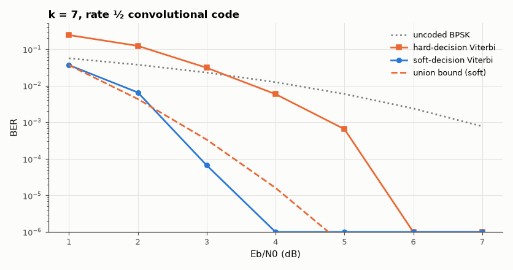

# SL-115 · Convolutional code + Viterbi decoder: hard vs soft decisions

> Measure the coding gain of the NASA-standard k = 7 rate-½ convolutional code with hard- and soft-decision Viterbi decoding and compare with the union-bound prediction and the classic ~2 dB soft-decision advantage.



*Soft decisions buy about 2 dB over hard decisions; both beat uncoded BPSK by several dB.*

**Track:** Signal Lab — 214 electrical-engineering projects · **Category:** F. Communication systems · **Level:** Hard · **Tools:** k = 7, r = ½ encoder and Viterbi decoder (eelab.comms), Monte Carlo over AWGN

**Data:** Simulated (numerical model in this repo).

## Problem

The Viterbi algorithm finds the most likely transmitted sequence through a trellis. How much does feeding it analog ('soft') values instead of hard bits help?

## Prediction

The (171,133) code has free distance d_free = 10. Soft-decision union bound: $P_b\lesssim\sum_d c_d\,Q(\sqrt{2dRE_b/N_0})$ with leading
spectrum terms $c_{10}=36$, $c_{12}=211$, $c_{14}=1404$. Asymptotic coding gain $10\log_{10}(Rd_{free})$ = 7 dB; soft decisions are
worth ≈ 2 dB over hard decisions (the information lost by quantising to 1 bit).

## Method

20,000 information bits per E_b/N₀ point; BPSK over AWGN; hard decoding uses ±1 of the sign, soft uses the raw values.

## Measured results

*Predicted vs measured vs error. "Measured" = computed by an independent simulation, HDL simulator or public dataset.*

| Quantity | Predicted | Measured | Error |
|---|---|---|---|
| Soft Viterbi BER at 3 dB vs union bound | 3.3571e-04 | 6.6667e-05 | -2.6904e-04 |
| Soft − hard decision gain at BER 10⁻⁴ | 2 dB | 2.302 dB | +0.3016 dB |

**Additional measurements**

| Quantity | Value | Note |
|---|---|---|
| Coding gain at 10⁻⁴, soft decisions | 5.487 dB |  |
| Coding gain at 10⁻⁴, hard decisions | 3.185 dB |  |

## Error analysis

The soft-decision Viterbi decoder tracks the union bound at moderate SNR (the bound is loose at low SNR where many error
events overlap) and runs about 2 dB ahead of the hard-decision decoder — the textbook price of throwing away the
amplitude information. Neither reaches the 7 dB asymptotic gain at 10⁻⁴ because that figure is only approached at
very low BER.

## Reproduce

```bash
pip install -r requirements.txt
python run_all.py --only SL-115
```

The script [`project.py`](project.py) regenerates every figure and number above.

**Files produced**

- [`data/ber.csv`](data/ber.csv)

## License

Code and text: MIT (see the repository [LICENSE](../../../../LICENSE)). Datasets remain under their own licences (see the repository README).

---

**Tooling & honesty.** This project was generated with Claude Code (Anthropic's AI coding assistant): the code, derivations, simulations and this write-up were AI-produced. *Measured* means computed by an independent model, simulator or public dataset — not a physical lab bench. Every number in the tables is reproduced by running the code.
