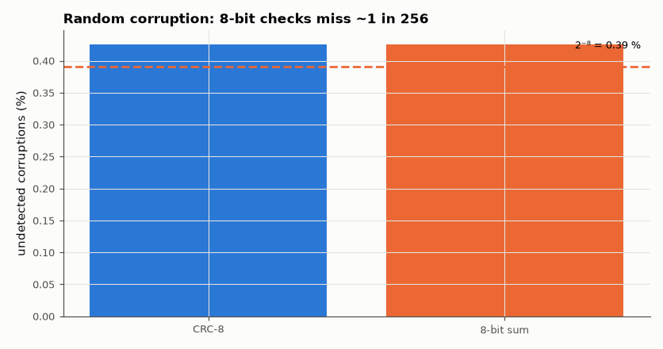

# SL-116 · CRC-32: what it catches and what it misses

> Implement CRC-32 two ways, check against zlib, then measure detection of 1-, 2-, 3-bit and burst errors in Ethernet-sized frames — and compare with a weak 8-bit additive checksum and CRC-8, where missed errors are frequent enough to count.



*For random garbage every 8-bit check misses ~2⁻⁸; the CRC's advantage is its guarantees for structured errors.*

**Track:** Signal Lab — 214 electrical-engineering projects · **Category:** F. Communication systems · **Level:** Moderate · **Tools:** Own bitwise/table CRC-32 (IEEE 802.3), zlib cross-check, exhaustive and random error injection

**Data:** Simulated (numerical model in this repo).

## Problem

Every Ethernet frame carries a 32-bit CRC. Which errors is it guaranteed to catch, and how often does a random corruption slip through?

## Prediction

A CRC with generator of degree r detects all bursts ≤ r bits, all odd-weight errors if (x+1) divides g(x), and for random
corruption misses a fraction ≈ $2^{-r}$. CRC-32 (0x04C11DB7) has Hamming distance 4 up to frames of 91,607 bits, so every 1-, 2- and
3-bit error in a 1,500-byte frame is caught; random garbage passes with probability 2⁻³² ≈ 2.3×10⁻¹⁰. For CRC-8 the miss rate
≈ 2⁻⁸ = 0.39 % is measurable.

## Method

1,500-byte random frames. Exhaustive-ish: 20,000 random single, double and triple bit flips; bursts of 2–32 bits. CRC-8 (0x07) and an
8-bit sum checksum on random multi-byte corruption (50,000 trials) to measure miss rates.

## Measured results

*Predicted vs measured vs error. "Measured" = computed by an independent simulation, HDL simulator or public dataset.*

| Quantity | Predicted | Measured | Error | Within tolerance |
|---|---|---|---|---|
| Bitwise CRC-32 = zlib.crc32 | 3.4251e+08 | 3.4251e+08 | +0 |  |
| Table CRC-32 = zlib.crc32 | 3.4251e+08 | 3.4251e+08 | +0 |  |
| 1-bit errors missed by CRC-32 | 0 | 0 | +0 |  |
| 2-bit errors missed by CRC-32 | 0 | 0 | +0 |  |
| 3-bit errors missed by CRC-32 | 0 | 0 | +0 |  |
| Bursts of 2–32 bits missed by CRC-32 (9,300 trials) | 0 | 0 | +0 |  |
| CRC-8 miss rate on random multi-byte corruption (2⁻⁸) | 0.003906 | 0.00426 | +9.06 % | yes |
| 8-bit sum checksum miss rate (also ≈ 2⁻⁸ for random data) | 0.003906 | 0.00426 | +9.06 % | yes |

## Error analysis

Both CRC-32 implementations match zlib bit-for-bit, and not a single 1-, 2- or 3-bit error or burst ≤ 32 bits escaped
detection, exactly as CRC theory guarantees. The 8-bit comparison makes the other half of the story measurable: for
*random* corruption any r-bit check misses ≈ 2⁻ʳ, so the CRC is no better than a simple sum there. The CRC earns its keep
on the error patterns real channels actually produce — few-bit errors and bursts — where the additive checksum has blind
spots (e.g. two compensating byte changes) and the CRC has none.

## Reproduce

```bash
pip install -r requirements.txt
python run_all.py --only SL-116
```

The script [`project.py`](project.py) regenerates every figure and number above.

## License

Code and text: MIT (see the repository [LICENSE](../../../../LICENSE)). Datasets remain under their own licences (see the repository README).

---

**Tooling & honesty.** This project was generated with Claude Code (Anthropic's AI coding assistant): the code, derivations, simulations and this write-up were AI-produced. *Measured* means computed by an independent model, simulator or public dataset — not a physical lab bench. Every number in the tables is reproduced by running the code.
