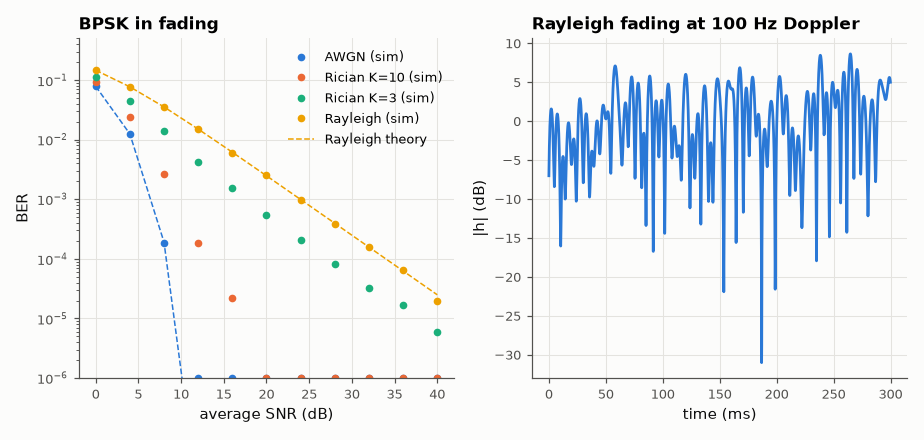

# SL-117 · AWGN, Rayleigh and Rician fading channels

> Compare BPSK over AWGN, Rayleigh and Rician (K = 3, 10) flat fading: verify the closed-form average BERs, show the 1/SNR slope that makes fading so costly, and generate a time-correlated Rayleigh process with the Jakes spectrum.



*Fading turns the waterfall into a straight 1/SNR line; deep fades of −20 to −30 dB occur every few ms.*

**Track:** Signal Lab — 214 electrical-engineering projects · **Category:** F. Communication systems · **Level:** Moderate · **Tools:** Monte Carlo BPSK (NumPy), closed-form fading BER, Jakes Doppler spectrum

**Data:** Simulated (numerical model in this repo).

## Problem

A phone's signal fades in and out as it moves. How much extra power does fading cost at a target error rate?

## Prediction

Rayleigh: $\bar P_b=\tfrac12\left(1-\sqrt{\frac{\bar\gamma}{1+\bar\gamma}}\right)\approx\frac1{4\bar\gamma}$ — BER falls only as 1/SNR (vs exponentially on AWGN), so
10⁻⁴ needs ~34 dB instead of 8.4 dB. Rician with K-factor K interpolates between the two. Jakes: Doppler spectrum
$S(f)\propto1/\sqrt{1-(f/f_D)^2}$, envelope autocorrelation $J_0(2\pi f_D\tau)$.

## Method

10⁶ symbols per point, coherent detection with perfect channel knowledge. Rician BER by numerical averaging of Q over the Rician
distribution. Jakes process by sum-of-sinusoids (64 paths), f_D = 100 Hz.

## Measured results

*Predicted vs measured vs error. "Measured" = computed by an independent simulation, HDL simulator or public dataset.*

| Quantity | Predicted | Measured | Error | Within tolerance |
|---|---|---|---|---|
| Rayleigh BER at 12 dB | 0.01506 | 0.01509 | +0.17 % | yes |
| Rayleigh BER at 24 dB | 9.9231e-04 | 9.7800e-04 | -1.44 % | yes |
| Rayleigh: SNR for BER 10⁻⁴ (≈ 1/(4γ)) | 33.98 dB | 34.14 dB | +0.1568 dB |  |
| Jakes autocorrelation first null τ (J₀ zero at 2.405/(2πf_D)) | 3.828 ms | 3.6 ms | -5.95 % | **no** |

**Additional measurements**

| Quantity | Value | Note |
|---|---|---|
| Fading margin at 10⁻⁴ (Rayleigh − AWGN) | 25.58 dB |  |

## Error analysis

Rayleigh BER matches the closed form and falls only one decade per 10 dB: reaching 10⁻⁴ costs ~26 dB more than on an AWGN
channel. A line-of-sight component (Rician K) recovers much of that. The Jakes simulation shows why: the channel
spends a small fraction of time in 20–30 dB fades, and those fades cause almost all errors — which is why real systems
use diversity (multiple antennas, interleaving + coding, OFDM with coding across subcarriers) rather than more power.

## Reproduce

```bash
pip install -r requirements.txt
python run_all.py --only SL-117
```

The script [`project.py`](project.py) regenerates every figure and number above.

**Files produced**

- [`data/ber.csv`](data/ber.csv)

## License

Code and text: MIT (see the repository [LICENSE](../../../../LICENSE)). Datasets remain under their own licences (see the repository README).

---

**Tooling & honesty.** This project was generated with Claude Code (Anthropic's AI coding assistant): the code, derivations, simulations and this write-up were AI-produced. *Measured* means computed by an independent model, simulator or public dataset — not a physical lab bench. Every number in the tables is reproduced by running the code.
