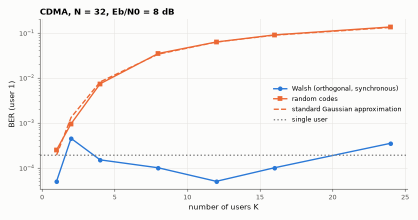

# SL-118 · Spread spectrum and CDMA with Walsh and Gold-like codes

> Put K users on the same band with direct-sequence spreading: orthogonal Walsh codes (synchronous) give single-user BER; random codes (asynchronous-like) suffer multiple-access interference that follows the standard Gaussian approximation.



*Orthogonal codes add users for free; non-orthogonal codes degrade gracefully with K/N.*

**Track:** Signal Lab — 214 electrical-engineering projects · **Category:** F. Communication systems · **Level:** Hard · **Tools:** NumPy DS-CDMA simulator, Walsh–Hadamard and random spreading codes, Gaussian-approximation theory

**Data:** Simulated (numerical model in this repo).

## Problem

How can many users transmit on the same frequency at the same time, and what limits how many?

## Prediction

Spreading factor N: each bit becomes N chips. With orthogonal codes (synchronous) cross-correlation is zero → BER = single-user
$Q(\sqrt{2E_b/N_0})$. With random codes, each interferer adds variance ≈ E_b/N per bit, so (standard Gaussian approximation)
$P_b\approx Q\!\left(\left[\frac{K-1}{N}+\frac{N_0}{2E_b}\right]^{-1/2}\right)$ — capacity is interference-limited.

## Method

N = 32 chips/bit, K = 1…24 users, equal power, E_b/N₀ = 8 dB, 20,000 bits per user per point. Walsh rows of a 32×32 Hadamard matrix vs
independent random ±1 sequences (redrawn each bit).

## Measured results

*Predicted vs measured vs error. "Measured" = computed by an independent simulation, HDL simulator or public dataset.*

| Quantity | Predicted | Measured | Error | Within tolerance |
|---|---|---|---|---|
| Walsh codes: BER pooled over all K (should equal single-user BER) | 1.9091e-04 | 1.7857e-04 | -6.46 % | yes |
| Random codes, 8 users (Gaussian approximation) | 0.03349 | 0.03465 | +3.48 % | yes |
| Random codes, 24 users (Gaussian approximation) | 0.1315 | 0.1348 | +2.57 % | yes |

## Error analysis

Synchronous Walsh codes are exactly orthogonal, so 24 users on the same band see the single-user BER. Random (or, in practice,
asynchronous Gold/m-sequence) codes are only nearly orthogonal; each extra user adds ~1/N of a bit's energy as
interference, and the measured BER follows the Gaussian approximation closely. This graceful, soft capacity limit —
more users simply raise the noise floor — is the defining property of CDMA (IS-95, 3G WCDMA, GPS).

## Reproduce

```bash
pip install -r requirements.txt
python run_all.py --only SL-118
```

The script [`project.py`](project.py) regenerates every figure and number above.

**Files produced**

- [`data/ber.csv`](data/ber.csv)

## License

Code and text: MIT (see the repository [LICENSE](../../../../LICENSE)). Datasets remain under their own licences (see the repository README).

---

**Tooling & honesty.** This project was generated with Claude Code (Anthropic's AI coding assistant): the code, derivations, simulations and this write-up were AI-produced. *Measured* means computed by an independent model, simulator or public dataset — not a physical lab bench. Every number in the tables is reproduced by running the code.
