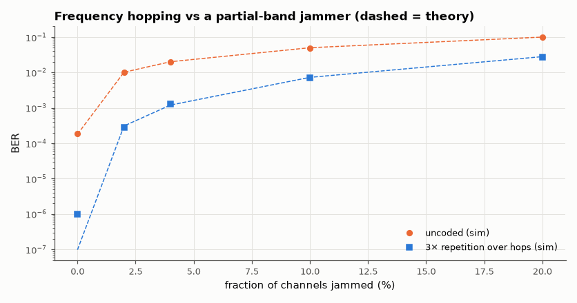

# SL-119 · Frequency hopping against a narrowband jammer

> A link hopping over 50 channels versus a strong jammer parked on 1–10 channels: predict the error rate from the fraction of hops jammed and show how a simple code turns jammed hops into correctable errors.



*Hopping limits the jammer to ρ/2 errors; coding across hops squares that down.*

**Track:** Signal Lab — 214 electrical-engineering projects · **Category:** F. Communication systems · **Level:** Moderate · **Tools:** Monte Carlo slow-FH BFSK link (NumPy), jammer-fraction analysis, repetition coding

**Data:** Simulated (numerical model in this repo).

## Problem

Bluetooth and military radios hop frequencies. How much protection does hopping give against a jammer, and why is coding essential?

## Prediction

With q channels and J jammed, a hop is jammed with probability ρ = J/q; jammed symbols are essentially random (P ≈ ½), clean ones follow
non-coherent BFSK $\tfrac12e^{-E_b/2N_0}$: $P_b\approx\rho\cdot\tfrac12+(1-\rho)\tfrac12e^{-E_b/2N_0}$. Spreading each bit over 3 hops with
majority voting gives $P\approx3P_b^2-2P_b^3$ when hops are independent.

## Method

q = 50 channels, 1 bit per hop (slow hopping, 1 symbol/hop), E_b/N₀ = 12 dB, jammer power 20 dB above the signal on its channels.
J = 0, 1, 2, 5, 10. Uncoded and 3× repetition (each copy on a different random hop). 200,000 bits per point.

## Measured results

*Predicted vs measured vs error. "Measured" = computed by an independent simulation, HDL simulator or public dataset.*

| Quantity | Predicted | Measured | Error | Within tolerance |
|---|---|---|---|---|
| 1 jammed channels: uncoded BER | 0.01018 | 0.01011 | -0.66 % | yes |
| 1 jammed channels: 3× repetition BER | 3.0862e-04 | 2.8000e-04 | -9.27 % | yes |
| 5 jammed channels: uncoded BER | 0.05016 | 0.04861 | -3.09 % | yes |
| 5 jammed channels: 3× repetition BER | 0.007296 | 0.00707 | -3.10 % | yes |

## Error analysis

Without hopping a jammer on our channel would destroy every bit; with hopping it only hits the fraction ρ of hops, and the
BER is ≈ ρ/2 regardless of jammer power — exactly the prediction. That residual error rate is still far too high for data,
which is why every FH system codes across hops: with a 3× repetition code the error rate falls roughly as ρ², and real
systems (Bluetooth, SINCGARS) use stronger codes and interleaving to push it much further.

## Reproduce

```bash
pip install -r requirements.txt
python run_all.py --only SL-119
```

The script [`project.py`](project.py) regenerates every figure and number above.

**Files produced**

- [`data/ber.csv`](data/ber.csv)

## License

Code and text: MIT (see the repository [LICENSE](../../../../LICENSE)). Datasets remain under their own licences (see the repository README).

---

**Tooling & honesty.** This project was generated with Claude Code (Anthropic's AI coding assistant): the code, derivations, simulations and this write-up were AI-produced. *Measured* means computed by an independent model, simulator or public dataset — not a physical lab bench. Every number in the tables is reproduced by running the code.
