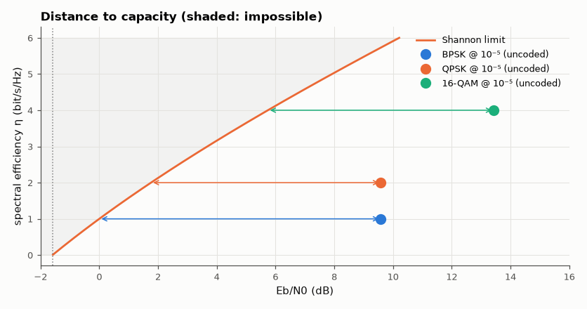

# SL-120 · Shannon capacity explorer

> An interactive page relating bandwidth, SNR and capacity, plus a measurement of how far uncoded BPSK, QPSK and 16-QAM are from the Shannon limit at BER 10⁻⁵, and the −1.59 dB ultimate limit.



*Uncoded modulations sit 7–9 dB from the Shannon limit; the arrows are what coding can recover.*

**Track:** Signal Lab — 214 electrical-engineering projects · **Category:** F. Communication systems · **Level:** Moderate · **Tools:** HTML/JS interactive plot + Python: C = B·log₂(1+SNR), gap-to-capacity of real modulations (Monte Carlo)

**Data:** Simulated (numerical model in this repo).

## Problem

What is the maximum data rate a channel can carry, and how close do practical signals get?

## Prediction

$C=B\log_2(1+SNR)$. In terms of spectral efficiency η = R/B and $E_b/N_0$: reliable communication requires
$E_b/N_0\ge\frac{2^\eta-1}{\eta}$, which tends to ln 2 = −1.59 dB as η → 0. Uncoded QPSK (η = 2) needs 9.6 dB at 10⁻⁵ where the limit is
1.76 dB: a 7.8 dB gap that coding (turbo, LDPC) closes to within ~1 dB.

## Method

Required E_b/N₀ at BER 10⁻⁵ for BPSK, QPSK, 16-QAM from closed forms, checked by Monte Carlo near the operating point; Shannon
minimum E_b/N₀ at the same η; plotted on the η–E_b/N₀ plane. Web page: sliders for B and SNR.

## Measured results

*Predicted vs measured vs error. "Measured" = computed by an independent simulation, HDL simulator or public dataset.*

| Quantity | Predicted | Measured | Error |
|---|---|---|---|
| BPSK: BER at its predicted 10⁻⁵ operating point (Monte Carlo) | 1.0000e-05 | 7.5000e-06 | -2.5000e-06 |
| QPSK: BER at its predicted 10⁻⁵ operating point (Monte Carlo) | 1.0000e-05 | 5.0000e-06 | -5.0000e-06 |
| 16-QAM: BER at its predicted 10⁻⁵ operating point (Monte Carlo) | 1.0000e-05 | 1.2500e-05 | +2.5000e-06 |
| Ultimate Shannon limit (η → 0) | -1.592 dB | -1.59 dB | +0.001505 dB |

**Additional measurements**

| Quantity | Value | Note |
|---|---|---|
| BPSK: gap to Shannon at η = 1 | 9.588 dB | needs 9.59 dB, limit 0.00 dB |
| QPSK: gap to Shannon at η = 2 | 7.827 dB | needs 9.59 dB, limit 1.76 dB |
| 16-QAM: gap to Shannon at η = 4 | 7.694 dB | needs 13.43 dB, limit 5.74 dB |

## Try it

Open [`web/index.html`](web/index.html) to explore C = B·log₂(1 + SNR).

## Error analysis

Monte Carlo confirms each modulation's 10⁻⁵ operating point, and the Shannon bound puts them in perspective: uncoded QPSK
wastes ~7.8 dB relative to what is theoretically possible at 2 bit/s/Hz. That gap is the entire motivation for modern
channel coding — LDPC and turbo codes recover all but ~0.5–1 dB of it — and the −1.59 dB floor is absolute: no scheme,
however clever, works below it.

## Reproduce

```bash
pip install -r requirements.txt
python run_all.py --only SL-120
```

The script [`project.py`](project.py) regenerates every figure and number above.

**Files produced**

- [`web/index.html`](web/index.html) — interactive capacity explorer

## License

Code and text: MIT (see the repository [LICENSE](../../../../LICENSE)). Datasets remain under their own licences (see the repository README).

---

**Tooling & honesty.** This project was generated with Claude Code (Anthropic's AI coding assistant): the code, derivations, simulations and this write-up were AI-produced. *Measured* means computed by an independent model, simulator or public dataset — not a physical lab bench. Every number in the tables is reproduced by running the code.
