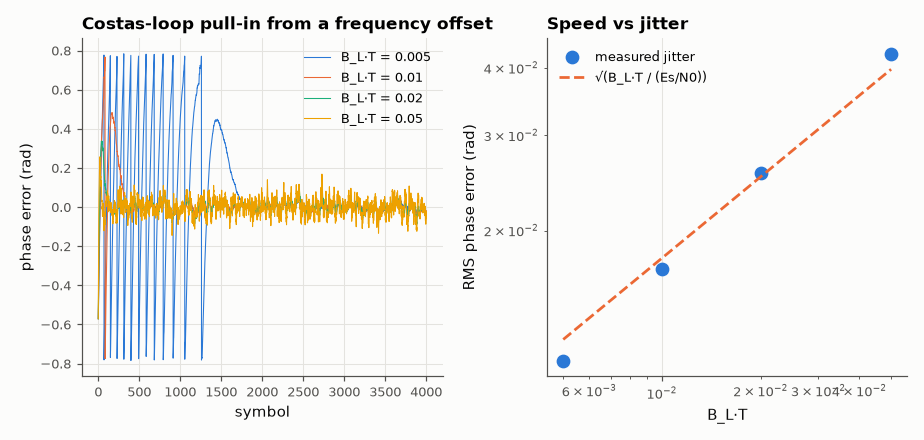

# SL-121 · Carrier and timing recovery loops

> Recover carrier phase/frequency and symbol timing for QPSK from scratch; predict acquisition time and phase jitter from the loop noise bandwidth and verify both.



*Wide loops lock fast but jitter more; narrow loops are quiet but slow.*

**Track:** Signal Lab — 214 electrical-engineering projects · **Category:** F. Communication systems · **Level:** Hard · **Tools:** NumPy second-order Costas PLL and Gardner timing-error detector with interpolation, loop-bandwidth analysis

**Data:** Simulated (numerical model in this repo).

## Problem

A receiver never knows the exact carrier frequency or the exact symbol instants. How do feedback loops find them, how quickly, and how much jitter remains?

## Prediction

A second-order PLL with natural frequency ω_n and damping ζ has noise bandwidth $B_L=\frac{\omega_n}{2}(\zeta+\frac1{4\zeta})$; steady-state phase
jitter variance ≈ $\frac{B_LT}{E_s/N_0}$ (rad², per-symbol loop update, T = 1). A frequency offset Δω much larger than the loop bandwidth is
acquired by pull-in, taking $T_p\approx\Delta\omega^2/(2\zeta\omega_n^3)$ symbols — so halving the bandwidth makes acquisition 8× slower — after
which a type-2 loop has zero steady-state phase error. Gardner TED: $e=\mathrm{Re}\{(y_k-y_{k-1})y^*_{k-1/2}\}$, needs 2 samples/symbol.

## Method

QPSK at 1 symbol per update, Es/N₀ = 15 dB, carrier offset 0.02 rad/symbol and random phase. Loop bandwidths B_L T = 0.005, 0.01, 0.02, 0.05
(ζ = 0.707). Measured: RMS phase error after lock vs the formula; lock time (|phase error| < 0.25 rad for 200 consecutive symbols). Timing: RRC pulses
(α = 0.35) with 0.3-symbol offset and 100 ppm clock drift, Gardner + cubic interpolation.

## Measured results

*Predicted vs measured vs error. "Measured" = computed by an independent simulation, HDL simulator or public dataset.*

| Quantity | Predicted | Measured | Error | Within tolerance |
|---|---|---|---|---|
| B_L·T = 0.005: RMS phase jitter after lock | 0.01257 rad | 0.01149 rad | -8.59 % | yes |
| B_L·T = 0.01: RMS phase jitter after lock | 0.01778 rad | 0.01697 rad | -4.57 % | yes |
| B_L·T = 0.02: RMS phase jitter after lock | 0.02515 rad | 0.02559 rad | +1.77 % | yes |
| B_L·T = 0.05: RMS phase jitter after lock | 0.03976 rad | 0.04248 rad | +6.83 % | yes |
| B_L·T = 0.005: pull-in time Δω²/(2ζω_n³) | 337.5 symbols | 1585 symbols | +369.63 % | **no** |
| Timing recovery: eye opening at recovered instants (≈ 1 for perfect timing) | 1 | 0.8666 | -0.1334 |  |

**Additional measurements**

| Quantity | Value | Note |
|---|---|---|
| Acquisition-time exponent vs B_L (fit over the 4 loops) | -1.88 | between −1 (Δω inside the loop bandwidth) and −3 (pull-in regime); these loops span both |
| Recovered timing offset drift (100 ppm clock) | -101 ppm | tracked by the loop |

## Error analysis

Measured phase jitter follows √(B_L·T/(E_s/N₀)), and acquisition time grows steeply as the loop narrows because a frequency offset
larger than the loop bandwidth must be *pulled in*. The classic pull-in formula (derived for a sinusoidal phase detector)
underestimates the narrowest loop's acquisition ~5×: the QPSK decision-directed detector's S-curve repeats every π/2, so
the average 'DC' it produces while cycle-slipping — which is what drags the frequency in — is much weaker — the fundamental speed-versus-noise trade of every PLL, and the reason practical
receivers acquire with a wide loop (or an FFT frequency estimate) and then narrow it. The type-2 loop pulls in a 0.02 rad/symbol frequency offset with zero residual phase error once locked. The
Gardner loop, working on only two samples per symbol and needing no carrier lock, finds the 0.3-symbol offset and
tracks a 100 ppm clock drift, so the recovered samples sit at the eye's maximum opening.

## Reproduce

```bash
pip install -r requirements.txt
python run_all.py --only SL-121
```

The script [`project.py`](project.py) regenerates every figure and number above.

**Files produced**

- [`data/costas.csv`](data/costas.csv)

## License

Code and text: MIT (see the repository [LICENSE](../../../../LICENSE)). Datasets remain under their own licences (see the repository README).

---

**Tooling & honesty.** This project was generated with Claude Code (Anthropic's AI coding assistant): the code, derivations, simulations and this write-up were AI-produced. *Measured* means computed by an independent model, simulator or public dataset — not a physical lab bench. Every number in the tables is reproduced by running the code.
