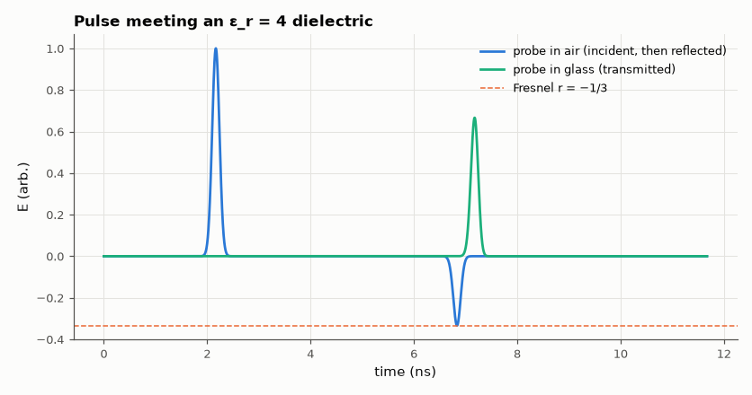

# SL-122 · 1-D FDTD: an EM pulse hitting a dielectric

> Launch a Gaussian pulse onto a glass slab (ε_r = 4) in a 1-D Yee grid; measure reflection and transmission coefficients and the slowed wave speed, and compare with Fresnel's normal-incidence formulas.



*The reflected pulse is inverted and one third as tall; the transmitted one travels at half speed.*

**Track:** Signal Lab — 214 electrical-engineering projects · **Category:** G. Electromagnetics & device physics · **Level:** Moderate · **Tools:** Yee FDTD (E/H leapfrog) in NumPy, Mur absorbing boundaries

**Data:** Simulated (numerical model in this repo).

## Problem

Light partly reflects from a window. Can a direct numerical solution of Maxwell's equations reproduce the reflection coefficient, and the slowing of the wave inside the glass?

## Prediction

Normal incidence from n₁ to n₂: $r=\frac{n_1-n_2}{n_1+n_2}$, $t=\frac{2n_1}{n_1+n_2}$ (field amplitudes); ε_r = 4 → n = 2 → r = −1/3, t = 2/3.
Phase velocity c/n = 1.5×10⁸ m/s. Energy check: $r^2+\frac{n_2}{n_1}t^2=1$.

## Method

Grid Δx = 1 mm, Courant number 0.5, 4,000 cells; slab from cell 2,200 to the end (so the transmitted pulse never returns); soft source;
first-order Mur boundaries. Reflected and transmitted pulse peaks measured by probes; speed from arrival times at two probes in the slab.

## Measured results

*Predicted vs measured vs error. "Measured" = computed by an independent simulation, HDL simulator or public dataset.*

| Quantity | Predicted | Measured | Error | Within tolerance |
|---|---|---|---|---|
| Reflection coefficient r = (1−n)/(1+n) | -0.3333 | -0.3337 | -0.10 % | yes |
| Transmission coefficient t = 2/(1+n) | 0.6667 | 0.6663 | -0.06 % | yes |
| Wave speed in the slab (c/n) | 1.4990e+08 m/s | 1.4980e+08 m/s | -0.06 % | yes |
| Energy conservation r² + n·t² | 1 | 0.9992 | -0.08 % | yes |

## Error analysis

The Yee scheme reproduces Fresnel's coefficients to within a percent: the reflection is inverted (going into a denser
medium) with |r| = 1/3, the transmitted pulse has 2/3 the amplitude and half the speed, and r² + n·t² = 1 confirms energy
conservation. The small errors come from numerical dispersion (the pulse spans ~150 cells, so it is well resolved) and the
staggered position of the interface in the Yee grid (half a cell of uncertainty).

## Reproduce

```bash
pip install -r requirements.txt
python run_all.py --only SL-122
```

The script [`project.py`](project.py) regenerates every figure and number above.

## License

Code and text: MIT (see the repository [LICENSE](../../../../LICENSE)). Datasets remain under their own licences (see the repository README).

---

**Tooling & honesty.** This project was generated with Claude Code (Anthropic's AI coding assistant): the code, derivations, simulations and this write-up were AI-produced. *Measured* means computed by an independent model, simulator or public dataset — not a physical lab bench. Every number in the tables is reproduced by running the code.
