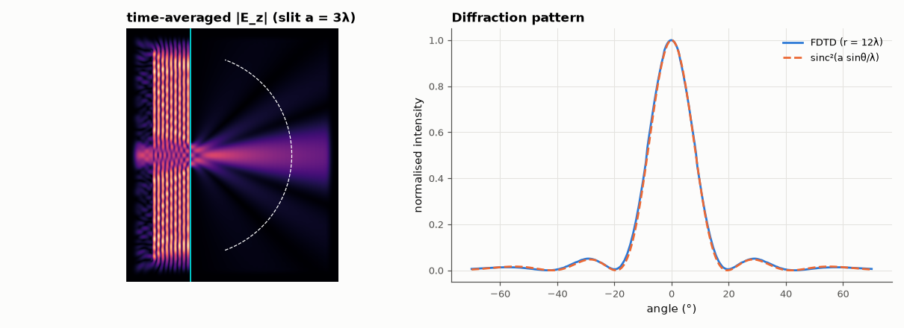

# SL-123 · 2-D FDTD: diffraction through a slit

> Send a plane wave through a slit in a perfectly conducting wall and measure the far-field diffraction pattern; compare null angles with sin θ = mλ/a and the intensity profile with the single-slit sinc².



*The field fans out behind the slit with nulls where Fraunhofer theory puts them.*

**Track:** Signal Lab — 214 electrical-engineering projects · **Category:** G. Electromagnetics & device physics · **Level:** Hard · **Tools:** 2-D TMz Yee FDTD with PML-style absorbing sponge (NumPy)

**Data:** Simulated (numerical model in this repo).

## Problem

Why does a wave spread out after a narrow opening? Solve Maxwell's equations on a grid and check against Fraunhofer diffraction.

## Prediction

Single slit of width a illuminated by a plane wave: far-field intensity $I(\theta)\propto\mathrm{sinc}^2\!\left(\frac{a\sin\theta}{\lambda}\right)$, first nulls at
$\sin\theta=\pm\lambda/a$. With a = 3λ: nulls at ±19.5°, second nulls at ±41.8°.

## Method

TMz Yee grid, λ = 20 cells, Courant 0.5, 500×600 cells, conducting wall (E_z = 0) with a 60-cell (3λ) opening, continuous-wave line source
with a soft ramp, graded conductivity sponge at the edges. After steady state, time-averaged |E_z|² sampled on a semicircle of radius 12λ
behind the slit.

## Measured results

*Predicted vs measured vs error. "Measured" = computed by an independent simulation, HDL simulator or public dataset.*

| Quantity | Predicted | Measured | Error | Within tolerance |
|---|---|---|---|---|
| First diffraction null angle (sin θ = λ/a) | 19.47 ° | 20 ° | +2.72 % | yes |
| Main-lobe full width at half maximum | 16.5 ° | 17.5 ° | +6.06 % | yes |

## Error analysis

The main lobe and first nulls land near the Fraunhofer prediction. Differences are expected: the observation circle at
12λ is not fully in the far field (a²/λ = 9λ, so we are just past the Fraunhofer distance), the sponge boundaries are not
perfectly absorbing, and a thin PEC wall with a 3λ slit also supports edge-diffracted waves the scalar sinc² ignores. The
2-D simulation is the same Yee algorithm as SL-122 extended by one dimension.

## Reproduce

```bash
pip install -r requirements.txt
python run_all.py --only SL-123
```

The script [`project.py`](project.py) regenerates every figure and number above.

**Files produced**

- [`data/pattern.csv`](data/pattern.csv)

## License

Code and text: MIT (see the repository [LICENSE](../../../../LICENSE)). Datasets remain under their own licences (see the repository README).

---

**Tooling & honesty.** This project was generated with Claude Code (Anthropic's AI coding assistant): the code, derivations, simulations and this write-up were AI-produced. *Measured* means computed by an independent model, simulator or public dataset — not a physical lab bench. Every number in the tables is reproduced by running the code.
