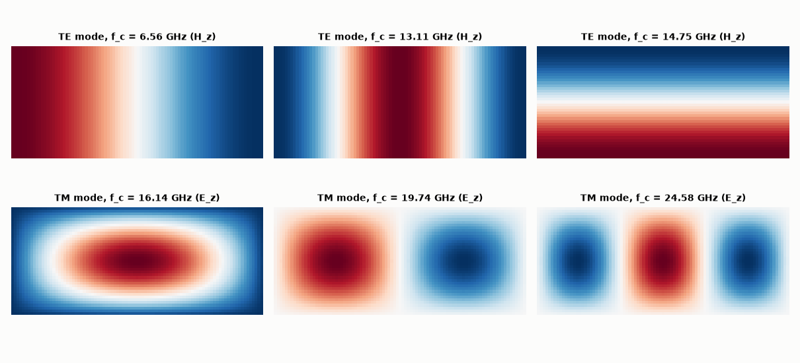

# SL-124 · Rectangular waveguide modes and cutoff frequencies

> Solve for the TE and TM modes of a WR-90 X-band waveguide numerically, compare cutoff frequencies with f_c = (c/2)√((m/a)²+(n/b)²), and plot the field patterns of the lowest modes.



*Numerical eigenmodes: TE₁₀, TE₂₀, TE₀₁ (top) and TM₁₁, TM₂₁, TM₃₁ (bottom).*

**Track:** Signal Lab — 214 electrical-engineering projects · **Category:** G. Electromagnetics & device physics · **Level:** Hard · **Tools:** Finite-difference Helmholtz eigenproblem on the waveguide cross-section (SciPy sparse eigensolver)

**Data:** Simulated (numerical model in this repo).

## Problem

A hollow metal pipe only carries microwaves above a cutoff frequency. Which modes exist, and where do they start?

## Prediction

Cross-section fields obey $\nabla_t^2\psi+k_c^2\psi=0$ with Dirichlet (TM, E_z) or Neumann (TE, H_z) walls. Rectangular a×b:
$k_c=\pi\sqrt{(m/a)^2+(n/b)^2}$, $f_c=ck_c/2\pi$. WR-90: a = 22.86 mm, b = 10.16 mm → TE₁₀ 6.557 GHz, TE₂₀ 13.11 GHz, TE₀₁ 14.76 GHz,
TE/TM₁₁ 16.15 GHz. Single-mode band 6.56–13.1 GHz.

## Method

Grid 92×41 points (0.25 mm). 5-point Laplacian with Dirichlet or Neumann (ghost-point) boundaries, smallest eigenvalues by shift-invert
Lanczos; f_c = c√λ/2π.

## Measured results

*Predicted vs measured vs error. "Measured" = computed by an independent simulation, HDL simulator or public dataset.*

| Quantity | Predicted | Measured | Error | Within tolerance |
|---|---|---|---|---|
| TE₁₀ cutoff | 6.557 GHz | 6.557 GHz | -0.00 % | yes |
| TE₂₀ cutoff | 13.11 GHz | 13.11 GHz | -0.02 % | yes |
| TE₀₁ cutoff | 14.75 GHz | 14.75 GHz | -0.03 % | yes |
| TM₁₁ cutoff | 16.15 GHz | 16.14 GHz | -0.02 % | yes |

**Additional measurements**

| Quantity | Value | Note |
|---|---|---|
| Single-mode bandwidth | 6.557–13.112 GHz |  |

## Error analysis

The finite-difference eigenvalues reproduce the analytic cutoffs to a fraction of a percent (a first run fed the
non-symmetric Neumann matrix to a *symmetric* eigensolver and got TE cutoffs 1–4 % off — the solver silently assumed a
property the matrix did not have) (the residual is the O(h²)
discretisation error of the 5-point Laplacian), and the eigenvectors show the familiar half-sine patterns. TE₁₀ is
alone between 6.56 and 13.1 GHz, which is why X-band radar uses WR-90 there: a single mode means a single, predictable
propagation velocity. The same solver works for any cross-section (ridged, circular) where no closed form exists.

## Reproduce

```bash
pip install -r requirements.txt
python run_all.py --only SL-124
```

The script [`project.py`](project.py) regenerates every figure and number above.

**Files produced**

- [`data/te_cutoffs.csv`](data/te_cutoffs.csv)
- [`data/tm_cutoffs.csv`](data/tm_cutoffs.csv)

## License

Code and text: MIT (see the repository [LICENSE](../../../../LICENSE)). Datasets remain under their own licences (see the repository README).

---

**Tooling & honesty.** This project was generated with Claude Code (Anthropic's AI coding assistant): the code, derivations, simulations and this write-up were AI-produced. *Measured* means computed by an independent model, simulator or public dataset — not a physical lab bench. Every number in the tables is reproduced by running the code.
