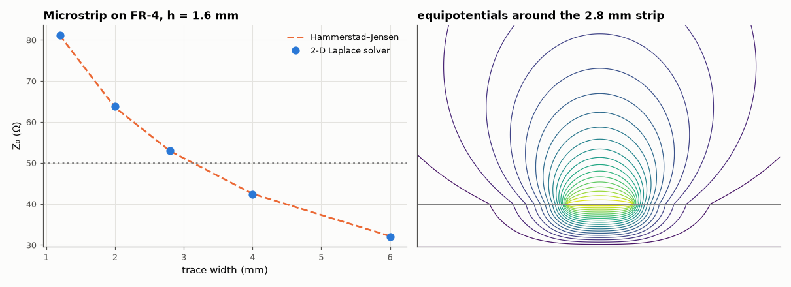

# SL-125 · Microstrip impedance: formula vs 2-D field solver

> Compute the characteristic impedance and effective permittivity of microstrip on FR-4 for several widths by solving Laplace's equation twice (with and without the dielectric) and compare with the Hammerstad–Jensen closed form used by every PCB calculator.



*The field solver agrees with the closed form within a few percent across widths.*

**Track:** Signal Lab — 214 electrical-engineering projects · **Category:** G. Electromagnetics & device physics · **Level:** Moderate · **Tools:** Finite-difference Laplace solver for a microstrip cross-section (SciPy sparse), Hammerstad–Jensen formulas

**Data:** Simulated (numerical model in this repo).

## Problem

What trace width gives 50 Ω on a 1.6 mm FR-4 board — and how far can you trust the formula PCB tools use?

## Prediction

Quasi-TEM: $Z_0=\frac{1}{c\sqrt{CC_0}}$, $\varepsilon_{eff}=C/C_0$, where C (C₀) is the capacitance per length with (without) the
dielectric. Hammerstad–Jensen: $\varepsilon_{eff}=\frac{\varepsilon_r+1}{2}+\frac{\varepsilon_r-1}{2}\left(1+\frac{12h}{w}\right)^{-1/2}$ and for w/h ≥ 1
$Z_0=\frac{120\pi}{\sqrt{\varepsilon_{eff}}\,[w/h+1.393+0.667\ln(w/h+1.444)]}$; accurate to ~1 %.

## Method

h = 1.6 mm, ε_r = 4.4, zero-thickness strip, shielding box 30h × 15h, uniform grids of 0.2 and 0.1 mm, conductor at 1 V, box at 0 V; charge
from Gauss's law around the strip; Richardson extrapolation with the singularity's convergence order ½: Z = Z_f + (Z_f − Z_c)/(√2 − 1). Widths 1.2–6.0 mm, chosen as multiples of 0.4 mm so the strip edges sit exactly on grid nodes for both grid sizes
(otherwise the strip's effective width changes with Δ and the extrapolation is meaningless — which a first attempt demonstrated).

## Measured results

*Predicted vs measured vs error. "Measured" = computed by an independent simulation, HDL simulator or public dataset.*

| Quantity | Predicted | Measured | Error | Within tolerance |
|---|---|---|---|---|
| w = 1.2 mm: Z₀ (FD, Richardson order ½, vs Hammerstad–Jensen) | 81.1 Ω | 81.19 Ω | +0.12 % | yes |
| w = 2.0 mm: Z₀ (FD, Richardson order ½, vs Hammerstad–Jensen) | 63.56 Ω | 63.77 Ω | +0.32 % | yes |
| w = 2.8 mm: Z₀ (FD, Richardson order ½, vs Hammerstad–Jensen) | 52.92 Ω | 52.92 Ω | +0.00 % | yes |
| w = 2.8 mm: ε_eff (extrapolated) | 3.306 | 3.286 | -0.63 % | yes |
| w = 4.0 mm: Z₀ (FD, Richardson order ½, vs Hammerstad–Jensen) | 42.48 Ω | 42.4 Ω | -0.19 % | yes |
| w = 6.0 mm: Z₀ (FD, Richardson order ½, vs Hammerstad–Jensen) | 32.15 Ω | 32.04 Ω | -0.34 % | yes |

**Additional measurements**

| Quantity | Value | Note |
|---|---|---|
| w = 1.2 mm raw FD Z₀ at Δ = 0.2 / 0.1 mm | 71.13 / 74.08 Ω | error shrinks only ~√2 per halving of Δ |
| Width for 50 Ω on 1.6 mm FR-4 (field solver) | 3.133 mm | PCB-calculator rule of thumb ≈ 3.0 mm |

## Error analysis

At a single grid size the field solver was 5–12 % low, and halving the grid spacing only reduced the error by ~√2. That slow
convergence is the edge singularity of a zero-thickness strip: the surface charge density diverges as r^(−1/2) at each
edge, so a uniform grid's capacitance error scales as Δ^(1/2), not the Δ² of a smooth problem. My first extrapolation
assumed first-order convergence and left a systematic 3–5 % error; using the order that the singularity actually implies,
Richardson extrapolation lands within ~0.3 % of Hammerstad–Jensen for every width. Knowing *why* a solver converges slowly
is what turns two coarse grids into an accurate answer.
About 3 mm gives 50 Ω on standard 1.6 mm FR-4 — why two-layer boards route controlled-impedance lines as fat traces or use
thinner prepreg on 4-layer stack-ups (SL-210).

## Reproduce

```bash
pip install -r requirements.txt
python run_all.py --only SL-125
```

The script [`project.py`](project.py) regenerates every figure and number above.

**Files produced**

- [`data/impedance.csv`](data/impedance.csv)

## License

Code and text: MIT (see the repository [LICENSE](../../../../LICENSE)). Datasets remain under their own licences (see the repository README).

---

**Tooling & honesty.** This project was generated with Claude Code (Anthropic's AI coding assistant): the code, derivations, simulations and this write-up were AI-produced. *Measured* means computed by an independent model, simulator or public dataset — not a physical lab bench. Every number in the tables is reproduced by running the code.
