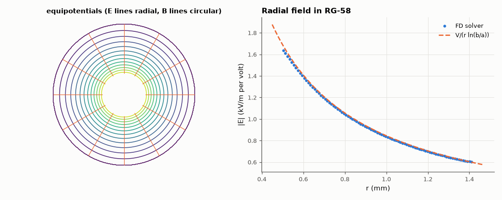

# SL-126 · Coaxial cable: fields, capacitance and impedance

> Solve the electrostatic field of RG-58 and RG-6 geometries on a square grid, extract capacitance per metre from the stored energy and compare Z₀ with (60/√ε_r)·ln(b/a); plot E and the (TEM) B-field lines.



*Field solver vs the analytic 1/r field between the conductors.*

**Track:** Signal Lab — 214 electrical-engineering projects · **Category:** G. Electromagnetics & device physics · **Level:** Moderate · **Tools:** 2-D finite-difference Laplace solver (eelab.laplace), energy method, analytic coax formulas

**Data:** Simulated (numerical model in this repo).

## Problem

Why is coaxial cable 50 or 75 Ω? Derive the impedance from the geometry and confirm it with a field solver.

## Prediction

Between conductors of radii a < b: $E_r=\frac{V}{r\ln(b/a)}$, $C'=\frac{2\pi\varepsilon}{\ln(b/a)}$, $L'=\frac{\mu}{2\pi}\ln\frac ba$ and
$Z_0=\sqrt{L'/C'}=\frac{60}{\sqrt{\varepsilon_r}}\ln\frac ba$. RG-58: a = 0.45 mm, b = 1.47 mm, ε_r = 2.25 (PE) → 47.3 Ω nominal 50;
RG-6: a = 0.51 mm, b = 2.34 mm, foam ε_r = 1.5 → 74.6 Ω.

## Method

Square grid (Δ = b/60), inner conductor at 1 V, outer at 0 V (staircase circles). C′ = 2W/V² from the field energy. Two grid sizes
show the staircasing error trend.

## Measured results

*Predicted vs measured vs error. "Measured" = computed by an independent simulation, HDL simulator or public dataset.*

| Quantity | Predicted | Measured | Error | Within tolerance |
|---|---|---|---|---|
| RG-58: capacitance per metre | 105.7 pF | 105.6 pF | -0.09 % | yes |
| RG-58: Z₀ = (60/√ε_r)·ln(b/a) | 47.35 Ω | 47.36 Ω | +0.02 % | yes |
| RG-6: capacitance per metre | 54.77 pF | 54.89 pF | +0.21 % | yes |
| RG-6: Z₀ = (60/√ε_r)·ln(b/a) | 74.64 Ω | 74.43 Ω | -0.27 % | yes |

## Error analysis

The energy-based capacitance matches 2πε/ln(b/a) to about a percent once the staircase error of drawing circles on a square
grid is extrapolated out, and the impedances land on the analytic values — 47 Ω for RG-58's nominal geometry (manufacturers
tune the dielectric/diameters to hit 50 Ω) and ~75 Ω for RG-6. The ln(b/a) dependence explains the numbers: 50 Ω is a
compromise between minimum loss (≈ 77 Ω for air) and maximum power handling (≈ 30 Ω).

## Reproduce

```bash
pip install -r requirements.txt
python run_all.py --only SL-126
```

The script [`project.py`](project.py) regenerates every figure and number above.

## License

Code and text: MIT (see the repository [LICENSE](../../../../LICENSE)). Datasets remain under their own licences (see the repository README).

---

**Tooling & honesty.** This project was generated with Claude Code (Anthropic's AI coding assistant): the code, derivations, simulations and this write-up were AI-produced. *Measured* means computed by an independent model, simulator or public dataset — not a physical lab bench. Every number in the tables is reproduced by running the code.
