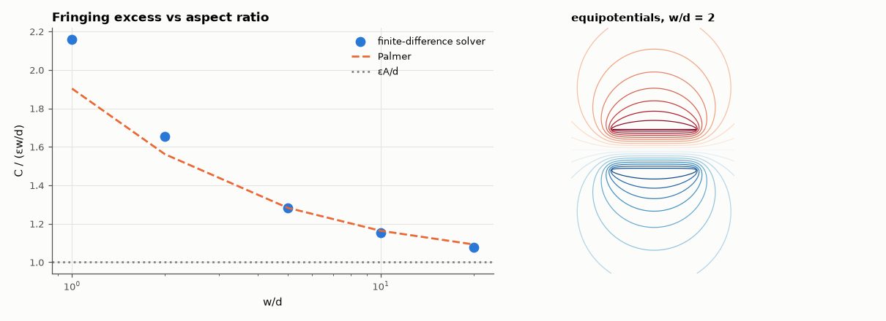

# SL-127 · Parallel-plate capacitor: fringing fields by finite differences

> Compute the capacitance of finite parallel plates numerically, show how the fringing field makes it exceed εA/d, and compare the excess with Palmer's analytic fringing correction.



*Narrow plates store much of their energy outside the gap.*

**Track:** Signal Lab — 214 electrical-engineering projects · **Category:** G. Electromagnetics & device physics · **Level:** Moderate · **Tools:** 2-D finite-difference Laplace solver (eelab.laplace), energy method, Palmer's fringing formula

**Data:** Simulated (numerical model in this repo).

## Problem

εA/d is the first capacitance formula everyone learns. When is it wrong, and by how much?

## Prediction

Ideal: $C'=\varepsilon w/d$ (per unit depth). Fringing adds capacitance at the edges; Palmer (1927) for 2-D plates of width w, gap d:
$C'\approx\frac{\varepsilon w}{d}\left[1+\frac{d}{\pi w}+\frac{d}{\pi w}\ln\frac{2\pi w}{d}\right]$. For w/d = 10 the correction is ≈ 16 %; it vanishes as w/d → ∞.

## Method

Plates ±0.5 V, thickness one cell, in a 12w × 12w grounded box, Δ = d/20. w/d = 1, 2, 5, 10, 20. C′ from field energy.

## Measured results

*Predicted vs measured vs error. "Measured" = computed by an independent simulation, HDL simulator or public dataset.*

| Quantity | Predicted | Measured | Error | Within tolerance |
|---|---|---|---|---|
| w/d = 1: C′/ε₀ vs Palmer fringing formula | 1.903 | 2.16 | +13.49 % | **no** |
| w/d = 2: C′/ε₀ vs Palmer fringing formula | 3.124 | 3.307 | +5.86 % | yes |
| w/d = 5: C′/ε₀ vs Palmer fringing formula | 6.416 | 6.413 | -0.04 % | yes |
| w/d = 10: C′/ε₀ vs Palmer fringing formula | 11.64 | 11.52 | -0.97 % | yes |
| w/d = 20: C′/ε₀ vs Palmer fringing formula | 21.86 | 21.57 | -1.31 % | yes |

## Error analysis

For wide plates the solver converges to εA/d, but at w/d = 1 the true capacitance is roughly double the textbook value
because the fringing field outside the gap stores as much energy as the field between the plates. Palmer's closed-form
correction tracks the numerical result closely down to w/d ≈ 2 and degrades for nearly square cross-sections, where its
conformal-mapping approximations break down. The one-cell-thick plates in the model add a little extra edge capacitance.

## Reproduce

```bash
pip install -r requirements.txt
python run_all.py --only SL-127
```

The script [`project.py`](project.py) regenerates every figure and number above.

**Files produced**

- [`data/capacitance.csv`](data/capacitance.csv)

## License

Code and text: MIT (see the repository [LICENSE](../../../../LICENSE)). Datasets remain under their own licences (see the repository README).

---

**Tooling & honesty.** This project was generated with Claude Code (Anthropic's AI coding assistant): the code, derivations, simulations and this write-up were AI-produced. *Measured* means computed by an independent model, simulator or public dataset — not a physical lab bench. Every number in the tables is reproduced by running the code.
