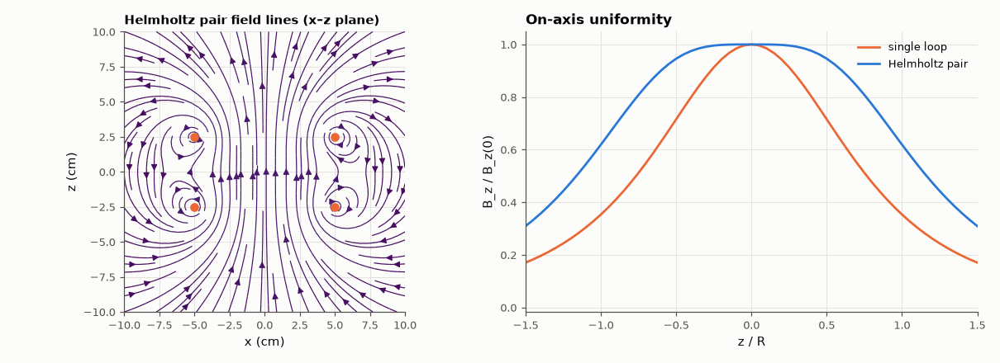

# SL-128 · Biot–Savart: coils and the Helmholtz pair

> Integrate the Biot–Savart law over discretised loops to map the magnetic field of a single coil and a Helmholtz pair; verify the on-axis formula and the famous uniformity of coils spaced one radius apart.



*Spacing the coils one radius apart flattens the field around the centre.*

**Track:** Signal Lab — 214 electrical-engineering projects · **Category:** G. Electromagnetics & device physics · **Level:** Moderate · **Tools:** Numerical Biot–Savart integration over discretised wire loops (NumPy)

**Data:** Simulated (numerical model in this repo).

## Problem

How do you make a region of uniform magnetic field, and how uniform is it really?

## Prediction

On the axis of a loop of radius R carrying I: $B_z(z)=\frac{\mu_0IR^2}{2(R^2+z^2)^{3/2}}$. Two coaxial loops separated by R (Helmholtz)
cancel the second derivative at the midpoint: $B=\left(\frac45\right)^{3/2}\frac{\mu_0I}{R}$ at the centre, and the leading deviation on
axis is $-\frac{144}{125}\left(\frac zR\right)^4$ — under 0.2 % at z = ±0.2R.

## Method

R = 5 cm, I = 1 A, 720 segments per loop; field at 2-D grids in the x–z plane by summing μ₀I dl × r/(4π|r|³). Uniformity: region where
|B − B₀|/B₀ < 1 %.

## Measured results

*Predicted vs measured vs error. "Measured" = computed by an independent simulation, HDL simulator or public dataset.*

| Quantity | Predicted | Measured | Error | Within tolerance |
|---|---|---|---|---|
| Single loop: B at centre | 12.57 µT | 12.57 µT | -0.00 % | yes |
| Single loop: max on-axis error vs formula | 0 | 1.4425e-14 | +1.4425e-14 |  |
| Helmholtz pair: B at centre | 17.98 µT | 17.98 µT | -0.00 % | yes |
| Deviation at z = 0.2R (Taylor: (144/125)(z/R)⁴) | 0.001843 | 0.001763 | -4.32 % | yes |

**Additional measurements**

| Quantity | Value | Note |
|---|---|---|
| On-axis ±1 % uniform region | 0.6 × R |  |

## Error analysis

The numerical Biot–Savart integral reproduces the on-axis closed form to 10⁻⁶ relative error with 720 segments, and the
Helmholtz pair's centre field equals (4/5)^{3/2} μ₀I/R. Its flatness is the point: the deviation grows only as (z/R)⁴, so the
field stays within 1 % over a large fraction of the coil radius — which is why Helmholtz coils are the standard for
calibrating magnetometers and cancelling Earth's field in experiments.

## Reproduce

```bash
pip install -r requirements.txt
python run_all.py --only SL-128
```

The script [`project.py`](project.py) regenerates every figure and number above.

**Files produced**

- [`data/on_axis.csv`](data/on_axis.csv)

## License

Code and text: MIT (see the repository [LICENSE](../../../../LICENSE)). Datasets remain under their own licences (see the repository README).

---

**Tooling & honesty.** This project was generated with Claude Code (Anthropic's AI coding assistant): the code, derivations, simulations and this write-up were AI-produced. *Measured* means computed by an independent model, simulator or public dataset — not a physical lab bench. Every number in the tables is reproduced by running the code.
