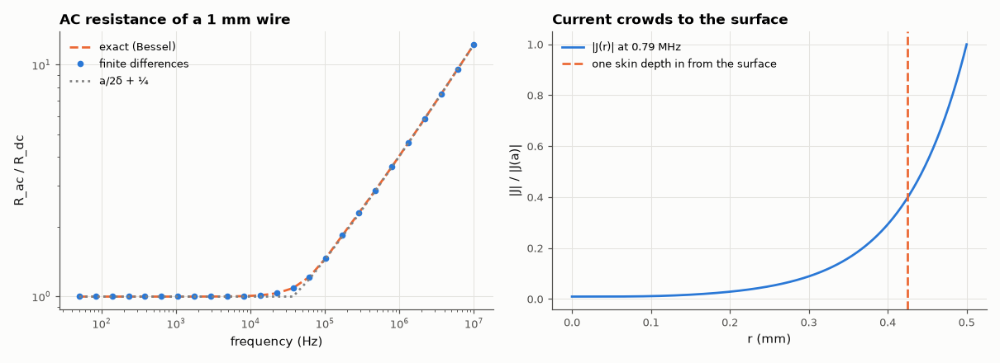

# SL-129 · Skin effect in a round copper wire

> Solve for the AC current density inside a 1 mm copper wire from 50 Hz to 10 MHz, compare with the exact Bessel solution, and track R_ac/R_dc against the high-frequency approximation r/(2δ).



*Above ~20 kHz the current retreats to a surface layer a few δ thick.*

**Track:** Signal Lab — 214 electrical-engineering projects · **Category:** G. Electromagnetics & device physics · **Level:** Moderate · **Tools:** Finite-difference solution of the 1-D radial diffusion (eddy-current) equation, exact Bessel-function solution

**Data:** Simulated (numerical model in this repo).

## Problem

Why does a thick wire have more resistance at radio frequencies, and when does it start to matter?

## Prediction

Inside a conductor $\nabla^2 J = j\omega\mu\sigma J$; for a round wire $J(r)\propto J_0(kr)$ with $k=(1-j)/\delta$ and skin depth
$\delta=\sqrt{2/(\omega\mu\sigma)}$ (copper: 9.2 mm at 50 Hz, 66 µm at 1 MHz). At high frequency $R_{ac}/R_{dc}\approx\frac{a}{2\delta}+\frac14$.

## Method

Wire radius a = 0.5 mm, σ = 5.8×10⁷ S/m. Radial finite differences (400 nodes, symmetric axis condition), complex linear solve per frequency,
J(a) fixed; total current integrated; R_ac = Re(E/I) per length. Compared with the exact J₀ solution and the asymptote.

## Measured results

*Predicted vs measured vs error. "Measured" = computed by an independent simulation, HDL simulator or public dataset.*

| Quantity | Predicted | Measured | Error | Within tolerance |
|---|---|---|---|---|
| Skin depth of copper at 1 MHz | 66.1 µm | 66.09 µm | -0.02 % | yes |
| R_ac/R_dc at ~1 MHz: FD vs exact Bessel | 3.619 | 3.619 | +0.01 % | yes |
| R_ac/R_dc at 10 MHz vs a/(2δ) + ¼ | 12.21 | 12.23 | +0.12 % | yes |

**Additional measurements**

| Quantity | Value | Note |
|---|---|---|
| Frequency where R_ac exceeds R_dc by 10 % | 61.9 kHz | δ ≈ a at this point |

## Error analysis

The finite-difference solution matches the exact Bessel-function result to well under a percent across five decades, and
at high frequency R_ac/R_dc follows a/(2δ) + ¼. For this 1 mm wire the resistance is flat to ~15 kHz and then rises as √f —
which is why RF inductors use Litz wire (many insulated strands, each thinner than δ) and why high-current RF conductors
are silver-plated tubes: the middle carries almost no current.

## Reproduce

```bash
pip install -r requirements.txt
python run_all.py --only SL-129
```

The script [`project.py`](project.py) regenerates every figure and number above.

**Files produced**

- [`data/rac.csv`](data/rac.csv)

## License

Code and text: MIT (see the repository [LICENSE](../../../../LICENSE)). Datasets remain under their own licences (see the repository README).

---

**Tooling & honesty.** This project was generated with Claude Code (Anthropic's AI coding assistant): the code, derivations, simulations and this write-up were AI-produced. *Measured* means computed by an independent model, simulator or public dataset — not a physical lab bench. Every number in the tables is reproduced by running the code.
