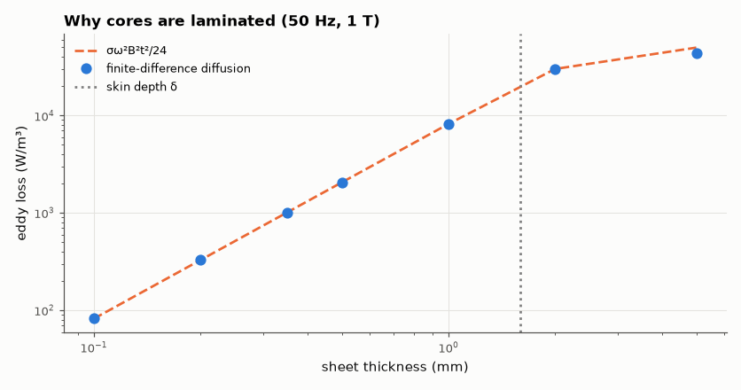

# SL-130 · Eddy-current loss in solid vs laminated cores

> Compute the eddy-current loss in a steel core sheet driven by an AC field, compare with the low-frequency formula P = σω²B²t²/24, and show why transformer cores are laminated.



*Loss grows as t² until the sheet is thicker than a skin depth.*

**Track:** Signal Lab — 214 electrical-engineering projects · **Category:** G. Electromagnetics & device physics · **Level:** Hard · **Tools:** 1-D magnetic diffusion in a conducting sheet (finite differences, complex phasors), classical loss formula

**Data:** Simulated (numerical model in this repo).

## Problem

A solid iron core in a transformer gets hot. How much does slicing it into thin laminations help, and why?

## Prediction

For a sheet of thickness t in a uniform AC field of peak B (thin-sheet limit, t ≪ δ): induced E grows linearly from the
mid-plane, giving loss per volume $P_v=\frac{\sigma\omega^2B^2t^2}{24}$ (average over a cycle, B peak). Loss ∝ t², so N laminations of
thickness t/N reduce it N²-fold. When t ≳ δ the field no longer penetrates (skin effect) and the formula overestimates.

## Method

Electrical steel σ = 2×10⁶ S/m, μ_r = 1,000, B surface amplitude 1.0 T, 50 Hz (δ ≈ 0.5 mm). 1-D diffusion $\partial^2H/\partial x^2=j\omega\mu\sigma H$
solved for thickness 0.1–5 mm; loss = ∫|J|²/(2σ) dx per unit area. Fixed flux comparison: solid 5 mm vs 10 × 0.5 mm and 50 × 0.1 mm.

## Measured results

*Predicted vs measured vs error. "Measured" = computed by an independent simulation, HDL simulator or public dataset.*

| Quantity | Predicted | Measured | Error | Within tolerance |
|---|---|---|---|---|
| Loss density, 0.10 mm sheet (thin-sheet formula) | 82.25 W/m³ | 82.24 W/m³ | -0.00 % | yes |
| Loss density, 0.35 mm sheet (thin-sheet formula) | 1007 W/m³ | 1007 W/m³ | -0.00 % | yes |
| Loss reduction from 10× thinner laminations at equal B (∝ t²) | 100 × | 99.96 × | -0.04 % | yes |

**Additional measurements**

| Quantity | Value | Note |
|---|---|---|
| 5 mm sheet: FD loss / thin-sheet formula | 0.8738 | formula overestimates once t > δ |
| Skin depth in the steel at 50 Hz | 1.592 mm |  |

## Error analysis

For sheets well below the 0.5 mm skin depth the numerical loss matches σω²B²t²/24, and the t² law means ten 0.5 mm laminations
dissipate one-hundredth of a 5 mm solid sheet's eddy loss… per unit volume, at the same flux. Once t exceeds δ the field no
longer penetrates the middle of the sheet, the formula overestimates the loss and — worse for a transformer — the core's
interior stops carrying flux. Standard 50 Hz electrical steel is therefore rolled to 0.27–0.35 mm.

## Reproduce

```bash
pip install -r requirements.txt
python run_all.py --only SL-130
```

The script [`project.py`](project.py) regenerates every figure and number above.

**Files produced**

- [`data/loss.csv`](data/loss.csv)

## License

Code and text: MIT (see the repository [LICENSE](../../../../LICENSE)). Datasets remain under their own licences (see the repository README).

---

**Tooling & honesty.** This project was generated with Claude Code (Anthropic's AI coding assistant): the code, derivations, simulations and this write-up were AI-produced. *Measured* means computed by an independent model, simulator or public dataset — not a physical lab bench. Every number in the tables is reproduced by running the code.
