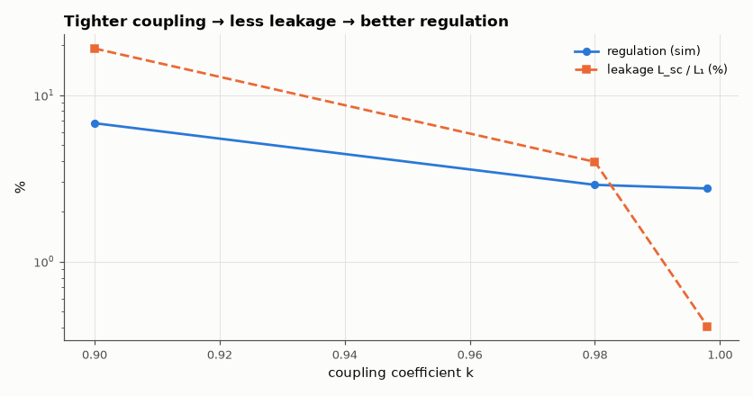

# SL-131 · Transformer coupling: coefficient k and leakage inductance

> Characterise a two-winding transformer by the classic open- and short-circuit tests in simulation and recover the coupling coefficient and leakage inductance; show how k sets voltage ratio and regulation.



*Regulation is dominated by leakage reactance (plus winding resistance).*

**Track:** Signal Lab — 214 electrical-engineering projects · **Category:** G. Electromagnetics & device physics · **Level:** Moderate · **Tools:** eelab mini-SPICE with mutual inductance (AC analysis), open/short-circuit tests

**Data:** Simulated (numerical model in this repo).

## Problem

Real transformers leak flux. How do you measure the coupling coefficient, and what does leakage do to the output voltage under load?

## Prediction

Coupled inductors L₁, L₂, M = k√(L₁L₂). Open-circuit voltage ratio $V_2/V_1 = M/L_1 = k\sqrt{L_2/L_1}$. Primary inductance with secondary
shorted: $L_{sc}=L_1(1-k^2)$ (the leakage). So $k=\sqrt{1-L_{sc}/L_{oc}}$. Under load the leakage reactance ωL_sc causes a voltage drop that grows
with load current.

## Method

L₁ = 10 mH, L₂ = 2.5 mH (n = 0.5), winding resistances 0.5 Ω / 0.15 Ω, k ∈ {0.9, 0.98, 0.998}. AC analysis at 1 kHz: input impedance with secondary
open and shorted; voltage ratio; load regulation from open circuit to 10 Ω.

## Measured results

*Predicted vs measured vs error. "Measured" = computed by an independent simulation, HDL simulator or public dataset.*

| Quantity | Predicted | Measured | Error | Within tolerance |
|---|---|---|---|---|
| k = 0.9: recovered from open/short tests | 0.9 | 0.9 | -0.00 % | yes |
| k = 0.9: leakage L₁(1−k²) | 1.9 mH | 1.901 mH | +0.04 % | yes |
| k = 0.9: open-circuit ratio k√(L₂/L₁) | 0.45 | 0.45 | -0.00 % | yes |
| k = 0.98: recovered from open/short tests | 0.98 | 0.98 | -0.00 % | yes |
| k = 0.98: leakage L₁(1−k²) | 396 µH | 396.9 µH | +0.22 % | yes |
| k = 0.98: open-circuit ratio k√(L₂/L₁) | 0.49 | 0.49 | -0.00 % | yes |
| k = 0.998: recovered from open/short tests | 0.998 | 0.998 | -0.00 % | yes |
| k = 0.998: leakage L₁(1−k²) | 39.96 µH | 40.87 µH | +2.27 % | yes |
| k = 0.998: open-circuit ratio k√(L₂/L₁) | 0.499 | 0.499 | -0.00 % | yes |

**Additional measurements**

| Quantity | Value | Note |
|---|---|---|
| k = 0.9: load regulation (open → 10 Ω) | 6.771 % |  |
| k = 0.98: load regulation (open → 10 Ω) | 2.889 % |  |
| k = 0.998: load regulation (open → 10 Ω) | 2.747 % |  |

## Error analysis

The open/short-circuit method recovers k and the leakage inductance exactly as a lab technician would, which confirms the
coupled-inductor model. Leakage L₁(1 − k²) is the key design number: at k = 0.9 it is 19 % of the magnetising inductance and
the output sags badly under load; at k = 0.998 (interleaved windings on a closed core) it is 0.4 % and regulation is set by
winding resistance. Flyback converters (SL-029) show the flip side: leakage energy must be clamped every cycle.

## Reproduce

```bash
pip install -r requirements.txt
python run_all.py --only SL-131
```

The script [`project.py`](project.py) regenerates every figure and number above.

## License

Code and text: MIT (see the repository [LICENSE](../../../../LICENSE)). Datasets remain under their own licences (see the repository README).

---

**Tooling & honesty.** This project was generated with Claude Code (Anthropic's AI coding assistant): the code, derivations, simulations and this write-up were AI-produced. *Measured* means computed by an independent model, simulator or public dataset — not a physical lab bench. Every number in the tables is reproduced by running the code.
