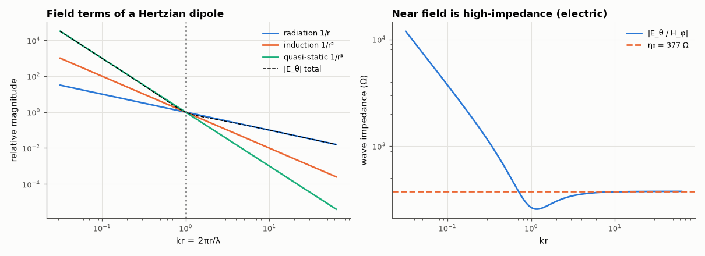

# SL-132 · Antenna near field vs far field (Hertzian dipole)

> Plot the exact E and H fields of a small dipole from 0.01λ to 10λ, locate where the 1/r³, 1/r² and 1/r terms cross over (r = λ/2π), and watch the wave impedance approach 377 Ω.



*All terms cross at kr = 1; beyond a few λ only the 1/r radiation field remains.*

**Track:** Signal Lab — 214 electrical-engineering projects · **Category:** G. Electromagnetics & device physics · **Level:** Hard · **Tools:** Exact closed-form fields of an oscillating dipole (NumPy), wave-impedance and energy analysis

**Data:** Simulated (numerical model in this repo).

## Problem

Close to an antenna the fields behave like a capacitor; far away they form a radiating wave. Where is the boundary, and what changes there?

## Prediction

Hertzian dipole (Idl): $E_\theta\propto\left[\frac{1}{r}+\frac{1}{jkr^2}-\frac{1}{k^2r^3}\right]$, $H_\phi\propto\left[\frac1r+\frac{1}{jkr^2}\right]$. All three terms are equal in
magnitude at kr = 1, i.e. r = λ/2π ≈ 0.16λ. Wave impedance |E_θ/H_φ| → η₀ = 376.7 Ω for kr ≫ 1 and ≈ η₀/(kr) (high, 'electric') for kr ≪ 1.
Reactive (stored) energy dominates for kr < 1; the power flow's real part is independent of r.

## Method

Broadside (θ = 90°) fields for kr from 0.03 to 60; crossover of the |1/r| and |1/r³| terms; |Z_w| vs r; ratio of reactive to real Poynting
flux integrated over a sphere.

## Measured results

*Predicted vs measured vs error. "Measured" = computed by an independent simulation, HDL simulator or public dataset.*

| Quantity | Predicted | Measured | Error | Within tolerance |
|---|---|---|---|---|
| Wave impedance at kr = 60 (far field) | 376.7 Ω | 376.6 Ω | -0.03 % | yes |
| Wave impedance at kr = 0.1 ≈ η₀/(kr) | 3.767 kΩ | 3.73 kΩ | -0.98 % | yes |
| Near/far crossover (|1/r| = |1/r³| term) | 1 kr | 0.9931 kr | -0.69 % | yes |
| Real power through a sphere (∝ Re S·r²) at kr = 60 vs kr = 0.03 | 1 | 1 | -0.00 % | yes |

**Additional measurements**

| Quantity | Value | Note |
|---|---|---|
| Reactive / real power ratio at kr = 0.2 | 125 |  |
| Reactive / real power ratio at kr = 5 | 0.008002 |  |

## Error analysis

The exact fields show three regimes meeting at r = λ/2π: inside it the 1/r³ quasi-static term dominates, the wave impedance
is far above 377 Ω (a small electric dipole's near field is mostly E) and most of the Poynting flux is reactive — energy
sloshing in and out each cycle. Outside it the 1/r radiation term wins and E/H → 377 Ω. The real part of the power flow is
the same at every radius (energy conservation), a useful check on the algebra. This is why near-field EMC probes and
far-field antenna measurements need different set-ups.

## Reproduce

```bash
pip install -r requirements.txt
python run_all.py --only SL-132
```

The script [`project.py`](project.py) regenerates every figure and number above.

## License

Code and text: MIT (see the repository [LICENSE](../../../../LICENSE)). Datasets remain under their own licences (see the repository README).

---

**Tooling & honesty.** This project was generated with Claude Code (Anthropic's AI coding assistant): the code, derivations, simulations and this write-up were AI-produced. *Measured* means computed by an independent model, simulator or public dataset — not a physical lab bench. Every number in the tables is reproduced by running the code.
