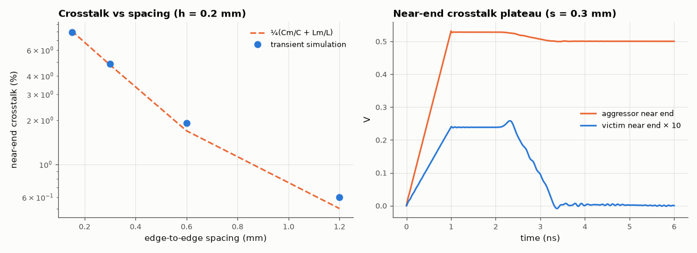

# SL-133 · PCB crosstalk vs trace spacing

> Extract mutual capacitance and inductance of two parallel microstrips for several spacings, predict near-end crosstalk K_NE = ¼(C_m/C + L_m/L), and verify with a transient simulation of a 1 ns edge on a 20 cm pair.



*The victim's near end sees a plateau lasting the round-trip delay; its height falls quickly with spacing.*

**Track:** Signal Lab — 214 electrical-engineering projects · **Category:** G. Electromagnetics & device physics · **Level:** Moderate · **Tools:** 2-D Laplace solver for coupled microstrip capacitances + eelab mini-SPICE coupled-line ladder (transient)

**Data:** Simulated (numerical model in this repo).

## Problem

Two neighbouring traces talk to each other. How much, and how much does spacing them out help?

## Prediction

For weakly coupled lines the backward (near-end) crosstalk saturates at $K_{NE}=\frac14\left(\frac{C_m}{C}+\frac{L_m}{L}\right)$ once the line delay exceeds
half the rise time. Mutual terms fall roughly as $1/(1+(s/h)^2)$, so doubling the spacing cuts crosstalk ~4× (the '3W rule').

## Method

Two 0.3 mm traces, h = 0.2 mm, ε_r = 4.4, spacings 0.15–1.2 mm. Capacitance matrix from two Laplace solves; inductance from the air-filled
capacitance matrix (L = μ₀ε₀ C₀⁻¹). Transient: 40-section LC ladder with coupling capacitors and K-coupled inductors, 50 Ω terminations,
1 V / 1 ns ramp on the aggressor.

## Measured results

*Predicted vs measured vs error. "Measured" = computed by an independent simulation, HDL simulator or public dataset.*

| Quantity | Predicted | Measured | Error | Within tolerance |
|---|---|---|---|---|
| s = 0.15 mm: near-end crosstalk (¼(Cm/C + Lm/L)) | 0.08116 | 0.07947 | -2.08 % | yes |
| s = 0.30 mm: near-end crosstalk (¼(Cm/C + Lm/L)) | 0.04767 | 0.04859 | +1.94 % | yes |
| s = 0.60 mm: near-end crosstalk (¼(Cm/C + Lm/L)) | 0.01699 | 0.01924 | +13.28 % | yes |
| s = 1.20 mm: near-end crosstalk (¼(Cm/C + Lm/L)) | 0.005024 | 0.006008 | +19.61 % | **no** |

**Additional measurements**

| Quantity | Value | Note |
|---|---|---|
| Crosstalk reduction from 0.3 → 0.6 mm spacing | 2.525 × |  |

## Error analysis

The field-solver coupling coefficients predict the simulated near-end crosstalk plateau within the ladder model's
discretisation error, and both fall quickly with spacing: going from one trace width to two widths apart cuts crosstalk
by several times — the origin of the '3W' layout rule. Moving the traces closer to the ground plane (smaller h) has the
same effect, because the field then terminates on the plane instead of the neighbour.

## Reproduce

```bash
pip install -r requirements.txt
python run_all.py --only SL-133
```

The script [`project.py`](project.py) regenerates every figure and number above.

**Files produced**

- [`data/crosstalk.csv`](data/crosstalk.csv)

## License

Code and text: MIT (see the repository [LICENSE](../../../../LICENSE)). Datasets remain under their own licences (see the repository README).

---

**Tooling & honesty.** This project was generated with Claude Code (Anthropic's AI coding assistant): the code, derivations, simulations and this write-up were AI-produced. *Measured* means computed by an independent model, simulator or public dataset — not a physical lab bench. Every number in the tables is reproduced by running the code.
