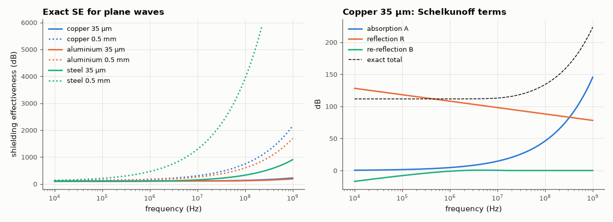

# SL-134 · RF shielding effectiveness: Schelkunoff vs exact

> Compute the shielding effectiveness of copper, aluminium and steel foils from 10 kHz to 1 GHz exactly, compare with Schelkunoff's absorption + reflection + multiple-reflection formula, and find where thin foils fail.



*Reflection dominates at low frequency; absorption takes over once the foil is several skin depths thick.*

**Track:** Signal Lab — 214 electrical-engineering projects · **Category:** G. Electromagnetics & device physics · **Level:** Moderate · **Tools:** Exact plane-wave transmission through a conducting slab (ABCD / transmission-line model), Schelkunoff's A + R + B approximation

**Data:** Simulated (numerical model in this repo).

## Problem

How much does a metal sheet attenuate a radio wave, and why does a thin copper foil shield well at 100 MHz but poorly at 50 kHz?

## Prediction

Plane wave (η₀) through a slab of thickness t with intrinsic impedance $\eta_s=\sqrt{j\omega\mu/\sigma}$ and propagation constant γ = (1+j)/δ.
Schelkunoff: $SE=A+R+B$ with $A=8.686\,t/\delta$, $R=20\log_{10}\frac{|\eta_0|}{4|\eta_s|}$, and a correction B that becomes large and negative
when t ≲ δ (multiple internal reflections). The exact result follows from the slab's transmission-line ABCD matrix.

## Method

Copper (σ = 5.8e7, μ_r = 1), aluminium (3.5e7, 1), steel (1e7, μ_r = 200); t = 35 µm (1 oz PCB copper) and 0.5 mm. SE_exact = 20 log|E_inc/E_trans|
from $T=rac{2\eta_0}{(A\eta_0+B+C\eta_0^2+D\eta_0)}$ with the slab ABCD; A + R + B computed separately.

## Measured results

*Predicted vs measured vs error. "Measured" = computed by an independent simulation, HDL simulator or public dataset.*

| Quantity | Predicted | Measured | Error |
|---|---|---|---|
| Copper 35 µm at 1e+05 Hz: Schelkunoff A+R+B vs exact | 111.7 dB | 111.7 dB | -6.7500e-06 dB |
| Copper 35 µm at 1e+08 Hz: Schelkunoff A+R+B vs exact | 134.1 dB | 134.1 dB | -4.6420e-04 dB |

**Additional measurements**

| Quantity | Value | Note |
|---|---|---|
| Copper 35 µm: worst |A+R (no B) − exact| | 16.95 dB | B correction is essential for thin foils |

## Error analysis

With the multiple-reflection correction B included, Schelkunoff's decomposition agrees with the exact slab solution to a
fraction of a dB — it is in fact exact for plane waves once B is computed with complex values. Dropping B (as quick
calculators often do) overestimates thin-foil shielding by tens of dB at low frequency, where the 35 µm copper is thinner
than a skin depth. Plane waves are the easy case: near-field magnetic sources at low frequency are much harder to shield
because R becomes small, which is why steel (high μ) beats copper there.

## Reproduce

```bash
pip install -r requirements.txt
python run_all.py --only SL-134
```

The script [`project.py`](project.py) regenerates every figure and number above.

**Files produced**

- [`data/se_copper_35um.csv`](data/se_copper_35um.csv)

## License

Code and text: MIT (see the repository [LICENSE](../../../../LICENSE)). Datasets remain under their own licences (see the repository README).

---

**Tooling & honesty.** This project was generated with Claude Code (Anthropic's AI coding assistant): the code, derivations, simulations and this write-up were AI-produced. *Measured* means computed by an independent model, simulator or public dataset — not a physical lab bench. Every number in the tables is reproduced by running the code.
